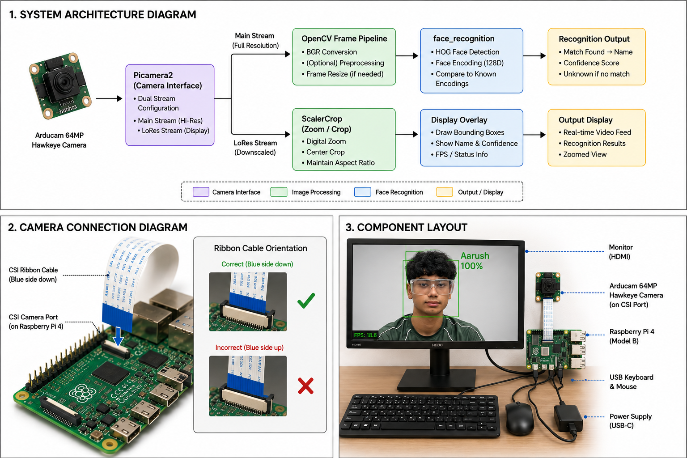

# Facial Recognition System

This project uses a Raspberry Pi to build a real-time facial recognition system capable of identifying people at distance using a 64MP camera, digital zoom, and machine learning. The system is trained on a custom image dataset to recognize specific individuals through a connected camera with live confidence scoring.

| **Engineer** | **School** | **Area of Interest** | **Grade** |
|:--:|:--:|:--:|:--:|
| Aarush H | Evergreen Valley High School | Computer Engineering | Incoming Senior |


---

## Final Milestone

<!--
<iframe width="560" height="315" src="https://www.youtube.com/embed/F7M7imOVGug" title="YouTube video player" frameborder="0" allow="accelerometer; autoplay; clipboard-write; encrypted-media; gyroscope; picture-in-picture; web-share" allowfullscreen></iframe>

- Achieved reliable facial recognition at up to 8 meters using the 64MP Arducam Hawkeye camera with digital zoom
- Built a dynamic zoom system (= / - keys) that automatically adjusts processing detail and frame skip rate based on zoom level — more zoom means the algorithm keeps more pixel detail per face
- Implemented confidence percentage scoring on every recognized face, color coded green (high), orange (low), red (unknown)
- Solved the core range problem by exploiting the 64MP sensor: zooming in crops the sensor rather than stretching pixels, so faces at distance still have hundreds of pixels of detail for the algorithm to work with
- Overhauled model training with image augmentation (flip, brightness, rotation) that multiplies each training photo 6x without taking more pictures, and a CNN fallback for hard-to-detect faces
-->

---

## Second Milestone

<iframe width="560" height="315" src="https://www.youtube.com/embed/xFbNuY9iE_g?si=Cp3FTndi-fisdUzk" title="YouTube video player" frameborder="0" allow="accelerometer; autoplay; clipboard-write; encrypted-media; gyroscope; picture-in-picture; web-share" referrerpolicy="strict-origin-when-cross-origin" allowfullscreen></iframe>

-Trained the model on images in the dataset using Python, allowing the live feed to show people’s names

-Surprised by how much data the model needs, only 200 pictures of 4 people in the dataset wasn’t enough to allow the model to recognize people past 3 feet

-Initially the live feed was extremely zoomed in, so I adjusted the resolution to fit the monitor and then added more people to the dataset to improve the accuracy of the model

-The next goal is to detect a person from across the classroom, around 10 meters

---

## First Milestone

<iframe width="560" height="315" src="https://www.youtube.com/embed/wKA9XhxVHsE?si=93JbfTmWjfTUcsn5" title="YouTube video player" frameborder="0" allow="accelerometer; autoplay; clipboard-write; encrypted-media; gyroscope; picture-in-picture; web-share" referrerpolicy="strict-origin-when-cross-origin" allowfullscreen></iframe>

-Set up OpenCV and Python scripts that capture photos on spacebar press and organize them into named folders so the model can associate names with faces

-The quality of the camera was worse than expected only ever sharp when the subject was directly in front of it

-Some of the captured images became corrupted silently causing me to have to mass delete entire batches of images as there was no way of knowing which were corrupted

-Next goal is to detect myself and at least one other person

---

## Starter Milestone

<iframe width="560" height="315" src="https://www.youtube.com/embed/wKA9XhxVHsE?si=93JbfTmWjfTUcsn5" title="YouTube video player" frameborder="0" allow="accelerometer; autoplay; clipboard-write; encrypted-media; gyroscope; picture-in-picture; web-share" referrerpolicy="strict-origin-when-cross-origin" allowfullscreen></iframe>

-Built retro arcade device by connecting a battery to the metal contacts on the back of the device, soldering the side charging port and buttons (movement and reset), then finally putting it all together in the acrylic case with the screws.

---

## Schematics



---

## Code

### Face Recognition (face_rec-picam.py)
The main script. Runs continuous facial recognition on the Pi Camera feed with dynamic zoom, autofocus control, and live confidence scoring.

```python
import face_recognition
import cv2
import numpy as np
from picamera2 import Picamera2
from libcamera import controls, Transform
import time
import pickle
import os
import mediapipe as mp
from threading import Thread, Lock

# ── LOAD BOTH PICKLES ──
print("[INFO] loading encodings...")

with open("encodings_close.pickle", "rb") as f:
    data_close = pickle.loads(f.read())
known_face_encodings_close = data_close["encodings"]
known_face_names_close = data_close["names"]
print(f"[INFO] close: {len(set(known_face_names_close))} people, {len(known_face_names_close)} encodings")

if os.path.exists("encodings_far.pickle"):
    with open("encodings_far.pickle", "rb") as f:
        data_far = pickle.loads(f.read())
    known_face_encodings_far = data_far["encodings"]
    known_face_names_far = data_far["names"]
    print(f"[INFO] far: {len(set(known_face_names_far))} people, {len(known_face_names_far)} encodings")
    HAS_FAR_ENCODINGS = True
else:
    known_face_encodings_far = known_face_encodings_close
    known_face_names_far = known_face_names_close
    HAS_FAR_ENCODINGS = False
    print("[WARN] encodings_far.pickle not found — using close encodings for all distances")

# ── MEDIAPIPE ──
mp_face_detection = mp.solutions.face_detection
face_detector = mp_face_detection.FaceDetection(
    model_selection=1,
    min_detection_confidence=0.5
)
print("[INFO] MediaPipe ready")

# ── CAMERA ──
picam2 = Picamera2()
config = picam2.create_preview_configuration(
    main={"size": (1280, 720), "format": "RGB888"},
    lores={"size": (640, 480), "format": "YUV420"},
    transform=Transform(hflip=True, vflip=True)
)
picam2.configure(config)
picam2.start()

picam2.set_controls({
    "AfMode": controls.AfModeEnum.Auto,
    "AfTrigger": controls.AfTriggerEnum.Start,
    "AfSpeed": controls.AfSpeedEnum.Fast,
    "AfRange": controls.AfRangeEnum.Full
})
time.sleep(2)
picam2.set_controls({
    "AfMode": controls.AfModeEnum.Continuous,
    "AfSpeed": controls.AfSpeedEnum.Fast,
    "AfRange": controls.AfRangeEnum.Full
})

# ── CONSTANTS ──
DISPLAY_W, DISPLAY_H = 1024, 600
MAIN_W, MAIN_H = 1280, 720
ZONE_COLORS = [(0, 220, 255), (0, 160, 255), (180, 0, 255)]
ZONE_NAMES = ["ZONE A", "ZONE B", "ZONE C"]
MAX_ZONES = 3
FAR_ZOOM_THRESHOLD = 2.5

# ── STATE ──
zoom_factor = 1.5
cv_scaler = 3
frame_skip = 5

result_lock = Lock()
face_locations = []
face_names = []
face_distances_list = []
face_zones = []

auto_zoom_enabled = True
auto_zoom_target = 1.5
auto_zoom_current = 1.5

zones = []
selecting = False
select_start = None
select_current = None
frozen_frame = None
selection_mode = False

frame_count = 0
start_time = time.time()
fps = 0
frame_skip_count = 0
processing = False
latest_main_frame = None
main_frame_lock = Lock()

# ── ZOOM ──
def apply_zoom(z):
    size = picam2.camera_properties['PixelArraySize']
    fw, fh = size
    cw = int(fw / z)
    ch = int(fh / z)
    cx = (fw - cw) // 2
    cy = (fh - ch) // 2
    picam2.set_controls({"ScalerCrop": (cx, cy, cw, ch)})

def update_zoom_full(z):
    size = picam2.camera_properties['PixelArraySize']
    fw, fh = size
    cw = int(fw / z)
    ch = int(fh / z)
    cx = (fw - cw) // 2
    cy = (fh - ch) // 2
    picam2.set_controls({
        "ScalerCrop": (cx, cy, cw, ch),
        "AfMode": controls.AfModeEnum.Auto,
        "AfTrigger": controls.AfTriggerEnum.Start,
        "AfSpeed": controls.AfSpeedEnum.Fast,
        "AfRange": controls.AfRangeEnum.Full
    })
    time.sleep(0.4)
    picam2.set_controls({
        "AfMode": controls.AfModeEnum.Continuous,
        "AfSpeed": controls.AfSpeedEnum.Fast,
        "AfRange": controls.AfRangeEnum.Full
    })

def get_cv_scaler(z):
    if z >= 5.0: return 2
    elif z >= 3.0: return 3
    else: return 4

def get_frame_skip(z):
    if z >= 5.0: return 8
    elif z >= 3.0: return 6
    else: return 4

def get_active_encodings():
    if HAS_FAR_ENCODINGS and zoom_factor >= FAR_ZOOM_THRESHOLD:
        return known_face_encodings_far, known_face_names_far, True
    return known_face_encodings_close, known_face_names_close, False

apply_zoom(zoom_factor)

# ── MEDIAPIPE DETECTION ──
def detect_faces_mediapipe(rgb_frame):
    h, w = rgb_frame.shape[:2]
    results = face_detector.process(rgb_frame)
    locations = []
    if results.detections:
        for detection in results.detections:
            bbox = detection.location_data.relative_bounding_box
            x1 = max(0, int(bbox.xmin * w))
            y1 = max(0, int(bbox.ymin * h))
            x2 = min(w, int((bbox.xmin + bbox.width) * w))
            y2 = min(h, int((bbox.ymin + bbox.height) * h))
            locations.append((y1, x2, y2, x1))
    return locations

# ── ZONE HELPERS ──
def display_to_main(x, y):
    return int(x * MAIN_W / DISPLAY_W), int(y * MAIN_H / DISPLAY_H)

def normalize_zone(z):
    x1, y1, x2, y2 = z
    return (min(x1,x2), min(y1,y2), max(x1,x2), max(y1,y2))

def crop_frame_to_zone(frame, zone):
    x1, y1, x2, y2 = zone
    mx1, my1 = display_to_main(x1, y1)
    mx2, my2 = display_to_main(x2, y2)
    mx1 = max(0, mx1); my1 = max(0, my1)
    mx2 = min(MAIN_W, mx2); my2 = min(MAIN_H, my2)
    if mx2 <= mx1 or my2 <= my1:
        return None
    return frame[my1:my2, mx1:mx2]

# ── MOUSE CALLBACK ──
def mouse_callback(event, x, y, flags, param):
    global selecting, select_start, select_current, zones
    if not selection_mode:
        return
    if event == cv2.EVENT_LBUTTONDOWN:
        selecting = True
        select_start = (x, y)
        select_current = (x, y)
    elif event == cv2.EVENT_MOUSEMOVE and selecting:
        select_current = (x, y)
    elif event == cv2.EVENT_LBUTTONUP and selecting:
        selecting = False
        if select_start and select_current:
            zone = normalize_zone((*select_start, *select_current))
            w = zone[2] - zone[0]
            h = zone[3] - zone[1]
            if w > 20 and h > 20:
                if len(zones) < MAX_ZONES:
                    zones.append(zone)
                    print(f"Zone {len(zones)} set")
                else:
                    print("Max 3 zones — press C to clear")
        select_start = None
        select_current = None

cv2.namedWindow("Face Recognition")
cv2.setMouseCallback("Face Recognition", mouse_callback)

# ── RECOGNITION WORKER ──
def recognition_worker():
    global face_locations, face_names, face_distances_list, face_zones, processing

    while True:
        if not processing:
            time.sleep(0.01)
            continue

        with main_frame_lock:
            frame = latest_main_frame.copy() if latest_main_frame is not None else None

        if frame is None:
            processing = False
            continue

        active_encodings, active_names, using_far = get_active_encodings()
        tolerance = 0.5 if using_far else 0.55

        all_locations = []
        all_names = []
        all_dists = []
        all_zones_found = []

        if zones:
            for zone_idx, zone in enumerate(zones):
                cropped = crop_frame_to_zone(frame, zone)
                if cropped is None or cropped.size == 0:
                    continue

                rgb = cv2.cvtColor(cropped, cv2.COLOR_BGR2RGB)

                # MediaPipe inside zone
                locs = detect_faces_mediapipe(rgb)

                # HOG fallback
                if not locs:
                    small = cv2.resize(rgb, (0,0), fx=0.5, fy=0.5) if min(rgb.shape[:2]) > 200 else rgb
                    hog_locs = face_recognition.face_locations(small, model="hog", number_of_times_to_upsample=2)
                    scale = 2.0 if min(rgb.shape[:2]) > 200 else 1.0
                    locs = [(int(t*scale), int(r*scale), int(b*scale), int(l*scale)) for t,r,b,l in hog_locs]

                encs = face_recognition.face_encodings(rgb, locs, model="large")

                for (top, right, bottom, left), enc in zip(locs, encs):
                    matches = face_recognition.compare_faces(active_encodings, enc, tolerance=0.4)
                    name = "Unknown"
                    confidence = 0
                    dists = face_recognition.face_distance(active_encodings, enc)
                    if len(dists) > 0:
                        idx = np.argmin(dists)
                        if matches[idx]:
                            name = active_names[idx]
                            confidence = round((1 - dists[idx]) * 100, 1)

                    zone_x1_main, zone_y1_main = display_to_main(zone[0], zone[1])
                    zone_x2_main, zone_y2_main = display_to_main(zone[2], zone[3])
                    zw = zone_x2_main - zone_x1_main
                    zh = zone_y2_main - zone_y1_main
                    crop_h, crop_w = rgb.shape[:2]

                    abs_top = zone_y1_main + int(top * zh / crop_h)
                    abs_right = zone_x1_main + int(right * zw / crop_w)
                    abs_bottom = zone_y1_main + int(bottom * zh / crop_h)
                    abs_left = zone_x1_main + int(left * zw / crop_w)

                    all_locations.append((abs_top, abs_right, abs_bottom, abs_left))
                    all_names.append(name)
                    all_dists.append(confidence)
                    all_zones_found.append(zone_idx)

        else:
            scaler = cv_scaler
            resized = cv2.resize(frame, (0,0), fx=(1/scaler), fy=(1/scaler))
            rgb = cv2.cvtColor(resized, cv2.COLOR_BGR2RGB)

            locs = detect_faces_mediapipe(rgb)

            if not locs:
                locs = face_recognition.face_locations(rgb, model="hog", number_of_times_to_upsample=1)

            encs = face_recognition.face_encodings(rgb, locs, model="small")

            for loc, enc in zip(locs, encs):
                matches = face_recognition.compare_faces(active_encodings, enc, tolerance=tolerance)
                name = "Unknown"
                confidence = 0
                dists = face_recognition.face_distance(active_encodings, enc)
                if len(dists) > 0:
                    idx = np.argmin(dists)
                    if matches[idx]:
                        name = active_names[idx]
                        confidence = round((1 - dists[idx]) * 100, 1)
                all_locations.append(loc)
                all_names.append(name)
                all_dists.append(confidence)
                all_zones_found.append(-1)

        with result_lock:
            face_locations = all_locations
            face_names = all_names
            face_distances_list = all_dists
            face_zones = all_zones_found

        processing = False

worker_thread = Thread(target=recognition_worker, daemon=True)
worker_thread.start()

# ── AUTO ZOOM ──
def compute_auto_zoom(locs, current_z):
    if not locs:
        return max(1.5, current_z - 0.05)
    largest = max(locs, key=lambda b: (b[2]-b[0]) * (b[1]-b[3]))
    top, right, bottom, left = largest
    ratio = ((bottom-top) * (right-left)) / (DISPLAY_H * DISPLAY_W)
    if ratio < 0.03: return min(current_z + 0.15, 6.0)
    elif ratio < 0.06: return min(current_z + 0.05, 6.0)
    elif ratio > 0.25: return max(current_z - 0.1, 1.5)
    else: return current_z

# ── DRAW RESULTS ──
def draw_results(frame, scaler):
    scale = DISPLAY_W / MAIN_W
    with result_lock:
        locs = list(face_locations)
        names = list(face_names)
        dists = list(face_distances_list)
        fzones = list(face_zones)

    for (top, right, bottom, left), name, confidence, zone_idx in zip(locs, names, dists, fzones):
        top = int(top * scaler * scale)
        right = int(right * scaler * scale)
        bottom = int(bottom * scaler * scale)
        left = int(left * scaler * scale)

        if zone_idx >= 0:
            color = ZONE_COLORS[zone_idx]
        elif name == "Unknown":
            color = (60, 60, 255)
        elif confidence >= 75:
            color = (0, 220, 80)
        else:
            color = (0, 160, 255)

        cv2.rectangle(frame, (left, top), (right, bottom), color, 2)
        corner = 14
        for (x, y, dx, dy) in [(left,top,1,1),(right,top,-1,1),(left,bottom,1,-1),(right,bottom,-1,-1)]:
            cv2.line(frame, (x,y), (x+dx*corner,y), color, 2)
            cv2.line(frame, (x,y), (x,y+dy*corner), color, 2)

        _, _, using_far = get_active_encodings()
        if name == "Unknown":
            label = "UNKNOWN"
        else:
            far_tag = " [FAR]" if using_far else ""
            zone_tag = f" [{ZONE_NAMES[zone_idx]}]" if zone_idx >= 0 else ""
            label = f"{name.upper()}  {confidence}%{far_tag}{zone_tag}"

        label_y = top - 10 if top > 30 else bottom + 25
        (lw, lh), _ = cv2.getTextSize(label, cv2.FONT_HERSHEY_SIMPLEX, 0.5, 1)
        cv2.rectangle(frame, (left, label_y-lh-6), (left+lw+8, label_y+2), color, -1)
        cv2.putText(frame, label, (left+4, label_y-2),
                    cv2.FONT_HERSHEY_SIMPLEX, 0.5, (0,0,0), 1, cv2.LINE_AA)

    return frame

# ── DRAW ZONES ──
def draw_zones(frame):
    if not zones and not (selecting and select_start and select_current):
        return frame
    overlay = frame.copy()
    cv2.rectangle(overlay, (0,0), (DISPLAY_W, DISPLAY_H), (0,0,0), -1)
    cv2.addWeighted(overlay, 0.45, frame, 0.55, 0, frame)
    for i, zone in enumerate(zones):
        x1, y1, x2, y2 = zone
        color = ZONE_COLORS[i]
        zone_region = frame[y1:y2, x1:x2].copy()
        bright = cv2.convertScaleAbs(zone_region, alpha=1.4, beta=20)
        frame[y1:y2, x1:x2] = bright
        cv2.rectangle(frame, (x1,y1), (x2,y2), color, 2)
        corner = 16
        for (x, y, dx, dy) in [(x1,y1,1,1),(x2,y1,-1,1),(x1,y2,1,-1),(x2,y2,-1,-1)]:
            cv2.line(frame, (x,y), (x+dx*corner,y), color, 3)
            cv2.line(frame, (x,y), (x,y+dy*corner), color, 3)
        label = f"{ZONE_NAMES[i]} — SCANNING"
        cv2.putText(frame, label, (x1+8, y1+20),
                    cv2.FONT_HERSHEY_SIMPLEX, 0.5, color, 1, cv2.LINE_AA)
        pulse = int(abs(np.sin(time.time() * 3)) * 5) + 3
        cv2.circle(frame, (x1 + len(label)*7 + 20, y1+16), pulse, color, -1)
    if selecting and select_start and select_current:
        cv2.rectangle(frame, select_start, select_current, (0,220,255), 1)
    return frame

# ── SELECTION UI ──
def draw_selection_ui(frame):
    overlay = frame.copy()
    cv2.rectangle(overlay, (0,0), (DISPLAY_W, DISPLAY_H), (0,0,0), -1)
    cv2.addWeighted(overlay, 0.3, frame, 0.7, 0, frame)
    cv2.putText(frame, "ZONE SELECTION MODE", (DISPLAY_W//2-130, 30),
                cv2.FONT_HERSHEY_SIMPLEX, 0.7, (0,220,255), 2, cv2.LINE_AA)
    cv2.putText(frame, f"Click and drag to define a zone  ({len(zones)}/{MAX_ZONES} zones set)",
                (DISPLAY_W//2-170, 55), cv2.FONT_HERSHEY_SIMPLEX, 0.45, (180,180,180), 1, cv2.LINE_AA)
    cv2.putText(frame, "Press S to confirm and exit selection",
                (DISPLAY_W//2-150, 75), cv2.FONT_HERSHEY_SIMPLEX, 0.45, (180,180,180), 1, cv2.LINE_AA)
    if selecting and select_start and select_current:
        cv2.rectangle(frame, select_start, select_current, (0,220,255), 2)
    return frame

# ── HUD ──
def draw_hud(frame, current_fps, zoom, scaler, skip, auto_zoom):
    h, w = frame.shape[:2]
    overlay = frame.copy()
    cv2.rectangle(overlay, (0,0), (w,50), (0,0,0), -1)
    cv2.addWeighted(overlay, 0.55, frame, 0.45, 0, frame)

    fps_color = (0,220,80) if current_fps >= 8 else (0,160,255) if current_fps >= 4 else (60,60,255)
    cv2.putText(frame, f"FPS {current_fps:.0f}", (w-90,32),
                cv2.FONT_HERSHEY_SIMPLEX, 0.7, fps_color, 2, cv2.LINE_AA)
    cv2.putText(frame, f"ZOOM  {zoom:.1f}x", (10,32),
                cv2.FONT_HERSHEY_SIMPLEX, 0.7, (0,220,80), 2, cv2.LINE_AA)

    az_color = (0,220,80) if auto_zoom else (100,100,100)
    cv2.putText(frame, "AUTO" if auto_zoom else "MANUAL", (170,32),
                cv2.FONT_HERSHEY_SIMPLEX, 0.55, az_color, 1, cv2.LINE_AA)

    _, _, using_far = get_active_encodings()
    enc_label = "ENC:FAR" if using_far else "ENC:CLOSE"
    enc_color = (0,160,255) if using_far else (0,220,80)
    enc_available = " ✓" if HAS_FAR_ENCODINGS else " ✗"
    cv2.putText(frame, enc_label + enc_available, (260,32),
                cv2.FONT_HERSHEY_SIMPLEX, 0.5, enc_color, 1, cv2.LINE_AA)

    cv2.putText(frame, "MP+DLIB", (380,32),
                cv2.FONT_HERSHEY_SIMPLEX, 0.5, (180,100,255), 1, cv2.LINE_AA)

    zone_status = f"ZONES {len(zones)}/{MAX_ZONES}" if zones else "FULL FRAME"
    zone_color = (0,220,255) if zones else (120,120,120)
    cv2.putText(frame, zone_status, (450,32),
                cv2.FONT_HERSHEY_SIMPLEX, 0.5, zone_color, 1, cv2.LINE_AA)

    with result_lock:
        known = sum(1 for n in face_names if n != "Unknown")
        unknown = sum(1 for n in face_names if n == "Unknown")
    cv2.putText(frame, f"K:{known} U:{unknown}", (560,32),
                cv2.FONT_HERSHEY_SIMPLEX, 0.5, (180,180,180), 1, cv2.LINE_AA)

    overlay2 = frame.copy()
    cv2.rectangle(overlay2, (0,h-36), (w,h), (0,0,0), -1)
    cv2.addWeighted(overlay2, 0.55, frame, 0.45, 0, frame)
    cv2.putText(frame, "=  zoom in     -  zoom out     A  auto zoom     S  select zone     C  clear zones     Q  quit",
                (10,h-10), cv2.FONT_HERSHEY_SIMPLEX, 0.38, (150,150,150), 1, cv2.LINE_AA)
    return frame

# ── CALCULATE FPS ──
def calculate_fps():
    global frame_count, start_time, fps
    frame_count += 1
    elapsed = time.time() - start_time
    if elapsed > 1:
        fps = frame_count / elapsed
        frame_count = 0
        start_time = time.time()
    return fps

print("[INFO] starting...")
print(f"[INFO] Far encodings: {'loaded' if HAS_FAR_ENCODINGS else 'NOT FOUND — using close encodings'}")
print("Controls: = zoom in | - zoom out | A auto zoom | S select zone | C clear zones | Q quit")

while True:
    display_raw = picam2.capture_array("lores")
    display_raw = cv2.cvtColor(display_raw, cv2.COLOR_YUV420p2RGB)
    display_frame = cv2.resize(display_raw, (DISPLAY_W, DISPLAY_H), interpolation=cv2.INTER_LINEAR)

    if selection_mode:
        if frozen_frame is None:
            frozen_frame = display_frame.copy()
        display_frame = frozen_frame.copy()
        display_frame = draw_selection_ui(display_frame)
        if zones or (selecting and select_start):
            display_frame = draw_zones(display_frame)
        cv2.imshow("Face Recognition", display_frame)
        key = cv2.waitKey(1) & 0xFF
        if key == ord('s') or key == ord('S'):
            selection_mode = False
            frozen_frame = None
            print(f"Selection confirmed — {len(zones)} zone(s) active")
        elif key == ord('c') or key == ord('C'):
            zones.clear()
        elif key == ord('q'):
            break
        continue

    frame_skip_count += 1
    if frame_skip_count % frame_skip == 0 and not processing:
        main_frame = picam2.capture_array("main")
        with main_frame_lock:
            latest_main_frame = main_frame
        processing = True
        frame_skip_count = 0

    if auto_zoom_enabled and not zones:
        with result_lock:
            locs = list(face_locations)
        auto_zoom_target = compute_auto_zoom(locs, auto_zoom_current)
        auto_zoom_current += (auto_zoom_target - auto_zoom_current) * 0.08
        if abs(auto_zoom_current - zoom_factor) > 0.05:
            zoom_factor = round(auto_zoom_current, 2)
            cv_scaler = get_cv_scaler(zoom_factor)
            frame_skip = get_frame_skip(zoom_factor)
            apply_zoom(zoom_factor)

    if zones:
        display_frame = draw_zones(display_frame)

    display_frame = draw_results(display_frame, cv_scaler)
    current_fps = calculate_fps()
    display_frame = draw_hud(display_frame, current_fps, zoom_factor, cv_scaler, frame_skip, auto_zoom_enabled)
    cv2.imshow("Face Recognition", display_frame)

    key = cv2.waitKey(1) & 0xFF

    if key == ord('='):
        auto_zoom_enabled = False
        auto_zoom_current = zoom_factor
        zoom_factor = min(zoom_factor + 0.5, 8.0)
        auto_zoom_current = zoom_factor
        cv_scaler = get_cv_scaler(zoom_factor)
        frame_skip = get_frame_skip(zoom_factor)
        update_zoom_full(zoom_factor)

    elif key == ord('-'):
        auto_zoom_enabled = False
        auto_zoom_current = zoom_factor
        zoom_factor = max(zoom_factor - 0.5, 1.0)
        auto_zoom_current = zoom_factor
        cv_scaler = get_cv_scaler(zoom_factor)
        frame_skip = get_frame_skip(zoom_factor)
        update_zoom_full(zoom_factor)

    elif key == ord('a') or key == ord('A'):
        auto_zoom_enabled = not auto_zoom_enabled
        auto_zoom_current = zoom_factor
        print(f"Auto zoom: {'ON' if auto_zoom_enabled else 'OFF'}")

    elif key == ord('s') or key == ord('S'):
        selection_mode = True
        frozen_frame = None
        print("Selection mode — draw zones on screen")

    elif key == ord('c') or key == ord('C'):
        zones.clear()
        print("All zones cleared")

    elif key == ord('q'):
        break

cv2.destroyAllWindows()
picam2.stop()
```

---

### Model Training (model_training.py)
Processes every photo in the dataset, augments each image 6x, and builds the encodings.pickle file the recognition script loads.

```python
import os
import face_recognition
import pickle
import cv2
import numpy as np
from datetime import datetime
import argparse

parser = argparse.ArgumentParser()
parser.add_argument('--mode', choices=['close', 'far'], default='close',
                    help='close = normal dataset, far = distance dataset')
args = parser.parse_args()

DATASET_FOLDER = "dataset" if args.mode == "close" else "dataset_far"
OUTPUT_FILE = f"encodings_{args.mode}.pickle"

def list_images(path):
    extensions = [".jpg", ".jpeg", ".png", ".bmp"]
    for root, dirs, files in os.walk(path):
        for file in files:
            if os.path.splitext(file)[1].lower() in extensions:
                yield os.path.join(root, file)

def augment_image(image):
    augmented = [image]
    augmented.append(cv2.flip(image, 1))
    augmented.append(cv2.convertScaleAbs(image, alpha=1.2, beta=20))
    augmented.append(cv2.convertScaleAbs(image, alpha=0.8, beta=-20))
    h, w = image.shape[:2]
    M = cv2.getRotationMatrix2D((w/2, h/2), 10, 1.0)
    augmented.append(cv2.warpAffine(image, M, (w, h)))
    M = cv2.getRotationMatrix2D((w/2, h/2), -10, 1.0)
    augmented.append(cv2.warpAffine(image, M, (w, h)))
    return augmented

print("=" * 50)
print(f"TRAINING MODE: {args.mode.upper()}")
print(f"Dataset folder: {DATASET_FOLDER}")
print(f"Output file: {OUTPUT_FILE}")
print("=" * 50)
print(f"Started: {datetime.now().strftime('%Y-%m-%d %H:%M:%S')}")
print()

if not os.path.exists(DATASET_FOLDER):
    print(f"[ERROR] Folder '{DATASET_FOLDER}' not found.")
    print(f"Create it and add subfolders named after each person.")
    exit()

imagePaths = list(list_images(DATASET_FOLDER))

if len(imagePaths) == 0:
    print(f"[ERROR] No images found in {DATASET_FOLDER}")
    exit()

people = {}
for imagePath in imagePaths:
    name = imagePath.split(os.path.sep)[-2]
    if name not in people:
        people[name] = 0
    people[name] += 1

print(f"[INFO] Found {len(people)} people and {len(imagePaths)} total images:")
for person, count in sorted(people.items()):
    min_photos = 30 if args.mode == "close" else 10
    status = "✓" if count >= min_photos else "⚠ low"
    print(f"  {status} {person}: {count} photos")
print()

if any(count < (30 if args.mode == "close" else 10) for count in people.values()):
    print("[WARNING] Some people have fewer photos than recommended")
    print()

knownEncodings = []
knownNames = []
failed = []
total = len(imagePaths)

for (i, imagePath) in enumerate(imagePaths):
    name = imagePath.split(os.path.sep)[-2]
    print(f"[INFO] Processing {i+1}/{total} — {name} — {os.path.basename(imagePath)}")
    image = cv2.imread(imagePath)
    if image is None:
        print(f"  [SKIP] Could not read image")
        failed.append(imagePath)
        continue
    rgb = cv2.cvtColor(image, cv2.COLOR_BGR2RGB)
    boxes = face_recognition.face_locations(rgb, model="hog")
    if len(boxes) == 0:
        print(f"  [RETRY] HOG found no face, trying CNN...")
        boxes = face_recognition.face_locations(rgb, model="cnn")
    if len(boxes) == 0:
        print(f"  [SKIP] No face found")
        failed.append(imagePath)
        continue
    if len(boxes) > 1:
        boxes = [max(boxes, key=lambda b: (b[2]-b[0]) * (b[1]-b[3]))]
    encodings = face_recognition.face_encodings(rgb, boxes, model="large", num_jitters=1)
    for aug_image in augment_image(rgb):
        aug_boxes = face_recognition.face_locations(aug_image, model="hog")
        if len(aug_boxes) > 0:
            for enc in face_recognition.face_encodings(aug_image, aug_boxes, model="large", num_jitters=1):
                knownEncodings.append(enc)
                knownNames.append(name)
    for encoding in encodings:
        knownEncodings.append(encoding)
        knownNames.append(name)

print()
print("=" * 50)
print(f"[INFO] Saving to {OUTPUT_FILE}...")
data = {"encodings": knownEncodings, "names": knownNames}
with open(OUTPUT_FILE, "wb") as f:
    f.write(pickle.dumps(data))

print()
print("TRAINING COMPLETE")
print(f"Finished: {datetime.now().strftime('%Y-%m-%d %H:%M:%S')}")
print(f"Total encodings saved: {len(knownEncodings)}")
print(f"People trained: {len(people)}")
if failed:
    print(f"Skipped: {len(failed)} images")
print("=" * 50)
```

---

### Headshot Capture (headshots_capture-picam.py)
Takes training photos at 4K resolution with live preview, autofocus triggering before each shot, and a 1-second cooldown to prevent accidental double captures.

```python
import cv2
import os
from datetime import datetime
from picamera2 import Picamera2
from libcamera import controls, Transform
import time
import numpy as np

PERSON_NAME = "Name"
CAPTURE_SIZE = (3840, 2160)
DISPLAY_SIZE = (1024, 600)

def create_folder(name):
    person_folder = os.path.join("dataset", name)
    os.makedirs(person_folder, exist_ok=True)
    return person_folder

def apply_zoom(picam2, z):
    size = picam2.camera_properties['PixelArraySize']
    fw, fh = size
    cw = int(fw / z)
    ch = int(fh / z)
    cx = (fw - cw) // 2
    cy = (fh - ch) // 2
    picam2.set_controls({"ScalerCrop": (cx, cy, cw, ch)})

def update_zoom_full(picam2, z):
    size = picam2.camera_properties['PixelArraySize']
    fw, fh = size
    cw = int(fw / z)
    ch = int(fh / z)
    cx = (fw - cw) // 2
    cy = (fh - ch) // 2
    picam2.set_controls({
        "ScalerCrop": (cx, cy, cw, ch),
        "AfMode": controls.AfModeEnum.Auto,
        "AfTrigger": controls.AfTriggerEnum.Start,
        "AfSpeed": controls.AfSpeedEnum.Fast,
        "AfRange": controls.AfRangeEnum.Full
    })
    time.sleep(0.5)
    picam2.set_controls({
        "AfMode": controls.AfModeEnum.Continuous,
        "AfSpeed": controls.AfSpeedEnum.Fast,
        "AfRange": controls.AfRangeEnum.Full
    })

def capture_photos(name):
    folder = create_folder(name)
    picam2 = Picamera2()
    config = picam2.create_preview_configuration(
        main={"size": CAPTURE_SIZE, "format": "RGB888"},
        lores={"size": (640, 480), "format": "YUV420"},
        transform=Transform(hflip=True, vflip=True)
    )
    picam2.configure(config)
    picam2.start()

    picam2.set_controls({
        "AfMode": controls.AfModeEnum.Auto,
        "AfTrigger": controls.AfTriggerEnum.Start,
        "AfSpeed": controls.AfSpeedEnum.Fast,
        "AfRange": controls.AfRangeEnum.Full
    })
    time.sleep(2)
    picam2.set_controls({
        "AfMode": controls.AfModeEnum.Continuous,
        "AfSpeed": controls.AfSpeedEnum.Fast,
        "AfRange": controls.AfRangeEnum.Full
    })

    zoom_factor = 1.0
    apply_zoom(picam2, zoom_factor)

    photo_count = 0
    last_photo_time = 0
    flash_frames = 0
    DISPLAY_W, DISPLAY_H = DISPLAY_SIZE

    print(f"""
CLOSE RANGE CAPTURE — {name}
Stand 0.5-2 meters from the camera
Vary angles between shots

Controls:
  SPACE     = take photo
  = / -     = zoom in / out
  Q         = quit
""")

    while True:
        preview = picam2.capture_array("lores")
        preview = cv2.cvtColor(preview, cv2.COLOR_YUV420p2RGB)
        preview = cv2.resize(preview, DISPLAY_SIZE, interpolation=cv2.INTER_LINEAR)
        h, w = preview.shape[:2]

        if flash_frames > 0:
            overlay = preview.copy()
            cv2.rectangle(overlay, (0,0), (w,h), (255,255,255), -1)
            cv2.addWeighted(overlay, 0.3, preview, 0.7, 0, preview)
            flash_frames -= 1

        # Top bar
        bar = preview.copy()
        cv2.rectangle(bar, (0,0), (w,50), (0,0,0), -1)
        cv2.addWeighted(bar, 0.55, preview, 0.45, 0, preview)
        cv2.putText(preview, f"ZOOM  {zoom_factor:.1f}x", (10,32),
                    cv2.FONT_HERSHEY_SIMPLEX, 0.7, (0,220,80), 2, cv2.LINE_AA)
        cv2.putText(preview, f"CLOSE DATASET — {name.upper()}", (180,32),
                    cv2.FONT_HERSHEY_SIMPLEX, 0.6, (0,220,255), 1, cv2.LINE_AA)
        cv2.putText(preview, f"Photos: {photo_count}", (w-150,32),
                    cv2.FONT_HERSHEY_SIMPLEX, 0.6, (180,180,180), 1, cv2.LINE_AA)

        # Face guide box with corner accents
        box_w = w // 3
        box_h = int(h * 0.6)
        bx1 = w//2 - box_w//2
        by1 = h//2 - box_h//2
        bx2 = w//2 + box_w//2
        by2 = h//2 + box_h//2
        corner = 20
        color = (0, 220, 255)
        for (x, y, dx, dy) in [(bx1,by1,1,1),(bx2,by1,-1,1),(bx1,by2,1,-1),(bx2,by2,-1,-1)]:
            cv2.line(preview, (x,y), (x+dx*corner,y), color, 2)
            cv2.line(preview, (x,y), (x,y+dy*corner), color, 2)
        cv2.putText(preview, "Align face here", (bx1, by1-8),
                    cv2.FONT_HERSHEY_SIMPLEX, 0.45, color, 1, cv2.LINE_AA)

        # Ready indicator
        cooldown = time.time() - last_photo_time
        if cooldown < 1.0:
            cv2.putText(preview, "WAIT...", (10, h//2),
                        cv2.FONT_HERSHEY_SIMPLEX, 0.7, (0,165,255), 2, cv2.LINE_AA)
        else:
            cv2.putText(preview, "READY", (10, h//2),
                        cv2.FONT_HERSHEY_SIMPLEX, 0.7, (0,220,80), 2, cv2.LINE_AA)

        # Angle reminder every 10 photos
        if photo_count > 0 and photo_count % 10 == 0:
            cv2.putText(preview, f"Try a different angle — {photo_count} taken",
                        (10, h-45), cv2.FONT_HERSHEY_SIMPLEX, 0.42, (0,220,255), 1, cv2.LINE_AA)

        # Progress bar
        target = 50
        progress = min(photo_count / target, 1.0)
        bar_x1, bar_y1 = 10, h-50
        bar_x2, bar_y2 = w-10, h-42
        cv2.rectangle(preview, (bar_x1,bar_y1), (bar_x2,bar_y2), (40,40,40), -1)
        fill_x = int(bar_x1 + (bar_x2-bar_x1) * progress)
        bar_color = (0,220,80) if progress >= 1.0 else (0,180,255)
        cv2.rectangle(preview, (bar_x1,bar_y1), (fill_x,bar_y2), bar_color, -1)
        cv2.putText(preview, f"{photo_count}/{target}", (fill_x+4, bar_y2-1),
                    cv2.FONT_HERSHEY_SIMPLEX, 0.35, (200,200,200), 1, cv2.LINE_AA)

        # Bottom bar
        bar2 = preview.copy()
        cv2.rectangle(bar2, (0,h-36), (w,h), (0,0,0), -1)
        cv2.addWeighted(bar2, 0.55, preview, 0.45, 0, preview)
        cv2.putText(preview, "SPACE  capture     =  zoom in     -  zoom out     Q  quit",
                    (10,h-10), cv2.FONT_HERSHEY_SIMPLEX, 0.38, (150,150,150), 1, cv2.LINE_AA)

        cv2.imshow("Close Headshot Capture", preview)
        key = cv2.waitKey(1) & 0xFF

        if key == ord('='):
            zoom_factor = min(zoom_factor + 0.5, 8.0)
            update_zoom_full(picam2, zoom_factor)
            print(f"Zoom: {zoom_factor}x")

        elif key == ord('-'):
            zoom_factor = max(zoom_factor - 0.5, 1.0)
            update_zoom_full(picam2, zoom_factor)
            print(f"Zoom: {zoom_factor}x")

        elif key == ord(' '):
            if time.time() - last_photo_time < 1.0:
                continue
            photo_count += 1
            last_photo_time = time.time()
            flash_frames = 5

            picam2.set_controls({
                "AfMode": controls.AfModeEnum.Auto,
                "AfTrigger": controls.AfTriggerEnum.Start
            })
            time.sleep(0.5)
            picam2.set_controls({"AfMode": controls.AfModeEnum.Continuous})

            timestamp = datetime.now().strftime("%Y%m%d_%H%M%S")
            filepath = os.path.join(folder, f"{name}_z{zoom_factor:.1f}_{timestamp}.jpg")
            full_frame = picam2.capture_array("main")
            cv2.imwrite(filepath, full_frame, [cv2.IMWRITE_JPEG_QUALITY, 95])
            print(f"Saved {photo_count}/50: {filepath}")

            if photo_count % 10 == 0:
                print(f"{photo_count} photos — try a different angle now")

        elif key == ord('q'):
            break

    cv2.destroyAllWindows()
    picam2.stop()
    print(f"\nDone. {photo_count} photos saved for {name}.")
    if photo_count < 30:
        print(f"Warning: only {photo_count} photos — aim for 50")

if __name__ == "__main__":
    capture_photos(PERSON_NAME)
```

---
### Headshot Capture (headshots_capture-far.py)
 Changes: starts at 2x zoom since shooting at distance, 1080p capture instead of 4K to match live feed resolution, distance rings overlay

```python
import cv2
import os
from datetime import datetime
from picamera2 import Picamera2
from libcamera import controls, Transform
import time
import numpy as np

PERSON_NAME = "Name"
CAPTURE_SIZE = (1920, 1080)
DISPLAY_SIZE = (1024, 600)

def create_folder(name):
    person_folder = os.path.join("dataset_far", name)
    os.makedirs(person_folder, exist_ok=True)
    return person_folder

def apply_zoom(picam2, z):
    size = picam2.camera_properties['PixelArraySize']
    fw, fh = size
    cw = int(fw / z)
    ch = int(fh / z)
    cx = (fw - cw) // 2
    cy = (fh - ch) // 2
    picam2.set_controls({"ScalerCrop": (cx, cy, cw, ch)})

def update_zoom_full(picam2, z):
    size = picam2.camera_properties['PixelArraySize']
    fw, fh = size
    cw = int(fw / z)
    ch = int(fh / z)
    cx = (fw - cw) // 2
    cy = (fh - ch) // 2
    picam2.set_controls({
        "ScalerCrop": (cx, cy, cw, ch),
        "AfMode": controls.AfModeEnum.Auto,
        "AfTrigger": controls.AfTriggerEnum.Start,
        "AfSpeed": controls.AfSpeedEnum.Fast,
        "AfRange": controls.AfRangeEnum.Full
    })
    time.sleep(0.5)
    picam2.set_controls({
        "AfMode": controls.AfModeEnum.Continuous,
        "AfSpeed": controls.AfSpeedEnum.Fast,
        "AfRange": controls.AfRangeEnum.Full
    })

def capture_photos(name):
    folder = create_folder(name)
    picam2 = Picamera2()
    config = picam2.create_preview_configuration(
        main={"size": CAPTURE_SIZE, "format": "RGB888"},
        lores={"size": (640, 480), "format": "YUV420"},
        transform=Transform(hflip=True, vflip=True)
    )
    picam2.configure(config)
    picam2.start()

    picam2.set_controls({
        "AfMode": controls.AfModeEnum.Auto,
        "AfTrigger": controls.AfTriggerEnum.Start,
        "AfSpeed": controls.AfSpeedEnum.Fast,
        "AfRange": controls.AfRangeEnum.Full
    })
    time.sleep(2)
    picam2.set_controls({
        "AfMode": controls.AfModeEnum.Continuous,
        "AfSpeed": controls.AfSpeedEnum.Fast,
        "AfRange": controls.AfRangeEnum.Full
    })

    zoom_factor = 2.0
    apply_zoom(picam2, zoom_factor)

    photo_count = 0
    last_photo_time = 0
    flash_frames = 0
    DISPLAY_W, DISPLAY_H = DISPLAY_SIZE

    print(f"""
DISTANCE TRAINING CAPTURE — {name}
Stand 3-5 meters from the camera
Vary angles slightly between shots

Controls:
  SPACE     = take photo
  = / -     = zoom in / out
  Q         = quit
""")

    while True:
        preview = picam2.capture_array("lores")
        preview = cv2.cvtColor(preview, cv2.COLOR_YUV420p2RGB)
        preview = cv2.resize(preview, DISPLAY_SIZE, interpolation=cv2.INTER_LINEAR)
        h, w = preview.shape[:2]

        if flash_frames > 0:
            overlay = preview.copy()
            cv2.rectangle(overlay, (0,0), (w,h), (255,255,255), -1)
            cv2.addWeighted(overlay, 0.3, preview, 0.7, 0, preview)
            flash_frames -= 1

        # Top bar
        bar = preview.copy()
        cv2.rectangle(bar, (0,0), (w,50), (0,0,0), -1)
        cv2.addWeighted(bar, 0.55, preview, 0.45, 0, preview)
        cv2.putText(preview, f"ZOOM  {zoom_factor:.1f}x", (10,32),
                    cv2.FONT_HERSHEY_SIMPLEX, 0.7, (0,220,80), 2, cv2.LINE_AA)
        cv2.putText(preview, f"FAR DATASET — {name.upper()}", (180,32),
                    cv2.FONT_HERSHEY_SIMPLEX, 0.6, (0,220,255), 1, cv2.LINE_AA)
        cv2.putText(preview, f"Photos: {photo_count}", (w-150,32),
                    cv2.FONT_HERSHEY_SIMPLEX, 0.6, (180,180,180), 1, cv2.LINE_AA)

        # Face guide corner accents
        box_w = w // 4
        box_h = h // 3
        bx1 = w//2 - box_w//2
        by1 = h//2 - box_h//2
        bx2 = w//2 + box_w//2
        by2 = h//2 + box_h//2
        corner = 20
        color = (0, 220, 255)
        for (x, y, dx, dy) in [(bx1,by1,1,1),(bx2,by1,-1,1),(bx1,by2,1,-1),(bx2,by2,-1,-1)]:
            cv2.line(preview, (x,y), (x+dx*corner,y), color, 2)
            cv2.line(preview, (x,y), (x,y+dy*corner), color, 2)
        cv2.putText(preview, "Align face here", (bx1, by1-8),
                    cv2.FONT_HERSHEY_SIMPLEX, 0.45, color, 1, cv2.LINE_AA)

        # Distance rings
        cx_ring, cy_ring = w//2, h//2
        for radius, label, ring_color in [
            (60, "3m", (0,255,150)),
            (100, "4m", (0,200,255)),
            (140, "5m", (0,160,255))
        ]:
            cv2.circle(preview, (cx_ring,cy_ring), radius, ring_color, 1)
            cv2.putText(preview, label, (cx_ring+radius+3, cy_ring),
                        cv2.FONT_HERSHEY_SIMPLEX, 0.35, ring_color, 1, cv2.LINE_AA)

        # Ready indicator
        cooldown = time.time() - last_photo_time
        if cooldown < 1.0:
            cv2.putText(preview, "WAIT...", (10, h//2),
                        cv2.FONT_HERSHEY_SIMPLEX, 0.7, (0,165,255), 2, cv2.LINE_AA)
        else:
            cv2.putText(preview, "READY", (10, h//2),
                        cv2.FONT_HERSHEY_SIMPLEX, 0.7, (0,220,80), 2, cv2.LINE_AA)

        # Angle reminder every 5 photos
        if photo_count > 0 and photo_count % 5 == 0:
            cv2.putText(preview, f"Try a different angle — {photo_count} taken",
                        (10, h-45), cv2.FONT_HERSHEY_SIMPLEX, 0.42, (0,220,255), 1, cv2.LINE_AA)

        # Progress bar
        target = 15
        progress = min(photo_count / target, 1.0)
        bar_x1, bar_y1 = 10, h-50
        bar_x2, bar_y2 = w-10, h-42
        cv2.rectangle(preview, (bar_x1,bar_y1), (bar_x2,bar_y2), (40,40,40), -1)
        fill_x = int(bar_x1 + (bar_x2-bar_x1) * progress)
        bar_color = (0,220,80) if progress >= 1.0 else (0,180,255)
        cv2.rectangle(preview, (bar_x1,bar_y1), (fill_x,bar_y2), bar_color, -1)
        cv2.putText(preview, f"{photo_count}/{target}", (fill_x+4, bar_y2-1),
                    cv2.FONT_HERSHEY_SIMPLEX, 0.35, (200,200,200), 1, cv2.LINE_AA)

        # Bottom bar
        bar2 = preview.copy()
        cv2.rectangle(bar2, (0,h-36), (w,h), (0,0,0), -1)
        cv2.addWeighted(bar2, 0.55, preview, 0.45, 0, preview)
        cv2.putText(preview, "SPACE  capture     =  zoom in     -  zoom out     Q  quit",
                    (10,h-10), cv2.FONT_HERSHEY_SIMPLEX, 0.38, (150,150,150), 1, cv2.LINE_AA)

        cv2.imshow("Distance Headshot Capture", preview)
        key = cv2.waitKey(1) & 0xFF

        if key == ord('='):
            zoom_factor = min(zoom_factor + 0.5, 8.0)
            update_zoom_full(picam2, zoom_factor)
            print(f"Zoom: {zoom_factor}x")

        elif key == ord('-'):
            zoom_factor = max(zoom_factor - 0.5, 1.0)
            update_zoom_full(picam2, zoom_factor)
            print(f"Zoom: {zoom_factor}x")

        elif key == ord(' '):
            if time.time() - last_photo_time < 1.0:
                continue
            photo_count += 1
            last_photo_time = time.time()
            flash_frames = 5

            picam2.set_controls({
                "AfMode": controls.AfModeEnum.Auto,
                "AfTrigger": controls.AfTriggerEnum.Start
            })
            time.sleep(0.5)
            picam2.set_controls({"AfMode": controls.AfModeEnum.Continuous})

            timestamp = datetime.now().strftime("%Y%m%d_%H%M%S")
            filepath = os.path.join(folder, f"{name}_far_z{zoom_factor:.1f}_{timestamp}.jpg")
            full_frame = picam2.capture_array("main")
            cv2.imwrite(filepath, full_frame, [cv2.IMWRITE_JPEG_QUALITY, 95])
            print(f"Saved {photo_count}: {filepath} (zoom {zoom_factor}x)")

            if photo_count % 5 == 0:
                print(f"{photo_count} photos — try a different angle or zoom level now")

        elif key == ord('q'):
            break

    cv2.destroyAllWindows()
    picam2.stop()
    print(f"\nDone. {photo_count} distance photos saved for {name}.")
    if photo_count < 15:
        print(f"Tip: aim for 15+ photos at varied angles and zoom levels")

if __name__ == "__main__":
    capture_photos(PERSON_NAME)
```    
## Bill of Materials

| **Part** | **Note** | **Price** | **Link** |
|:--:|:--:|:--:|:--:|
| 10.1" Security Monitor | Displays the live recognition feed | $78 | <a href="https://www.amazon.com/Haiway-Security-Surveillance-Controller-Resolution/dp/B07WKG9J35?th=1">Link</a> |
| Raspberry Pi 4 Starter Kit | Pi 4, micro SD, power supply, and case | $150 | <a href="https://www.amazon.com/CanaKit-Raspberry-4GB-Starter-Kit/dp/B07V5JTMV9">Link</a> |
| Arducam 64MP Hawkeye | 64MP autofocus camera for long-range detection | $50 | <a href="https://www.amazon.com/Raspberry-Pi-Camera-Module/dp/B0BRY6MVXL">Link</a> |
| Keyboard and Mouse | Controls the Pi | $15 | <a href="https://www.amazon.com/Logitech-Keyboard-Windows-Optical-Full-Size/dp/B003NREDC8">Link</a> |

---

## Other Resources/Examples

- [Example 1](https://trashytuber.github.io/YimingJiaBlueStamp/)
- [Example 2](https://sviatil0.github.io/Sviatoslav_BSE/)
- [Example 3](https://arneshkumar.github.io/arneshbluestamp/)
