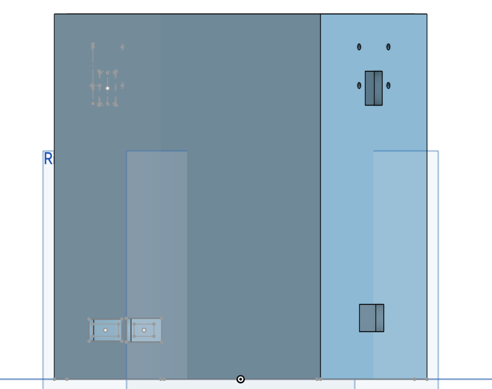
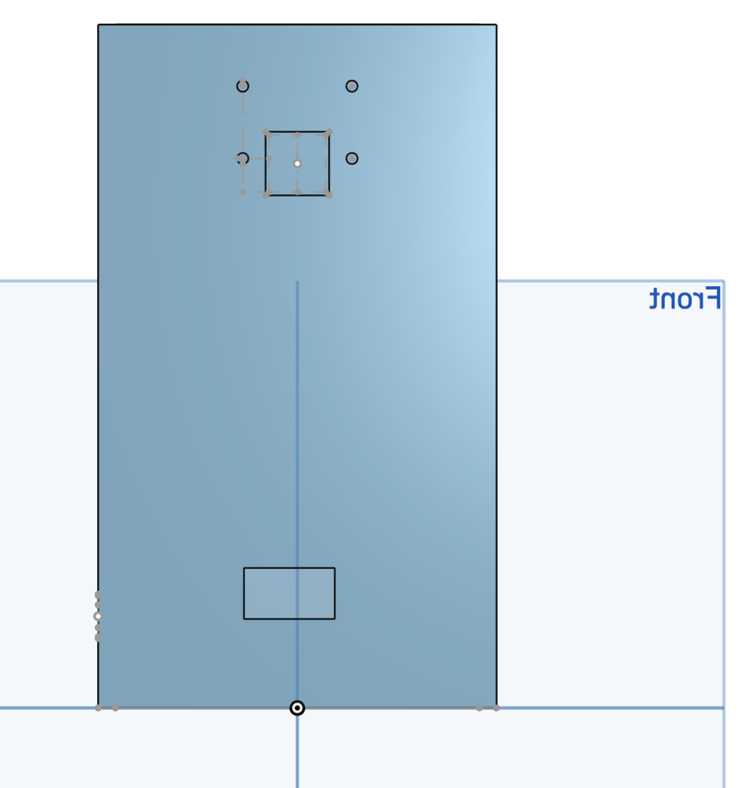
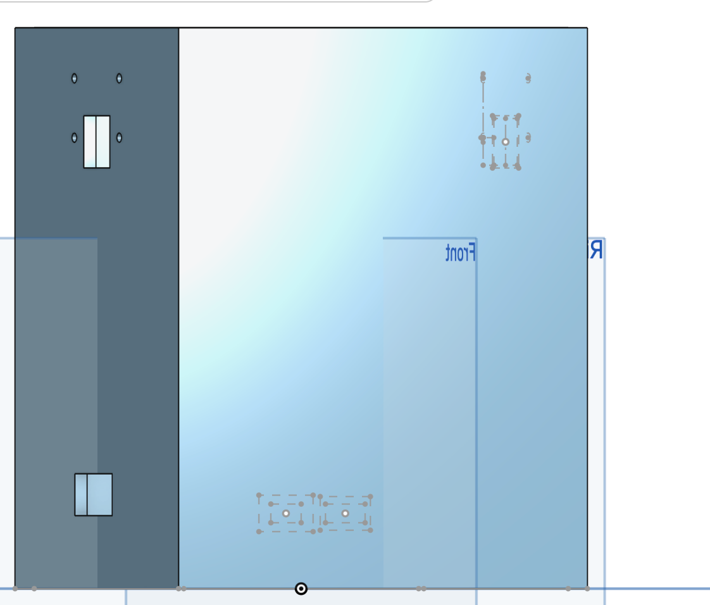
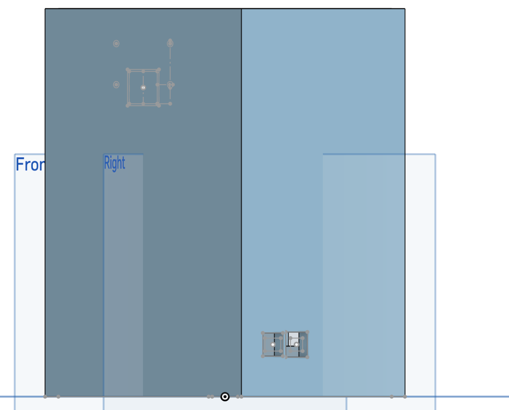

<html lang="en">
<head>
<meta charset="UTF-8">
<meta name="viewport" content="width=device-width, initial-scale=1.0">
<title>Facial Recognition System — Aarush H</title>
<link rel="preconnect" href="https://fonts.googleapis.com">
<link rel="preconnect" href="https://fonts.gstatic.com" crossorigin>
<link href="https://fonts.googleapis.com/css2?family=Bricolage+Grotesque:opsz,wght@12..96,400;12..96,600;12..96,700;12..96,800&family=Public+Sans:ital,wght@0,400;0,500;0,600;1,400&display=swap" rel="stylesheet">

</head>
<body>

<nav>
  

    Facial Recognition System
    <a href="#milestones">Milestones</a>
    <a href="#challenges">Challenges</a>
    <a href="#schematics">Schematics</a>
    <a href="#code">Code</a>
    <a href="#parts">Parts</a>
  

</nav>

<header class="hero" id="build">
  

    

      
Computer Engineering · BlueStamp

      <h1 class="title">Facial Recognition System</h1>
      
A Raspberry Pi that recognizes people at a distance in real time, using a 64-megapixel camera, digital zoom, and machine learning, with live confidence scoring on every face.

      

        

Engineer

Aarush H

        

School

Evergreen Valley High

        

Interest

Computer Engineering

        

Grade

Incoming Senior

      

      

        <a class="btn solid" href="#milestones">See how it was built</a>
        <a class="btn" href="#code">Read the code</a>
      

    

    

      <canvas id="sensor"></canvas>
      
REC&nbsp;CAST IDENTIFICATION · buffalo_l · 512-D

    

  

  

    

0

Detection range

    

0

Camera sensor

    

0

Face embedding

  

</header>

<main class="wrap">
<!-- ============ MILESTONES ============ -->
<section id="milestones">
  
01<h2>Milestones</h2>

  

    

      
Second Milestone<h3>Putting names on the live feed</h3>

      
<iframe src="https://www.youtube.com/embed/xFbNuY9iE_g" title="Second milestone" allowfullscreen loading="lazy"></iframe>

      

        
—Trained the model on images in the dataset using Python, allowing the live feed to show people's names

        
—Surprised by how much data the model needs, only 200 pictures of 4 people in the dataset wasn't enough to allow the model to recognize people past 3 feet

        
—Initially the live feed was extremely zoomed in, so I adjusted the resolution to fit the monitor and then added more people to the dataset to improve the accuracy of the model

        
—The next goal is to detect a person from across the classroom, around 10 meters

      

    

    

      
First Milestone<h3>Capturing and organizing faces</h3>

      
<iframe src="https://www.youtube.com/embed/wKA9XhxVHsE" title="First milestone" allowfullscreen loading="lazy"></iframe>

      

        
—Set up OpenCV and Python scripts that capture photos on spacebar press and organize them into named folders so the model can associate names with faces

        
—The quality of the camera was worse than expected only ever sharp when the subject was directly in front of it

        
—Some of the captured images became corrupted silently causing me to have to mass delete entire batches of images as there was no way of knowing which were corrupted

        
—Next goal is to detect myself and at least one other person

      

    

    

      
Starter Milestone<h3>Retro arcade build</h3>

      

        
—Built retro arcade device by connecting a battery to the metal contacts on the back of the device, soldering the side charging port and buttons (movement and reset), then finally putting it all together in the acrylic case with the screws.

      

    

  

</section>

<!-- ============ CHALLENGES ============ -->
<section id="challenges">
  
02<h2>Challenges &amp; Fixes</h2>

  
The real problems, and how each one got solved. Tap any card to open it. Most of the project was closing the gap between a model that works in theory and one that works in real time on cheap hardware.

  

    

      
DistanceFaces at a distance+

      

        
<b>The problem.</b> A face 3 feet away was too few pixels for the model to recognize.

        
<b>The fix.</b> The 64 MP sensor holds far more detail than the screen shows. Instead of stretching a tiny image and losing detail, I crop into the sensor to grab a face and its hundreds of pixels. That digital zoom runs on the = and - keys, works automatically, and later gained manual pan (T/F/G/B) to look around the frame without moving the camera.

      

    

    

      
DataBlurry, corrupted training photos+

      

        
<b>The problem.</b> The camera was only sharp head-on, and some saved photos corrupted silently.

        
<b>The fix.</b> Autofocus fires before every shot, with a cooldown so it never triggers twice in a row. Saving at high resolution with a set quality stopped the silent corruption for good.

      

    

    

      
DataNot enough training data+

      

        
<b>The problem.</b> 200 photos of 4 people worked up close but failed at 3 feet.

        
<b>The fix.</b> I shot more of myself from many angles and distances, then used augmentation to turn each photo into 6: flipped, brighter, darker, rotated. That teaches the model more lighting and angles without more photo sessions.

      

    

    

      
EngineSwitching the recognition engine+

      

        
<b>The problem.</b> The first engine (face_recognition + MediaPipe) worked up close but failed at distance and high accuracy.

        
<b>The fix.</b> I moved to InsightFace with the buffalo_l model. It turns a face into a list of 512 numbers, an embedding that acts like a fingerprint. Comparing embeddings tells the program which face is which.

      

    

    

      
SpeedThe model was too slow+

      

        
<b>The problem.</b> InsightFace takes close to a second per recognition on the Pi, and the box froze while it ran.

        
<b>The fix.</b> I split the work across three threads. One finds faces fast and draws boxes, a second runs the slow recognition and fills in names a beat later, and the main loop follows each face every frame with a template tracker. Box refresh got about 3× faster because detection no longer waits on recognition.

      

    

    

      
TrackingBoxes stuck to the wall+

      

        
<b>The problem.</b> The named box drifted off my face onto the wall behind me.

        
<b>The fix.</b> Three guards. The tracker checks a patch has real texture, and a wall has none. Any box the detector stops confirming is removed on a timer. And the detector raises its confidence bar so shadows aren't read as faces.

      

    

    

      
TrackingThe box showed where I used to be+

      

        
<b>The problem.</b> The detector is about a second behind, so its box lagged when I moved.

        
<b>The fix.</b> The fast tracker owns the box position in real time; the slow detector only supplies the name and corrects size. On top of that, each detection is projected forward by my measured speed to where I am now, so the box snaps onto my current position, not my old one.

      

    

    

      
TrackingLost boxes and duplicates+

      

        
<b>The problem.</b> Moving fast dropped the box, and sometimes one person got a second box elsewhere on screen.

        
<b>The fix.</b> The tracker coasts through brief failures, gliding at my last speed so a quick move or head turn doesn't drop it. A hard distance cap stops a lost box from flying across the screen, and duplicate suppression removes a stale second box with the same name. Two real people always stay separate.

      

    

    

      
MeasureDistance, height, speed, age+

      

        
<b>The problem.</b> Once tracking was solid, I wanted real measurements from the face box.

        
<b>The fix.</b> Distance comes from apparent face size, calibrated by standing at 1 m and pressing D. Height comes from where the head sits relative to the camera's optical axis, calibrated with K. Speed uses the face as an on-screen ruler. Age and gender come from the model's built-in estimator. The hard part was keeping distance and height accurate at zoom, because zooming and panning move the optical axis off the center of the frame.

      

    

    

      
MemoryRunning out of memory+

      

        
<b>The problem.</b> Full resolution ran the Pi out of memory.

        
<b>The fix.</b> Cap the full-mode request, hold fewer frame buffers, and allocate no raw buffers. If the camera can't start in high-res mode, it falls back to a lower one instead of crashing.

      

    

    

      
PortablePortable and headless+

      

        
<b>The problem.</b> I wanted it to run on a power bank with no monitor.

        
<b>The fix.</b> It streams the feed to a phone or laptop browser over WiFi, can join a phone hotspot to work anywhere, and auto-detects when there's no display so it streams only.

      

    

    

      
BugsSmall bugs along the way+

      

        
<b>The problem.</b> Everyone showed up with blue faces, and age readings were wildly off.

        
<b>The fix.</b> Blue faces were a red/blue channel swap in the color conversion, fixed by swapping them back. Age was wrong until I fed that model the color order it actually expects, kept separate from the recognition path.

      

    
  

</section>

<!-- ============ SCHEMATICS ============ -->
<section id="schematics">
  
03<h2>Schematics</h2>

  
The 3D-printed case and mounting, drawn in Onshape. Placeholder tiles are reserved for shots still to come.

  

    <figure></figure>
    <figure></figure>
    <figure></figure>
    <figure></figure>
    <figure>
Slot 05
</figure>
    <figure>
Slot 06
</figure>
    <figure>
Slot 07
</figure>
    <figure>
Slot 08
</figure>
  

</section>

<!-- ============ CODE ============ -->
<section id="code">
  
04<h2>The Code</h2>

  
Three scripts run the whole system. Each is collapsed to keep the page light. Click a bar to expand, or use Copy to grab the file.

  

    <b>=</b> zoom in<b>-</b> zoom out
    <b>A</b> auto zoom<b>T F G B</b> pan
    <b>V</b> re-center<b>H</b> sensor
    <b>E</b> encodings<b>D</b> calib distance
    <b>K</b> calib height<b>I</b> info
    <b>R</b> reload<b>L</b> screenshot
    <b>S</b> zones<b>C</b> clear
    <b>Q</b> quit
  

  

    
face_rec-picam.py — the main recognition system 3034 lines · click to expand

    

      <button class="copy" data-src="c-main">Copy</button>
      <pre><code id="c-main"># ---------------------------------------------------------------------
#  THREAD BUDGET  (must run BEFORE onnxruntime / OpenCV are imported)
#
#  The Pi 4 has 4 cores. Left alone, ONNX gives the detector 4 threads,
#  the embedder another 4, and OpenCV takes 4 more in the display loop.
#  That is 12 threads fighting over 4 cores, so the display loop gets
#  starved. The tracker runs in that loop, which is why the box stutters
#  and drops lock exactly when recognition is busy.
#
#  Capping each pool leaves a core free for the display loop. Detection
#  barely slows, because it was never really getting 4 cores anyway.
#  Raise these only if you move to a Pi 5.
# ---------------------------------------------------------------------
import os
ONNX_THREADS = 2
os.environ.setdefault(&quot;OMP_NUM_THREADS&quot;, str(ONNX_THREADS))
os.environ.setdefault(&quot;OPENBLAS_NUM_THREADS&quot;, str(ONNX_THREADS))
os.environ.setdefault(&quot;MKL_NUM_THREADS&quot;, str(ONNX_THREADS))

import cv2
cv2.setNumThreads(2)            # leave headroom for the ONNX workers

import numpy as np
from picamera2 import Picamera2
from libcamera import controls, Transform
import time
import pickle
import subprocess
import json
from queue import Queue, Full, Empty
import socket
from http.server import BaseHTTPRequestHandler, ThreadingHTTPServer
from urllib.parse import urlparse, parse_qs
from collections import deque, Counter
from insightface.app import FaceAnalysis
from insightface.app.common import Face
from threading import Thread, Lock

# =====================================================================
#  FACE RECOGNITION v2
#
#  What changed vs v1:
#  1. FEED QUALITY AT ZOOM
#     - Sensor mode auto-switches to FULL resolution at high zoom, so
#       ScalerCrop pulls detail from the full sensor readout instead
#       of a binned mode. Big sharpness gain past ~3x.
#     - RAM friendly: the full-mode request is capped at 3840x2160,
#       no raw buffers are allocated (sensor hint instead of a raw
#       stream), and FULL mode runs with 2 buffers. If allocation
#       still fails, the script drops back to BINNED on its own.
#     - Main (recognition) stream raised to 1920x1080.
#     - Display lores stream raised to 1024x576 (was 640x480 upscaled).
#  2. SPEED
#     - Detection decoupled from embedding. Every pass runs the fast
#       SCRFD detector; the heavy ArcFace embedding only runs when a
#       face is new or its identity is stale. Boxes refresh several
#       times per second instead of once per full pass.
#     - Optional: set MODEL_PACK = &quot;buffalo_s&quot; for a 3-5x speedup
#       (requires re-running enrollment, embeddings differ per pack).
#  3. ACCURACY
#     - No more cv_scaler downscale before detection (v1 shrank the
#       frame 3-4x, which destroyed small/far faces).
#     - Margin test: best match must beat the best OTHER person by
#       MATCH_MARGIN, cuts sibling/family mix-ups.
#     - Per-track name voting over the last 5 identifications, stops
#       label flicker.
#     - Small zone crops get a 2x cubic upscale before detection.
#     - Fixed a vertical scale bug in box placement (v1 used the X
#       scale factor for Y).
#     - Stored encodings are L2-normalized at load, so cosine scores
#       are always on a proper 0..1 scale.
#  4. SELECTION TOOL
#     - Freeze frame now comes from the full-res MAIN stream (sharp),
#       not the upscaled lores stream (blurry).
#     - Crosshair, live pixel dimensions while dragging, a magnifier
#       loupe at native resolution, and a high-res preview panel of
#       the last zone drawn.
#     - Right-click deletes the zone under the cursor. ESC or S
#       confirms and exits.
#
#  GHOST BOX PATCH
#     - Tracks now expire after TRACK_MAX_MISSES detector passes
#       without a confirming detection. Before, a drifted template
#       could pin a named box to a wall forever.
#     - Template matching threshold raised to 0.55 and low-texture
#       patches are rejected, so templates stop sticking to flat
#       walls.
#     - Detector confidence floor raised to 0.60.
#     - Cached identities only transfer to detections of similar
#       size, and camera moves or zone edits flush stale tracks and
#       cached identities.
#
#  RESPONSIVENESS PATCH
#     - Main stream back to 720p so the loop runs fast and the box
#       keeps up with you. Zoom detail still comes from the full-res
#       sensor crop, not this stream.
#     - Tracker restored to early-version feel: low match threshold
#       and a template that refreshes every frame, so the box follows
#       through motion blur instead of losing lock.
#     - Motion predictor shifts the search window ahead of a moving
#       face, so quick head movement no longer drops the box.
#     - Drift correction: a detection nudges the box only when it is
#       close (you are still); when far it is treated as stale and
#       never yanks the box. Keeps the box centered without lag.
#     - Roughly symmetric head expansion, so your face sits centered
#       in the drawn box.
#     - R reloads: clears tracks and identities and re-detects, for
#       when a box is stuck or a face is missed.
#
#  VOICE ANNOUNCEMENTS
#     - Offline Piper TTS speaks &quot;&lt;Name&gt; detected.&quot; over the speaker
#       when a known face appears above 60% confidence. New arrivals
#       only; a name re-announces after being gone 5s. Rendering is
#       cached per name, playback runs on its own thread so the video
#       never stalls. See the setup notes above ANNOUNCE_ENABLED.
#
#  Intended for recognizing enrolled household members on your own
#  hardware.
# =====================================================================

# =========================== TUNABLES ================================
MAIN_W, MAIN_H = 1280, 720      # recognition stream. 720p keeps the
                                # loop fast so the tracker follows you
                                # smoothly. Quality at zoom still comes
                                # from the full-res SENSOR crop, not
                                # this stream. Raise to 1600x900 only
                                # if you need more far-face detection
                                # and can spare the frame rate.
LORES_W, LORES_H = 1024, 576    # display source stream. MUST keep the
                                # same aspect ratio as MAIN (16:9), or
                                # the ISP may letterbox/crop instead of
                                # scaling, and every display-&gt;main
                                # conversion silently gains an unknown
                                # factor. The tiny resize to DISPLAY_H is
                                # worth the certainty.
DISPLAY_W, DISPLAY_H = 1024, 600

MODEL_PACK = &quot;buffalo_l&quot;        # &quot;buffalo_s&quot; is 3-5x faster on CPU but
                                # you must re-run enrollment with the
                                # same pack (embeddings not compatible)
DET_SIZE = (640, 640)           # 512x512 or 480x480 trades small-face
                                # detection for speed

SIMILARITY_THRESHOLD = 0.4      # cosine similarity, higher = stricter
ZONE_THRESHOLD = 0.35
MATCH_MARGIN = 0.03             # best match must beat best other
                                # person by this much

REVERIFY_SEC = 2.5              # re-run embedding on a face this often
MAX_EMBEDS_PER_PASS = 2         # cap heavy ArcFace calls per pass
MIN_FACE_EMBED_PX = 36          # skip embedding on faces smaller than
                                # this (main-frame pixels)
CACHE_SEEN_TTL = 3.0            # drop identity cache entries unseen
                                # this long
CACHE_MATCH_MIN_PX = 320        # how far a face may move between
                                # detection passes and still be
                                # recognised as the same person. Covers a
                                # brisk walk at typical detection rates.
CACHE_MATCH_FACE_FRAC = 3.0     # or this many face-heights, whichever is
                                # larger (close-up faces move further in
                                # pixels for the same real speed)

ZONE_UPSCALE_MIN = 380          # zone crops with min side below this
                                # get a 2x upscale before detection

# Sensor mode switching (feed quality at zoom)
ZOOM_FULLRES_ON = 3.0           # go to full-res sensor above this zoom
ZOOM_FULLRES_OFF = 2.2          # back to binned below this (hysteresis)
SENSOR_SWITCH_COOLDOWN = 4.0    # min seconds between mode switches
SENSOR_MAX_REQ = (3840, 2160)   # 4K cap on the full-mode request.
                                # The driver maps this onto the nearest
                                # real sensor readout.
BUFFERS_BINNED = 3              # camera buffers per stream
BUFFERS_FULL = 2                # keep FULL mode lean on RAM

# Display color path. This matches v1, which rendered skin tones
# correctly on the Pi ISP. If faces ever look blue or orange, swap
# RGB &lt;-&gt; BGR here (one line, nothing else changes).
LORES_COLOR = cv2.COLOR_YUV420p2RGB

FAR_ZOOM_THRESHOLD = 2.5
MAX_ZONES = 3
ZONE_COLORS = [(0, 220, 255), (0, 160, 255), (180, 0, 255)]
ZONE_NAMES = [&quot;ZONE A&quot;, &quot;ZONE B&quot;, &quot;ZONE C&quot;]

# Template tracker. The tracker runs every DISPLAY frame on the live
# image, so it owns box POSITION in real time. The slow detector only
# supplies identity, keeps tracks alive, and corrects box SIZE. This
# split is what stops the box snapping back to where you were a second
# ago when a slow detection finally returns.
TRACK_SEARCH_MARGIN = 120       # px search radius per frame, plus the
                                # motion predictor below, so fast head
                                # movement stays in range
MATCH_THRESHOLD = 0.30          # min correlation to MOVE the box. Kept
                                # low so the box follows through motion
                                # blur. Safe to be this loose because
                                # duplicate suppression and lag-corrected
                                # snapping now clean up anything wrong
MATCH_THRESHOLD_COAST = 0.20    # easier bar to REGAIN lock while
                                # coasting. Already committed to that
                                # face, so accept a weaker match rather
                                # than stall
PREDICT_GAIN = 0.9              # how much measured velocity shifts the
                                # search window ahead of the face
VEL_SMOOTH = 0.45               # EMA on velocity (px/sec)
COAST_MAX_FRAMES = 22           # frames to dead-reckon through a failed
                                # match before giving up. At ~15 fps this
                                # is ~1.5 s of gliding, which carries the
                                # box through blur or a brief head turn.
COAST_MAX_PX = 160              # floor for how far a box may coast in
                                # total. The real cap scales with face
                                # size (COAST_MAX_FACE_FRAC), because a
                                # close-up face legitimately crosses more
                                # pixels for the same real movement.
                                # Some cap is essential: without one, a
                                # box that lost lock at speed sails clear
                                # across the screen still wearing your
                                # name, which reads as a duplicate.
COAST_MAX_FACE_FRAC = 2.5       # or this many face-widths, whichever is
                                # larger
COAST_VEL_DECAY = 0.80          # bleed velocity off per coasted frame.
                                # A coasting box has no evidence you are
                                # still moving, so it should ease to a
                                # stop rather than cruise on forever.
# Template refresh adapts to motion. Standing still, refresh slowly so
# the template cannot walk off your face (anti-drift). Moving, refresh
# fast so the template stays blurred like your face is (anti-stutter).
# One blend rate cannot do both, which is what broke tracking before.
TEMPLATE_BLEND_STILL = 0.15
TEMPLATE_BLEND_MOVING = 0.55
BLEND_SPEED_FULL = 350.0        # px/sec at which the moving blend is
                                # fully applied
MIN_TEMPLATE_STD = 12.0         # tracked patch must have texture, so
                                # templates never latch onto flat walls
RESEED_SEARCH_MARGIN = 300      # a LAGGED detection still associates
                                # with your moved box instead of
                                # spawning a phantom track behind you
SPAWN_MIN_DIST = 50             # floor for the spawn guard, in px. The
                                # real guard scales with face size (see
                                # spawn_guard_px), because a fixed guard
                                # blocks two real people standing close
                                # together at distance from each getting
                                # their own box
SPAWN_FACE_FRAC = 0.9           # spawn guard = this * detected face height
# Duplicate suppression. Two boxes on one person happen when a template
# drifts onto a shoulder or hair and holds while the detector spawns a
# fresh track on the real face. This is NMS for tracks: overlapping or
# co-located tracks collapse to the one the detector confirmed most
# recently.
TRACK_MERGE_IOU = 0.35          # boxes overlapping more than this merge
TRACK_MERGE_CENTER_FRAC = 0.55  # or centers closer than this * face size
# Same-name duplicates are only removed when the copy is STALE, meaning
# the detector is not currently confirming it. Two live people who get
# briefly misidentified as each other must both keep their boxes.
SAME_NAME_STALE_SEC = 1.2
SAME_NAME_STALE_MISSES = 2
TRACK_UNCONFIRMED_SEC = 6.0     # hard time limit since the detector last
                                # confirmed a track. This is the real
                                # backstop against ghosts. Raised because
                                # a box vanishing for a few seconds and
                                # coming back is worse than a box that
                                # lingers slightly too long, and the
                                # duplicate suppressor removes wrong ones
                                # within a frame anyway.
# Lag compensation. The detector reports where a face WAS at capture
# time, typically ~1s ago on a Pi. Rather than blend partway toward that
# stale position (which leaves a permanent offset, so the box settles
# onto a neck or shoulder), project the detection forward by the
# tracker&#x27;s measured velocity and snap the box onto it. Correct position
# AND no yank, instead of a compromise between the two.
LAG_COMPENSATE = True
LAG_MAX_SEC = 1.5               # ignore absurd lags (worker hiccup)
LAG_MAX_SHIFT_PX = 400          # cap the projection, so a wild velocity
                                # estimate cannot fling the box
SNAP_BLEND = 0.9                # how hard to snap onto the (projected)
                                # detection. High on purpose: detection
                                # is ground truth for position once the
                                # lag is removed
SIZE_BLEND = 0.35               # how fast the box grows/shrinks toward
                                # the detected face size (0..1 per pass)
TRACK_MAX_MISSES = 12           # detector passes with no matching
                                # detection before a track is removed.
                                # TRACK_UNCONFIRMED_SEC is the real
                                # backstop, so this can be generous
IDENTITY_STALE_SEC = 5.0
NAME_VOTE_LEN = 5
DET_CONFIDENCE = 0.60           # SCRFD score floor. Default 0.5 lets
                                # wall textures and shadows through
PENDING = &quot;&quot;                    # placeholder name before the first ID

# Box framing. SCRFD boxes hug eyebrows to chin. Expansion is close to
# symmetric so your face sits CENTERED in the drawn box, with just a
# little extra on top for hair.
BOX_EXPAND_X = 0.18             # total width growth
BOX_EXPAND_TOP = 0.24           # upward growth (forehead, hair)
BOX_EXPAND_BOTTOM = 0.20        # downward growth (chin, jaw)

# Auto framing. Faces smaller than this (main-frame px) do not steer
# the auto zoom or pan, so a one-pass false detection at the frame
# edge no longer yanks the camera.
# =====================================================================
#  MANUAL PAN  (&quot;look around&quot; without moving the camera)
#
#  The sensor is far larger than the view, so at any zoom above 1x there
#  is real image sitting outside the frame. These controls slide the
#  crop around inside it, which looks exactly like panning a camera on a
#  tripod, except nothing physically moves.
#
#    T F G B           pan up / left / right / down   (letter keys, so
#                      no numpad or working arrows needed)
#    V                 re-centre the view
#    Arrow keys        same, if your OpenCV build passes them through
#    8 4 6 2 / 5       same again, numpad-style
#
#  T F G B sits as a diamond on the keyboard:  F and G are side by side
#  for left/right, T is above them, B below.
#
#  Panning switches auto-zoom OFF, otherwise auto-pan fights you for the
#  wheel. Press A to hand control back.
#
#  NOTE: at 1.0x zoom the crop already covers the whole sensor, so there
#  is nowhere to pan to. Zoom in first, then look around.
#
#  If a direction feels backwards on your camera, flip the matching
#  invert below. The camera Transform (HFLIP/VFLIP) can reverse these
#  depending on how the module is mounted.
# =====================================================================
PAN_STEP = 0.12                 # fraction of the current VIEW to move
                                # per keypress. Independent of zoom, so
                                # a press always shifts the picture by
                                # the same amount on screen.
PAN_INVERT_X = False            # set True if left/right feel swapped
PAN_INVERT_Y = False            # set True if up/down feel swapped

# Arrow key codes differ by OpenCV backend, so accept the known sets.
# Deliberately NOT including the legacy 81-84 codes: those collide with
# uppercase Q, R, S and T, which are already bound.
PAN_KEYS_UP = (65362, 16777235, 2490368, 63232)
PAN_KEYS_DOWN = (65364, 16777237, 2621440, 63233)
PAN_KEYS_LEFT = (65361, 16777234, 2424832, 63234)
PAN_KEYS_RIGHT = (65363, 16777236, 2555904, 63235)

AUTO_MIN_FACE_PX = 30

# =====================================================================
#  PORTABLE / BROWSER STREAM  (full quality, no throttling for now)
#
#  Runs the Pi with no monitor, powered by a battery, viewed from a
#  laptop or phone browser. Standard library only, so nothing to pip
#  install in the field.
#
#  Testing full quality first on purpose. If the feed lags or the Pi
#  throttles, drop STREAM_MAX_FPS and STREAM_QUALITY, or gate the frame
#  rate on whether a face is present. Not doing any of that yet.
#
#  ---- ONE-TIME: join your phone hotspot ----
#    Phone hotspot ON, then on the Pi (while on home WiFi or a monitor):
#      sudo nmcli device wifi connect &quot;HOTSPOT_NAME&quot; password &quot;PASSWORD&quot;
#    It reconnects automatically after that. Home WiFi still works too;
#    the Pi joins whichever is in range.
#
#  ---- USING IT ----
#    1. Hotspot ON, power the Pi, wait ~30 s.
#    2. Find the Pi&#x27;s IP: phone hotspot client list, or `hostname -I`.
#    3. Browse to  http://&lt;pi-ip&gt;:8000  from any device on the network.
#    4. Run under tmux so it survives an SSH disconnect:
#         tmux
#         python3 face_recognition_v2.py
#       Detach with Ctrl-B then D. Reattach with `tmux attach`.
#
#  Headless is auto-detected: no DISPLAY means no monitor, so the
#  OpenCV window is skipped. Force it with HEADLESS below.
#
#  ---- POWER (Pi 4) ----
#  Needs 5V/3A. A weaker bank browns out under load and reboots at
#  random, which looks like a crash. Check:  vcgencmd get_throttled
#  (0x0 is healthy). Fit a heatsink; a throttled Pi tanks FPS and
#  brings back the tracking problems.
# =====================================================================
STREAM_ENABLED = True
STREAM_PORT = 8000
STREAM_QUALITY = 90             # JPEG quality 1-100. High on purpose for
                                # this first test. Lower it if the feed
                                # or recognition struggle.
STREAM_MAX_FPS = 30             # no real throttle for now; the display
                                # loop rarely exceeds this on a Pi 4
HEADLESS = None                 # None = auto-detect from DISPLAY.
                                # True forces no window, False forces one

# =====================================================================
#  DISTANCE ESTIMATION
#
#  A face that covers more pixels is closer. With the pinhole model,
#  distance = DIST_C / apparent_size, where apparent_size is the face
#  box size normalized for the digital zoom. DIST_C bundles the focal
#  length and real face size into one number.
#
#  Two people are rarely the same face size, so the accurate path is a
#  one-time calibration: stand at DIST_CALIB_CM from the camera with
#  your face the largest in frame and press D. That reading is saved to
#  DIST_CALIB_FILE and reused on every future run. Until you calibrate,
#  a rough default is used and the readout is marked with a ~.
#
#  Caveats: tilting your head up or down changes the box size a little,
#  so expect a few percent wobble. Calibrate with the face you care
#  about most for best accuracy.
# =====================================================================
DIST_ENABLED = True
DIST_UNITS = &quot;ft&quot;               # &quot;ft&quot; or &quot;m&quot;
DIST_CALIB_CM = 100.0           # the known distance you stand at when
                                # you press D to calibrate
DIST_CALIB_FILE = &quot;dist_calib.json&quot;
DIST_CALIB_VERSION = 3          # bump whenever the units of DIST_C
                                # change, so a stale file is ignored
                                # instead of silently giving wrong
                                # numbers. v3 = display pixels (the
                                # original, self-consistent units).
DIST_C_DEFAULT = 8000.0         # rough uncalibrated constant
DIST_SMOOTH = 0.3               # EMA on the readout so it does not jitter

# =====================================================================
#  SPEED / HEIGHT / AGE
#
#  All three are derived FROM the face box, so they only exist while a
#  face is detected. None of them work on a person facing away.
#
#  Speed uses the face itself as an on-screen ruler: a face is roughly
#  FACE_REAL_CM across, so cm-per-pixel = FACE_REAL_CM / face_px. Zoom
#  cancels out because both terms are measured on the same image. The
#  readout combines lateral motion (across frame) with radial motion
#  (toward or away, from the change in distance).
#
#  Height uses the pinhole projection of the head-top against a LEVEL
#  camera at a known mount height:
#      Y = CAM_HEIGHT_CM + dy_px * distance / (zoom * focal_px)
#  Accuracy depends on CAM_HEIGHT_CM being right and the camera being
#  level. Tilt the camera and the number is wrong. Measure your mount
#  height and set it below. Expect a few inches of error at best.
# =====================================================================
FACE_REAL_CM = 16.5             # nominal face size, sqrt(width*height)
CAM_HEIGHT_CM = 100.0           # camera lens height above the floor.
                                # Do not guess. Either measure floor to
                                # LENS CENTER, or stand in view and
                                # press K to solve for it (see below).
MY_HEIGHT_CM = 178.0            # YOUR height, for the K calibration.
                                # 178 cm = 5 ft 10 in. Set this to your
                                # real height before pressing K.
SPEED_ENABLED = True
SPEED_SMOOTH = 0.25             # EMA on the speed readout
SPEED_MIN_SHOW = 0.3            # ft/s below this reads as &quot;still&quot;
HEIGHT_ENABLED = True
HEIGHT_SMOOTH = 0.15            # heavier smoothing, height should be
                                # stable for a given person
AGE_ENABLED = True              # buffalo_l ships a genderage model
AGE_MIN_FACE_PX = 70            # skip age on faces smaller than this.
                                # genderage needs real detail; a 36px
                                # face gives a number, but a meaningless
                                # one. Recognition still runs on smaller
                                # faces, this only gates age/gender.
AGE_VOTE_LEN = 9                # age is noisy frame to frame, so report
                                # the median of the last N readings and
                                # the majority gender
INFO_MODE_DEFAULT = &quot;full&quot;      # basic / full, toggled with I.
                                # &quot;full&quot; shows the speed / height /
                                # age line under each box, the optical
                                # axis, and the detection lag readout.
                                # &quot;basic&quot; hides all of that.

# Name freshness. A track keeps its voted name after the detector stops
# confirming it, which is what makes the label survive a head turn. The
# stored confidence goes stale though, so past this many seconds the box
# greys out and shows &quot;?&quot; instead of a percentage that is no longer
# true. The track itself lives until TRACK_UNCONFIRMED_SEC.
# This is memory of who that box was, NOT recognition of a turned face.
# Real back-turned ID needs a person re-identification model, which this
# project does not have.
NAME_FRESH_SEC = 6.0            # show &quot;?&quot; only when the name really is
                                # stale. MUST stay well above
                                # REVERIFY_SEC (2.5) plus embed latency,
                                # or every re-verify cycle flashes a grey
                                # &quot;?&quot; on a perfectly tracked face.

# =====================================================================
#  VOICE ANNOUNCEMENTS (Piper, offline)
#
#  ONE-TIME SETUP ON THE PI:
#    1. Install Piper (pick one):
#         pipx install piper-tts
#       or
#         pip install piper-tts --break-system-packages
#    2. Download the en_US-amy-medium voice (two files, same folder):
#         mkdir -p ~/piper_voices &amp;&amp; cd ~/piper_voices
#         wget https://huggingface.co/rhasspy/piper-voices/resolve/main/en/en_US/amy/medium/en_US-amy-medium.onnx
#         wget https://huggingface.co/rhasspy/piper-voices/resolve/main/en/en_US/amy/medium/en_US-amy-medium.onnx.json
#    3. Make sure a WAV plays out your speaker:
#         speaker-test -t wav -c2   (Ctrl-C to stop), or aplay some.wav
#       If it comes out the wrong jack: sudo raspi-config &gt; System &gt; Audio.
#
#  The script renders &quot;&lt;Name&gt; detected.&quot; to a cached WAV the first time
#  each name is needed, then just replays the file. If Piper or the
#  voice model is missing, announcements are disabled with a clear
#  message and the rest of the program runs normally.
# =====================================================================
ANNOUNCE_ENABLED = True
PIPER_VOICE = os.path.expanduser(&quot;~/piper_voices/en_US-amy-medium.onnx&quot;)
TTS_CACHE_DIR = &quot;tts_cache&quot;
ANNOUNCE_MIN_CONFIDENCE = 60.0  # only speak above this confidence
ANNOUNCE_GONE_SEC = 5.0         # a name must be absent this long before
                                # it can be announced again on return
ANNOUNCE_PHRASE = &quot;{name} detected.&quot;

# ======================= LOAD ENCODINGS ==============================
print(&quot;[INFO] loading encodings...&quot;)

def l2norm_rows(a):
    a = np.asarray(a, dtype=np.float32)
    n = np.linalg.norm(a, axis=1, keepdims=True)
    n[n == 0] = 1.0
    return a / n

with open(&quot;encodings_close.pickle&quot;, &quot;rb&quot;) as f:
    data_close = pickle.loads(f.read())
known_face_encodings_close = l2norm_rows(data_close[&quot;encodings&quot;])
known_face_names_close = list(data_close[&quot;names&quot;])
known_face_names_close_arr = np.array(known_face_names_close)
print(f&quot;[INFO] close: {len(set(known_face_names_close))} people, &quot;
      f&quot;{len(known_face_names_close)} encodings&quot;)

if os.path.exists(&quot;encodings_far.pickle&quot;):
    with open(&quot;encodings_far.pickle&quot;, &quot;rb&quot;) as f:
        data_far = pickle.loads(f.read())
    known_face_encodings_far = l2norm_rows(data_far[&quot;encodings&quot;])
    known_face_names_far = list(data_far[&quot;names&quot;])
    known_face_names_far_arr = np.array(known_face_names_far)
    HAS_FAR_ENCODINGS = True
    print(f&quot;[INFO] far: {len(set(known_face_names_far))} people, &quot;
          f&quot;{len(known_face_names_far)} encodings&quot;)
else:
    known_face_encodings_far = known_face_encodings_close
    known_face_names_far = known_face_names_close
    known_face_names_far_arr = known_face_names_close_arr
    HAS_FAR_ENCODINGS = False
    print(&quot;[WARN] encodings_far.pickle not found - using close &quot;
          &quot;encodings for all distances&quot;)

# ========================= INSIGHTFACE ===============================
print(f&quot;[INFO] loading InsightFace ({MODEL_PACK})...&quot;)
_modules = [&quot;detection&quot;, &quot;recognition&quot;]
if AGE_ENABLED:
    _modules.append(&quot;genderage&quot;)
app = FaceAnalysis(
    name=MODEL_PACK,
    allowed_modules=_modules,
    providers=[&quot;CPUExecutionProvider&quot;]
)
app.prepare(ctx_id=-1, det_size=DET_SIZE, det_thresh=DET_CONFIDENCE)
rec_model = app.models.get(&quot;recognition&quot;)
if rec_model is None:
    raise RuntimeError(&quot;Recognition model missing from pack &quot;
                       f&quot;&#x27;{MODEL_PACK}&#x27;&quot;)
ga_model = app.models.get(&quot;genderage&quot;) if AGE_ENABLED else None
_ga_warned = False              # one-shot flag for genderage errors

def warmup_models():
    &quot;&quot;&quot;Run one throwaway inference through every model at startup.

    ONNX Runtime builds and optimises its graph on the FIRST inference,
    and allocates its arenas then too. Without this, the first real face
    pays that cost, which is why the very first box and the very first
    name take noticeably longer than the rest. Doing it here on a blank
    image moves the cost to load time, where nobody is waiting on it.&quot;&quot;&quot;
    t0 = time.time()
    blank = np.zeros((DET_SIZE[1], DET_SIZE[0], 3), dtype=np.uint8)
    try:
        app.det_model.detect(blank, max_num=0, metric=&quot;default&quot;)
    except Exception as e:
        print(f&quot;[WARN] detector warmup failed: {e}&quot;)
    # Feed the recognition/genderage models a synthetic face-shaped box
    # so their sessions initialise too.
    try:
        f = Face(bbox=np.array([100, 100, 200, 240], dtype=np.float32),
                 kps=np.array([[130, 150], [170, 150], [150, 180],
                               [132, 205], [168, 205]], dtype=np.float32),
                 det_score=0.99)
        rec_model.get(blank, f)
        if ga_model is not None:
            ga_model.get(blank, f)
    except Exception as e:
        print(f&quot;[WARN] recognition warmup failed: {e}&quot;)
    print(f&quot;[INFO] models warmed up in {time.time() - t0:.1f}s &quot;
          &quot;(first real face is now fast)&quot;)
if AGE_ENABLED and ga_model is None:
    print(&quot;[WARN] genderage model not in pack - age/gender OFF&quot;)
warmup_models()
print(&quot;[INFO] InsightFace ready&quot;)

def detect_only(rgb):
    &quot;&quot;&quot;Fast pass: SCRFD detection only. Returns (bboxes Nx5, kpss).&quot;&quot;&quot;
    bboxes, kpss = app.det_model.detect(rgb, max_num=0, metric=&quot;default&quot;)
    return bboxes, kpss

def compute_embedding(rgb, bbox, kps, det_score):
    &quot;&quot;&quot;Heavy pass: ArcFace 512-D embedding for one detected face, plus
    age/gender if that model is loaded (same aligned face, so running
    it here costs one extra small inference instead of a second pass).
    Returns (embedding, age, gender) with age/gender None if disabled.
    NOTE: color handling matches v1 and your enrollment pipeline.
    Do not change the BGR-&gt;RGB conversion unless you re-enroll.&quot;&quot;&quot;
    face = Face(bbox=np.asarray(bbox, dtype=np.float32),
                kps=np.asarray(kps, dtype=np.float32),
                det_score=float(det_score))
    rec_model.get(rgb, face)
    age = gender = None
    if ga_model is not None and (bbox[3] - bbox[1]) &gt;= AGE_MIN_FACE_PX:
        global _ga_warned
        try:
            # COLOR: InsightFace expects BGR (its models swapRB internally).
            # This pipeline passes RGB, inherited from v1, and recognition
            # depends on that staying consistent with enrollment, so it is
            # left alone. But genderage is an ABSOLUTE prediction, not a
            # comparison, so wrong channel order produces wildly wrong
            # ages. Hand this model the BGR it actually wants.
            ga_model.get(cv2.cvtColor(rgb, cv2.COLOR_RGB2BGR), face)
            age = int(face.age) if face.age is not None else None
            # InsightFace: gender 1 = male, 0 = female
            gender = (&quot;M&quot; if int(face.gender) == 1 else &quot;F&quot;) \
                if face.gender is not None else None
        except Exception as e:
            # Report once. Silently swallowing this made a blank age
            # field impossible to diagnose.
            if not _ga_warned:
                print(f&quot;[WARN] genderage inference failed ({e}) - &quot;
                      &quot;age/gender will stay blank&quot;)
                _ga_warned = True
    return face.embedding, age, gender

def match_face(embedding, active_encodings, active_names_arr, threshold):
    &quot;&quot;&quot;Cosine matching with a margin test against other identities.&quot;&quot;&quot;
    if len(active_encodings) == 0:
        return &quot;Unknown&quot;, 0.0
    emb = embedding / np.linalg.norm(embedding)
    sims = active_encodings @ emb
    best_idx = int(np.argmax(sims))
    best_score = float(sims[best_idx])
    best_name = active_names_arr[best_idx]
    other_mask = active_names_arr != best_name
    best_other = float(sims[other_mask].max()) if other_mask.any() else -1.0
    confidence = round(best_score * 100, 1)
    if best_score &gt;= threshold and (best_score - best_other) &gt;= MATCH_MARGIN:
        return str(best_name), confidence
    return &quot;Unknown&quot;, confidence

# =========================== CAMERA ==================================
picam2 = Picamera2()

try:
    SENSOR_NATIVE = tuple(picam2.sensor_resolution)
except Exception:
    SENSOR_NATIVE = tuple(picam2.camera_properties[&quot;PixelArraySize&quot;])
SENSOR_BINNED = (SENSOR_NATIVE[0] // 2, SENSOR_NATIVE[1] // 2)
SENSOR_FULL = (min(SENSOR_NATIVE[0], SENSOR_MAX_REQ[0]),
               min(SENSOR_NATIVE[1], SENSOR_MAX_REQ[1]))
SENSOR_SIZES = {&quot;BINNED&quot;: SENSOR_BINNED, &quot;FULL&quot;: SENSOR_FULL}

# Camera orientation. These feed BOTH the camera Transform and the
# optical-axis math used by height. Keep them in sync by only ever
# changing them here.
HFLIP = True
VFLIP = True

def make_config(sensor_size, buffers):
    &quot;&quot;&quot;The &#x27;sensor&#x27; hint selects the readout mode WITHOUT allocating
    raw buffers to the app. On a Camera Module 3 in full mode this
    saves roughly 60 MB of contiguous memory versus requesting a raw
    stream. Falls back to a raw request on older picamera2.&quot;&quot;&quot;
    common = dict(
        main={&quot;size&quot;: (MAIN_W, MAIN_H), &quot;format&quot;: &quot;RGB888&quot;},
        lores={&quot;size&quot;: (LORES_W, LORES_H), &quot;format&quot;: &quot;YUV420&quot;},
        transform=Transform(hflip=HFLIP, vflip=VFLIP),
        buffer_count=buffers
    )
    try:
        return picam2.create_preview_configuration(
            sensor={&quot;output_size&quot;: sensor_size}, **common)
    except TypeError:
        return picam2.create_preview_configuration(
            raw={&quot;size&quot;: sensor_size}, **common)

CONFIGS = {&quot;BINNED&quot;: make_config(SENSOR_BINNED, BUFFERS_BINNED),
           &quot;FULL&quot;: make_config(SENSOR_FULL, BUFFERS_FULL)}

current_sensor = &quot;BINNED&quot;
sensor_pref = &quot;AUTO&quot;            # AUTO / BINNED / FULL, key H cycles
last_sensor_switch = 0.0

picam2.configure(CONFIGS[current_sensor])
picam2.start()

def af_kick():
    try:
        picam2.set_controls({
            &quot;AfMode&quot;: controls.AfModeEnum.Auto,
            &quot;AfTrigger&quot;: controls.AfTriggerEnum.Start,
            &quot;AfSpeed&quot;: controls.AfSpeedEnum.Fast,
            &quot;AfRange&quot;: controls.AfRangeEnum.Full
        })
        time.sleep(0.4)
        picam2.set_controls({
            &quot;AfMode&quot;: controls.AfModeEnum.Continuous,
            &quot;AfSpeed&quot;: controls.AfSpeedEnum.Fast,
            &quot;AfRange&quot;: controls.AfRangeEnum.Full
        })
    except Exception:
        pass  # sensor without autofocus

time.sleep(1.5)
af_kick()

# ============================ STATE ==================================
zoom_factor = 1.5
encoding_mode = &quot;auto&quot;          # auto / close / far, key E cycles

result_lock = Lock()
face_locations = []             # MAIN-frame coords (top,right,bottom,left)
face_names = []
face_confidences = []
face_zones = []
face_ages = []                  # per-face (age, gender) or None
info_mode = INFO_MODE_DEFAULT   # basic / full, toggled with I
last_result_time = 0.0

auto_zoom_enabled = True
auto_zoom_target = 1.5
auto_zoom_current = 1.5
pan_current_x = 0.5
pan_current_y = 0.5
pan_target_x_abs = 0.5          # absolute sensor-space pan targets,
pan_target_y_abs = 0.5          # stepped once per worker result
consumed_result_time = 0.0
last_applied_zoom = zoom_factor
last_applied_pan_x = 0.5
last_applied_pan_y = 0.5

zones = []                      # display coords
selecting = False
select_start = None
select_current = None
mouse_pos = (DISPLAY_W // 2, DISPLAY_H // 2)
selection_mode = False
frozen_main = None
frozen_display = None

frame_count = 0
start_time = time.time()
fps = 0
processing = False
latest_main_frame = None
latest_frame_meta = (zoom_factor, 0.5, 0.5, 0.0)  # (zoom, panx, pany,
                                                  # capture_time) for the
                                                  # frame handed to the
                                                  # worker
result_meta = (zoom_factor, 0.5, 0.5, 0.0)        # same, for the latest
                                                  # published results
main_frame_lock = Lock()

# Screenshots. L saves exactly what is on screen (boxes, labels, HUD).
SCREENSHOT_DIR = &quot;screenshot&quot;
screenshot_flash_until = 0.0                  # brief on-screen confirm

tracked_faces = []
last_reseed_time = 0.0

identity_cache = []             # worker-only: {cx,cy,h,name,conf,t,seen}

# ============================ ZOOM ===================================
def apply_zoom(z, cxf=0.5, cyf=0.5):
    &quot;&quot;&quot;ScalerCrop in full pixel-array coordinates (valid across sensor
    modes). cxf/cyf: fraction of the sensor to center in the crop.&quot;&quot;&quot;
    fw, fh = picam2.camera_properties[&quot;PixelArraySize&quot;]
    cw = int(fw / z)
    ch = int(fh / z)
    cx = int(cxf * fw - cw / 2)
    cy = int(cyf * fh - ch / 2)
    cx = max(0, min(cx, fw - cw))
    cy = max(0, min(cy, fh - ch))
    picam2.set_controls({&quot;ScalerCrop&quot;: (cx, cy, cw, ch)})

def update_zoom_full(z, cxf=0.5, cyf=0.5):
    apply_zoom(z, cxf, cyf)
    af_kick()

def get_active_encodings():
    &quot;&quot;&quot;Returns (encodings, names_arr, using_far).&quot;&quot;&quot;
    if encoding_mode == &quot;close&quot;:
        return known_face_encodings_close, known_face_names_close_arr, False
    if encoding_mode == &quot;far&quot;:
        if HAS_FAR_ENCODINGS:
            return known_face_encodings_far, known_face_names_far_arr, True
        return known_face_encodings_close, known_face_names_close_arr, False
    if HAS_FAR_ENCODINGS and zoom_factor &gt;= FAR_ZOOM_THRESHOLD:
        return known_face_encodings_far, known_face_names_far_arr, True
    return known_face_encodings_close, known_face_names_close_arr, False

def cycle_encoding_mode():
    global encoding_mode
    if encoding_mode == &quot;auto&quot;:
        encoding_mode = &quot;close&quot;
    elif encoding_mode == &quot;close&quot;:
        encoding_mode = &quot;far&quot; if HAS_FAR_ENCODINGS else &quot;auto&quot;
    else:
        encoding_mode = &quot;auto&quot;
    print(f&quot;[INFO] Encoding mode: {encoding_mode.upper()}&quot;)

# ===================== SENSOR MODE SWITCHING =========================
def switch_sensor(target):
    &quot;&quot;&quot;Reconfigure the camera to a different raw sensor mode. Takes
    about a second. FULL mode gives max detail for ScalerCrop at high
    zoom; on Camera Module 3 the sensor tops out near 14 fps there.&quot;&quot;&quot;
    global current_sensor, last_sensor_switch, tracked_faces, sensor_pref
    global cache_reset
    if target == current_sensor:
        return
    print(f&quot;[INFO] Sensor mode -&gt; {target} ({SENSOR_SIZES[target]})&quot;)
    picam2.stop()
    try:
        picam2.configure(CONFIGS[target])
        picam2.start()
    except Exception as e:
        print(f&quot;[WARN] {target} mode failed ({e}); staying BINNED. &quot;
              &quot;Lower MAIN_W/MAIN_H or raise CMA if this persists.&quot;)
        target = &quot;BINNED&quot;
        sensor_pref = &quot;BINNED&quot;
        picam2.configure(CONFIGS[target])
        picam2.start()
    current_sensor = target
    last_sensor_switch = time.time()
    time.sleep(0.25)
    apply_zoom(zoom_factor, pan_current_x, pan_current_y)
    af_kick()
    tracked_faces = []          # old templates no longer match
    cache_reset = True          # cached identities point at old coords

def desired_sensor():
    if sensor_pref in (&quot;BINNED&quot;, &quot;FULL&quot;):
        return sensor_pref
    if zoom_factor &gt;= ZOOM_FULLRES_ON:
        return &quot;FULL&quot;
    if zoom_factor &lt;= ZOOM_FULLRES_OFF:
        return &quot;BINNED&quot;
    return current_sensor       # hysteresis band, hold

def maybe_switch_sensor():
    target = desired_sensor()
    if target != current_sensor and \
       time.time() - last_sensor_switch &gt; SENSOR_SWITCH_COOLDOWN:
        switch_sensor(target)

def cycle_sensor_pref():
    global sensor_pref
    order = [&quot;AUTO&quot;, &quot;BINNED&quot;, &quot;FULL&quot;]
    sensor_pref = order[(order.index(sensor_pref) + 1) % 3]
    print(f&quot;[INFO] Sensor preference: {sensor_pref}&quot;)

apply_zoom(zoom_factor)

# ======================== COORD HELPERS ==============================
SX = DISPLAY_W / MAIN_W         # main -&gt; display
SY = DISPLAY_H / MAIN_H

def display_to_main(x, y):
    return int(x * MAIN_W / DISPLAY_W), int(y * MAIN_H / DISPLAY_H)

def normalize_zone(z):
    x1, y1, x2, y2 = z
    return (min(x1, x2), min(y1, y2), max(x1, x2), max(y1, y2))

def crop_zone_from_main(frame, zone):
    &quot;&quot;&quot;Crop a display-coordinate zone out of a MAIN-resolution frame.
    Returns (crop, mx1, my1) or (None, 0, 0).&quot;&quot;&quot;
    x1, y1, x2, y2 = zone
    mx1, my1 = display_to_main(x1, y1)
    mx2, my2 = display_to_main(x2, y2)
    mx1 = max(0, mx1); my1 = max(0, my1)
    mx2 = min(MAIN_W, mx2); my2 = min(MAIN_H, my2)
    if mx2 &lt;= mx1 or my2 &lt;= my1:
        return None, 0, 0
    return frame[my1:my2, mx1:mx2], mx1, my1

# ======================== MOUSE CALLBACK =============================
def mouse_callback(event, x, y, flags, param):
    global selecting, select_start, select_current, zones, mouse_pos
    mouse_pos = (x, y)
    if not selection_mode:
        return
    if event == cv2.EVENT_LBUTTONDOWN:
        selecting = True
        select_start = (x, y)
        select_current = (x, y)
    elif event == cv2.EVENT_MOUSEMOVE and selecting:
        select_current = (x, y)
    elif event == cv2.EVENT_LBUTTONUP and selecting:
        selecting = False
        if select_start and select_current:
            zone = normalize_zone((*select_start, *select_current))
            w = zone[2] - zone[0]
            h = zone[3] - zone[1]
            if w &gt; 20 and h &gt; 20:
                if len(zones) &lt; MAX_ZONES:
                    zones.append(zone)
                    print(f&quot;Zone {len(zones)} set&quot;)
                else:
                    print(&quot;Max 3 zones - press C to clear&quot;)
        select_start = None
        select_current = None
    elif event == cv2.EVENT_RBUTTONDOWN:
        for i in range(len(zones) - 1, -1, -1):
            x1, y1, x2, y2 = zones[i]
            if x1 &lt;= x &lt;= x2 and y1 &lt;= y &lt;= y2:
                zones.pop(i)
                print(f&quot;Zone {i + 1} deleted&quot;)
                break

if not HEADLESS:
    cv2.namedWindow(&quot;Face Recognition&quot;)
    cv2.setMouseCallback(&quot;Face Recognition&quot;, mouse_callback)
else:
    print(&quot;[INFO] headless: no display, browser stream only&quot;)

# ===================== IDENTITY CACHE (worker) =======================
cache_reset = False             # set by the main thread after camera
                                # moves or zone edits; worker clears
                                # the cache at the next pass
cache_lock = Lock()             # identity_cache is now touched by both
                                # the detect thread and the embed thread
embed_q = Queue(maxsize=2)      # detect -&gt; embed handoff. Small on
                                # purpose: a stale face is not worth
                                # embedding, so old jobs get dropped

def cache_match(cx, cy, fh):
    &quot;&quot;&quot;A detection only inherits a cached identity when close AND of
    similar size. Without the size check, a false detection on a wall
    near a person could pick up their name without any embedding.

    The tolerance has to cover how far a face MOVES between detection
    passes, not just detector jitter. At ~2.5 passes/sec a brisk walk
    covers ~240px, which the old 180px tolerance missed, so the name
    dropped out every time you moved. The size check is what keeps this
    safe despite the generous radius.&quot;&quot;&quot;
    best = None
    best_d = max(CACHE_MATCH_MIN_PX, fh * CACHE_MATCH_FACE_FRAC)
    for e in identity_cache:
        ratio = fh / max(e[&quot;h&quot;], 1.0)
        if ratio &lt; 0.5 or ratio &gt; 2.0:
            continue
        d = ((e[&quot;cx&quot;] - cx) ** 2 + (e[&quot;cy&quot;] - cy) ** 2) ** 0.5
        if d &lt; best_d:
            best_d = d
            best = e
    return best

def cache_prune(now):
    global identity_cache
    identity_cache = [e for e in identity_cache
                      if now - e[&quot;seen&quot;] &lt;= CACHE_SEEN_TTL]

# ====================== RECOGNITION WORKER ===========================
def recognition_worker():
    &quot;&quot;&quot;Two-phase pipeline per pass.

    Phase 1 (fast): SCRFD detection on the whole frame/zones. Boxes are
    published immediately with the last known name from the identity
    cache, or a scanning placeholder for brand-new faces. This is what
    makes the box appear on your face quickly instead of waiting for
    the slow embedding step.

    Phase 2 (slow): ArcFace embeddings for faces that are new or stale,
    up to MAX_EMBEDS_PER_PASS. Names are then republished. So the box
    tracks in near real time and the label sharpens a moment later.&quot;&quot;&quot;
    global face_locations, face_names, face_confidences, face_zones
    global processing, last_result_time, cache_reset, result_meta
    global face_ages

    def publish(locs, names, confs, fzones, ages, meta):
        global face_locations, face_names, face_confidences, face_zones
        global result_meta, last_result_time, face_ages
        with result_lock:
            face_locations = list(locs)
            face_names = list(names)
            face_confidences = list(confs)
            face_zones = list(fzones)
            face_ages = list(ages)
            result_meta = meta
            last_result_time = time.time()

    while True:
        if not processing:
            time.sleep(0.005)
            continue

        if cache_reset:
            with cache_lock:
                identity_cache.clear()
            cache_reset = False

        with main_frame_lock:
            frame = latest_main_frame.copy() if latest_main_frame is not None else None
            frame_meta = latest_frame_meta

        if frame is None:
            processing = False
            continue

        active_encodings, active_names_arr, using_far = get_active_encodings()
        base_threshold = ZONE_THRESHOLD if using_far else SIMILARITY_THRESHOLD

        now = time.time()
        locations = []
        names = []
        confs = []
        zones_found = []
        ages = []
        jobs = []           # deferred embed jobs

        def add_detection(rgb, bbox_local, kps_local, det_score,
                          off_x, off_y, inv_scale, zone_idx, threshold):
            lx1, ly1, lx2, ly2 = bbox_local
            mx1 = off_x + lx1 * inv_scale
            my1 = off_y + ly1 * inv_scale
            mx2 = off_x + lx2 * inv_scale
            my2 = off_y + ly2 * inv_scale
            mx1 = max(0.0, mx1); my1 = max(0.0, my1)
            mx2 = min(float(MAIN_W), mx2); my2 = min(float(MAIN_H), my2)
            if mx2 &lt;= mx1 or my2 &lt;= my1:
                return
            fh = my2 - my1
            cx = (mx1 + mx2) / 2
            cy = (my1 + my2) / 2

            with cache_lock:
                entry = cache_match(cx, cy, fh)
                if entry is not None:
                    entry[&quot;cx&quot;], entry[&quot;cy&quot;], entry[&quot;h&quot;] = cx, cy, fh
                    entry[&quot;seen&quot;] = now
                    name, conf = entry[&quot;name&quot;], entry[&quot;conf&quot;]
                    ag = entry.get(&quot;ag&quot;)
                else:
                    name, conf = PENDING, 0.0    # not yet embedded
                    ag = None

            idx = len(locations)
            locations.append((int(my1), int(mx2), int(my2), int(mx1)))
            names.append(name)
            confs.append(conf)
            zones_found.append(zone_idx)
            ages.append(ag)

            with cache_lock:
                fresh = (entry is not None
                         and (now - entry[&quot;t&quot;]) &lt;= REVERIFY_SEC)
            if (not fresh and fh &gt;= MIN_FACE_EMBED_PX
                    and kps_local is not None):
                jobs.append({
                    &quot;idx&quot;: idx, &quot;rgb&quot;: rgb, &quot;bbox&quot;: bbox_local,
                    &quot;kps&quot;: kps_local, &quot;score&quot;: det_score,
                    &quot;cx&quot;: cx, &quot;cy&quot;: cy, &quot;fh&quot;: fh,
                    &quot;entry&quot;: entry, &quot;threshold&quot;: threshold,
                })

        # ---- Phase 1: detection ----
        if zones:
            for zone_idx, zone in enumerate(zones):
                crop, off_x, off_y = crop_zone_from_main(frame, zone)
                if crop is None or crop.size == 0:
                    continue
                up = 2 if min(crop.shape[0], crop.shape[1]) &lt; ZONE_UPSCALE_MIN else 1
                if up &gt; 1:
                    crop = cv2.resize(crop, None, fx=up, fy=up,
                                      interpolation=cv2.INTER_CUBIC)
                rgb = cv2.cvtColor(crop, cv2.COLOR_BGR2RGB)
                bboxes, kpss = detect_only(rgb)
                for i in range(len(bboxes)):
                    x1, y1, x2, y2, score = bboxes[i]
                    kps = kpss[i] if kpss is not None else None
                    add_detection(rgb, (x1, y1, x2, y2), kps, score,
                                  off_x, off_y, 1.0 / up,
                                  zone_idx, ZONE_THRESHOLD)
        else:
            rgb = cv2.cvtColor(frame, cv2.COLOR_BGR2RGB)
            bboxes, kpss = detect_only(rgb)
            for i in range(len(bboxes)):
                x1, y1, x2, y2, score = bboxes[i]
                kps = kpss[i] if kpss is not None else None
                add_detection(rgb, (x1, y1, x2, y2), kps, score,
                              0, 0, 1.0, -1, base_threshold)

        publish(locations, names, confs, zones_found, ages, frame_meta)

        # ---- Hand the slow work to the embed thread ----
        # Embeddings used to run right here, which meant the next
        # detection could not start until they finished. Box refresh was
        # therefore gated by the SLOWEST step, so boxes updated about
        # once a second. Now detection loops at detection speed and the
        # embed thread fills in names alongside it. Names land a beat
        # later via the identity cache, which is the right trade: a box
        # in the right place immediately beats a name a moment sooner.
        jobs.sort(key=lambda j: j[&quot;fh&quot;], reverse=True)
        for job in jobs[:MAX_EMBEDS_PER_PASS]:
            job[&quot;encodings&quot;] = active_encodings
            job[&quot;names_arr&quot;] = active_names_arr
            job[&quot;t&quot;] = now
            try:
                embed_q.put_nowait(job)
            except Full:
                pass        # embedder busy; this face gets the next pass

        with cache_lock:
            cache_prune(now)
        processing = False

def embed_worker():
    &quot;&quot;&quot;Runs ArcFace (and genderage) off the detection thread, writing
    results into the identity cache. The detect loop reads that cache,
    so names appear on the next detection pass.&quot;&quot;&quot;
    while True:
        job = embed_q.get()
        try:
            emb, age, gender = compute_embedding(job[&quot;rgb&quot;], job[&quot;bbox&quot;],
                                                 job[&quot;kps&quot;], job[&quot;score&quot;])
            if emb is None:
                continue
            name, conf = match_face(emb, job[&quot;encodings&quot;],
                                    job[&quot;names_arr&quot;], job[&quot;threshold&quot;])
            ag = (age, gender) if age is not None else None
            now = time.time()
            with cache_lock:
                # Always re-match under the lock rather than trusting the
                # entry the detect thread captured. That reference can be
                # seconds old by now, and cache_prune rebuilds the list,
                # so a stale reference would take the result into a dict
                # no longer in the cache and the name would be lost.
                entry = cache_match(job[&quot;cx&quot;], job[&quot;cy&quot;], job[&quot;fh&quot;])
                if entry is None:
                    identity_cache.append({
                        &quot;cx&quot;: job[&quot;cx&quot;], &quot;cy&quot;: job[&quot;cy&quot;], &quot;h&quot;: job[&quot;fh&quot;],
                        &quot;name&quot;: name, &quot;conf&quot;: conf, &quot;t&quot;: now, &quot;seen&quot;: now,
                        &quot;ag&quot;: ag})
                else:
                    entry[&quot;name&quot;] = name
                    entry[&quot;conf&quot;] = conf
                    entry[&quot;t&quot;] = now
                    if ag is not None:
                        entry[&quot;ag&quot;] = ag
        except Exception as e:
            print(f&quot;[WARN] embed failed: {e}&quot;)

Thread(target=embed_worker, daemon=True).start()

worker_thread = Thread(target=recognition_worker, daemon=True)
worker_thread.start()

# ===================== VOICE ANNOUNCER (Piper) =======================
announce_queue = Queue()
present_names = {}          # name -&gt; last time seen present (main thread)
announced_names = set()     # names currently considered present
_piper_ok = False

def _piper_available():
    &quot;&quot;&quot;True if the piper binary and the voice model are both present.&quot;&quot;&quot;
    if not ANNOUNCE_ENABLED:
        return False
    if not os.path.exists(PIPER_VOICE):
        print(f&quot;[AUDIO] voice model not found at {PIPER_VOICE} - &quot;
              &quot;announcements OFF (see setup notes near the top)&quot;)
        return False
    if not os.path.exists(PIPER_VOICE + &quot;.json&quot;):
        print(f&quot;[AUDIO] {PIPER_VOICE}.json missing - announcements OFF&quot;)
        return False
    from shutil import which
    if which(&quot;piper&quot;) is None:
        print(&quot;[AUDIO] &#x27;piper&#x27; not on PATH - announcements OFF &quot;
              &quot;(pipx install piper-tts)&quot;)
        return False
    if which(&quot;aplay&quot;) is None:
        print(&quot;[AUDIO] &#x27;aplay&#x27; not found - announcements OFF &quot;
              &quot;(sudo apt install alsa-utils)&quot;)
        return False
    return True

def _safe_filename(name):
    return &quot;&quot;.join(c if c.isalnum() else &quot;_&quot; for c in name)

def _render_phrase(name):
    &quot;&quot;&quot;Return a path to a cached WAV of &#x27;&lt;name&gt; detected.&#x27;, rendering it
    with Piper on first use. None on failure.&quot;&quot;&quot;
    os.makedirs(TTS_CACHE_DIR, exist_ok=True)
    path = os.path.join(TTS_CACHE_DIR, _safe_filename(name) + &quot;.wav&quot;)
    if os.path.exists(path):
        return path
    phrase = ANNOUNCE_PHRASE.format(name=name)
    try:
        subprocess.run(
            [&quot;piper&quot;, &quot;--model&quot;, PIPER_VOICE, &quot;--output_file&quot;, path],
            input=phrase.encode(&quot;utf-8&quot;),
            stdout=subprocess.DEVNULL, stderr=subprocess.DEVNULL,
            check=True, timeout=30)
        print(f&quot;[AUDIO] rendered &#x27;{phrase}&#x27; -&gt; {path}&quot;)
        return path
    except Exception as e:
        print(f&quot;[AUDIO] Piper render failed for &#x27;{name}&#x27;: {e}&quot;)
        return None

def audio_worker():
    &quot;&quot;&quot;Plays queued names one at a time so speech never overlaps and
    never blocks the video loop.&quot;&quot;&quot;
    while True:
        name = announce_queue.get()
        if name is None:
            continue
        path = _render_phrase(name)
        if path is None:
            continue
        try:
            subprocess.run([&quot;aplay&quot;, &quot;-q&quot;, path],
                           stdout=subprocess.DEVNULL,
                           stderr=subprocess.DEVNULL, timeout=15)
        except Exception as e:
            print(f&quot;[AUDIO] playback failed for &#x27;{name}&#x27;: {e}&quot;)

_piper_ok = _piper_available()
if _piper_ok:
    Thread(target=audio_worker, daemon=True).start()
    print(&quot;[AUDIO] announcements ON (Piper, en_US-amy-medium)&quot;)

def update_announcements():
    &quot;&quot;&quot;Called each frame. Builds the set of confident, known names on
    screen right now, announces any that just arrived, and forgets any
    that have been gone longer than ANNOUNCE_GONE_SEC. A brief
    confidence dip keeps the name present (we only refresh &#x27;seen&#x27; when
    it is confidently identified), so it does not re-announce.&quot;&quot;&quot;
    if not _piper_ok:
        return
    now = time.time()

    # Names confidently on screen this frame.
    seen_now = set()
    for t in tracked_faces:
        name = track_display_name(t)
        if name is None or name == &quot;Unknown&quot;:
            continue
        if t[&quot;confidence&quot;] &gt;= ANNOUNCE_MIN_CONFIDENCE:
            seen_now.add(name)

    # Refresh last-seen time for anyone confidently visible.
    for name in seen_now:
        present_names[name] = now

    # Announce genuinely new arrivals.
    for name in seen_now:
        if name not in announced_names:
            announced_names.add(name)
            announce_queue.put(name)

    # Drop anyone not seen for the gone timeout, so they can announce
    # again next time they appear.
    for name in list(announced_names):
        if now - present_names.get(name, 0) &gt; ANNOUNCE_GONE_SEC:
            announced_names.discard(name)
            present_names.pop(name, None)

# ========================== AUTO ZOOM ================================
def compute_auto_zoom(locs, current_z):
    if not locs:
        return max(1.5, current_z - 0.05)
    largest = max(locs, key=lambda b: (b[2] - b[0]) * (b[1] - b[3]))
    top, right, bottom, left = largest
    ratio = ((bottom - top) * (right - left)) / (MAIN_H * MAIN_W)
    if ratio &lt; 0.03:
        return min(current_z + 0.15, 6.0)
    if ratio &lt; 0.06:
        return min(current_z + 0.05, 6.0)
    if ratio &gt; 0.25:
        return max(current_z - 0.1, 1.5)
    return current_z

def compute_auto_pan(locs):
    &quot;&quot;&quot;Largest face center as a fraction (0..1) of the MAIN frame.&quot;&quot;&quot;
    if not locs:
        return None
    largest = max(locs, key=lambda b: (b[2] - b[0]) * (b[1] - b[3]))
    top, right, bottom, left = largest
    cx = (left + right) / 2
    cy = (top + bottom) / 2
    return cx / MAIN_W, cy / MAIN_H

# =============== FAST BOX TRACKING (template matching) ===============
def get_identified_faces():
    &quot;&quot;&quot;Latest worker results converted MAIN -&gt; DISPLAY coords.&quot;&quot;&quot;
    with result_lock:
        age = time.time() - last_result_time
        if age &gt; IDENTITY_STALE_SEC:
            return []
        locs = list(face_locations)
        names = list(face_names)
        confs = list(face_confidences)
        fzones = list(face_zones)
        fages = list(face_ages)
        meta_zoom = result_meta[0] if result_meta else zoom_factor

    if len(fages) != len(locs):
        fages = [None] * len(locs)

    identities = []
    for (top, right, bottom, left), name, conf, zone_idx, ag in zip(
            locs, names, confs, fzones, fages):
        # Keep the TIGHT SCRFD box for tracking. The template is
        # grabbed from this region, so it stays on face texture and
        # never picks up the wall. Expansion happens only at draw time.
        top_d = int(top * SY)
        bottom_d = int(bottom * SY)
        left_d = int(left * SX)
        right_d = int(right * SX)
        identities.append({
            &quot;box&quot;: (top_d, right_d, bottom_d, left_d),
            # Raw detector output in MAIN pixels. Distance and height are
            # measured from THIS, never from the display-scaled box: the
            # display path adds an aspect/scaling factor, and the tracked
            # box is size-eased so it lags the true face size.
            &quot;m_box&quot;: (float(top), float(right), float(bottom), float(left)),
            &quot;m_zoom&quot;: meta_zoom,
            &quot;cx&quot;: (left_d + right_d) / 2,
            &quot;cy&quot;: (top_d + bottom_d) / 2,
            &quot;name&quot;: name,
            &quot;confidence&quot;: conf,
            &quot;zone_idx&quot;: zone_idx,
            &quot;ag&quot;: ag,
        })
    return identities

def expand_box(box):
    &quot;&quot;&quot;Grow a tight face box to frame the whole head, for DISPLAY only.
    Never fed back into the tracker template.&quot;&quot;&quot;
    top, right, bottom, left = box
    bw = right - left
    bh = bottom - top
    left = max(0, int(left - bw * BOX_EXPAND_X / 2))
    right = min(DISPLAY_W - 1, int(right + bw * BOX_EXPAND_X / 2))
    top = max(0, int(top - bh * BOX_EXPAND_TOP))
    bottom = min(DISPLAY_H - 1, int(bottom + bh * BOX_EXPAND_BOTTOM))
    return top, right, bottom, left

def update_tracks(gray_frame, dt):
    &quot;&quot;&quot;Move every box to where its face is right now.

    Velocity is kept in px/SECOND, so prediction and the speed readout
    stay correct even when the frame rate wobbles.

    On a failed match the box COASTS: it keeps gliding at its last known
    velocity for up to COAST_MAX_FRAMES instead of freezing. Freezing was
    what made the box stutter, because a frozen box also killed the
    prediction, which pushed the search window further behind the face
    and caused the next match to fail too.&quot;&quot;&quot;
    global tracked_faces
    h, w = gray_frame.shape[:2]
    if dt &lt;= 0:
        dt = 1 / 30.0
    for t in tracked_faces:
        top, right, bottom, left = t[&quot;box&quot;]
        vx = t.get(&quot;vx&quot;, 0.0)           # px/sec
        vy = t.get(&quot;vy&quot;, 0.0)
        # Predict where the face is heading and center the search there,
        # so a fast head move does not outrun the search window.
        ox = vx * dt * PREDICT_GAIN
        oy = vy * dt * PREDICT_GAIN
        m = TRACK_SEARCH_MARGIN
        sx1 = int(max(0, left + ox - m)); sy1 = int(max(0, top + oy - m))
        sx2 = int(min(w, right + ox + m)); sy2 = int(min(h, bottom + oy + m))
        search = gray_frame[sy1:sy2, sx1:sx2]
        tmpl = t[&quot;template&quot;]
        th, tw = tmpl.shape[:2]

        matched = False
        if not (th == 0 or tw == 0 or search.shape[0] &lt; th
                or search.shape[1] &lt; tw):
            res = cv2.matchTemplate(search, tmpl, cv2.TM_CCOEFF_NORMED)
            _, max_val, _, max_loc = cv2.minMaxLoc(res)
            # Already coasting means we are committed to this face, so
            # accept a weaker match to regain lock rather than stall.
            bar = MATCH_THRESHOLD_COAST if t.get(&quot;coast&quot;, 0) &gt; 0 \
                else MATCH_THRESHOLD
            if max_val &gt;= bar:
                matched = True
                new_left = sx1 + max_loc[0]
                new_top = sy1 + max_loc[1]
                new_right = new_left + tw
                new_bottom = new_top + th
                ocx, ocy = (left + right) / 2.0, (top + bottom) / 2.0
                ncx = (new_left + new_right) / 2.0
                ncy = (new_top + new_bottom) / 2.0
                mvx = (ncx - ocx) / dt          # px/sec
                mvy = (ncy - ocy) / dt
                t[&quot;vx&quot;] = vx + (mvx - vx) * VEL_SMOOTH
                t[&quot;vy&quot;] = vy + (mvy - vy) * VEL_SMOOTH
                t[&quot;box&quot;] = (new_top, new_right, new_bottom, new_left)
                t[&quot;coast&quot;] = 0
                t[&quot;coast_px&quot;] = 0.0

                # Refresh rate follows motion. Moving fast, the face is
                # blurred, so adopt the blurred patch quickly or the next
                # match fails. Standing still, adopt slowly so the
                # template cannot drift off-face.
                spd = (t[&quot;vx&quot;] ** 2 + t[&quot;vy&quot;] ** 2) ** 0.5
                k = min(1.0, spd / BLEND_SPEED_FULL)
                blend = TEMPLATE_BLEND_STILL + \
                    (TEMPLATE_BLEND_MOVING - TEMPLATE_BLEND_STILL) * k
                new_tmpl = gray_frame[new_top:new_bottom, new_left:new_right]
                if (new_tmpl.size &gt; 0 and new_tmpl.std() &gt;= MIN_TEMPLATE_STD
                        and new_tmpl.shape == tmpl.shape):
                    t[&quot;template&quot;] = cv2.addWeighted(tmpl, 1.0 - blend,
                                                    new_tmpl, blend, 0)

        if not matched:
            c = t.get(&quot;coast&quot;, 0) + 1
            t[&quot;coast&quot;] = c
            dx = vx * dt
            dy = vy * dt
            travelled = t.get(&quot;coast_px&quot;, 0.0) + (dx * dx + dy * dy) ** 0.5
            budget = max(COAST_MAX_PX, (right - left) * COAST_MAX_FACE_FRAC)
            if (c &lt;= COAST_MAX_FRAMES and travelled &lt;= budget
                    and (abs(vx) &gt; 1 or abs(vy) &gt; 1)):
                # Dead reckoning: keep gliding so the box stays on a
                # moving face through motion blur.
                t[&quot;coast_px&quot;] = travelled
                nl = int(max(0, min(w - (right - left), left + dx)))
                nt = int(max(0, min(h - (bottom - top), top + dy)))
                t[&quot;box&quot;] = (nt, nl + (right - left), nt + (bottom - top), nl)
                t[&quot;vx&quot;] = vx * COAST_VEL_DECAY
                t[&quot;vy&quot;] = vy * COAST_VEL_DECAY
            else:
                # Out of coast budget. Stop moving and wait for the
                # detector rather than drifting off into the scene.
                t[&quot;vx&quot;] = vx * 0.5
                t[&quot;vy&quot;] = vy * 0.5

def track_iou(a, b):
    &quot;&quot;&quot;Overlap between two track boxes, 0 to 1.&quot;&quot;&quot;
    at, ar, ab, al = a[&quot;box&quot;]
    bt, br, bb, bl = b[&quot;box&quot;]
    ix1, iy1 = max(al, bl), max(at, bt)
    ix2, iy2 = min(ar, br), min(ab, bb)
    iw, ih = max(0, ix2 - ix1), max(0, iy2 - iy1)
    inter = iw * ih
    if inter &lt;= 0:
        return 0.0
    aa = max(1, (ar - al) * (ab - at))
    ba = max(1, (br - bl) * (bb - bt))
    return inter / float(aa + ba - inter)

def tracks_collide(a, b):
    &quot;&quot;&quot;True if these two tracks are really the same person. Either they
    overlap, or their centers sit closer than a face width apart, which
    catches a box parked beside someone rather than on them.&quot;&quot;&quot;
    if track_iou(a, b) &gt; TRACK_MERGE_IOU:
        return True
    at, ar, ab, al = a[&quot;box&quot;]
    bt, br, bb, bl = b[&quot;box&quot;]
    acx, acy = (al + ar) / 2.0, (at + ab) / 2.0
    bcx, bcy = (bl + br) / 2.0, (bt + bb) / 2.0
    d = ((acx - bcx) ** 2 + (acy - bcy) ** 2) ** 0.5
    size = (((ar - al) + (br - bl)) / 2.0 +
            ((ab - at) + (bb - bt)) / 2.0) / 2.0
    return d &lt; size * TRACK_MERGE_CENTER_FRAC

def suppress_duplicate_tracks():
    &quot;&quot;&quot;Collapse duplicate boxes for one person. Keeps whichever track the
    detector confirmed most recently, since that is the one actually on
    the face. The loser is dropped, not merged, because its template is
    the drifted one we want gone.

    Two rules:
      1. Boxes that overlap or sit close together are the same face.
      2. Boxes carrying the SAME NAME are the same person no matter how
         far apart they are. A track that lost lock and coasted away
         still wears the name, so proximity alone never catches it.
    &quot;&quot;&quot;
    global tracked_faces
    if len(tracked_faces) &lt; 2:
        return
    now = time.time()
    def rank(t):
        return (t.get(&quot;id_time&quot;, 0.0), len(t.get(&quot;hist&quot;, ())),
                -t.get(&quot;misses&quot;, 0))
    order = sorted(range(len(tracked_faces)),
                   key=lambda i: rank(tracked_faces[i]), reverse=True)
    dropped = set()
    for pos, i in enumerate(order):
        if i in dropped:
            continue
        ni = track_display_name(tracked_faces[i])
        for j in order[pos + 1:]:
            if j in dropped:
                continue
            tj = tracked_faces[j]
            # Same name means same person ONLY if this copy is not
            # currently being confirmed by the detector. A real duplicate
            # (a track that lost lock and coasted off) goes unconfirmed
            # and stale. Two real people who happen to be misidentified
            # as each other are BOTH live, and dropping one would delete
            # a real person&#x27;s box, so live tracks are always kept.
            stale = (tj.get(&quot;misses&quot;, 0) &gt;= SAME_NAME_STALE_MISSES
                     or now - tj.get(&quot;seen_time&quot;, 0.0) &gt; SAME_NAME_STALE_SEC)
            same_name = (ni is not None and ni != &quot;Unknown&quot;
                         and track_display_name(tj) == ni and stale)
            if same_name or tracks_collide(tracked_faces[i], tj):
                dropped.add(j)
    if dropped:
        tracked_faces = [t for i, t in enumerate(tracked_faces)
                         if i not in dropped]

def expire_stale_tracks():
    &quot;&quot;&quot;Drop tracks the detector has not confirmed in TRACK_UNCONFIRMED_SEC.
    Bounds ghost boxes in real time rather than in detector passes.&quot;&quot;&quot;
    global tracked_faces
    now = time.time()
    tracked_faces = [
        t for t in tracked_faces
        if now - t.get(&quot;seen_time&quot;, now) &lt;= TRACK_UNCONFIRMED_SEC
    ]

def reseed_tracks(gray_frame, identities, lag=0.0):
    &quot;&quot;&quot;Fold a (possibly lagged) detector pass into the live tracks.

    Detection is slow, so its POSITION is stale. This function does NOT
    move the box to the detection. The template tracker already owns
    position from the live frame. Detection only:
      - keeps a matched track alive (resets its miss counter),
      - votes the identity/name,
      - eases the box SIZE toward the detected face size, keeping the
        tracker&#x27;s current center. This is what makes the box frame the
        whole face as you move closer or further, fixing &#x27;only part of
        my face&#x27;, without dragging the box back to where you were.
    A detection spawns a NEW track only when it is far from every
    existing track, so a lagged detection of a person already tracked
    can no longer create a phantom box behind them.&quot;&quot;&quot;
    global tracked_faces
    h, w = gray_frame.shape[:2]
    used_tracks = set()
    n_before = len(tracked_faces)

    for ident in identities:
        cx, cy = ident[&quot;cx&quot;], ident[&quot;cy&quot;]
        matched = None
        best_dist = RESEED_SEARCH_MARGIN
        for i in range(n_before):
            if i in used_tracks:
                continue
            top, right, bottom, left = tracked_faces[i][&quot;box&quot;]
            tcx, tcy = (left + right) / 2, (top + bottom) / 2
            d = ((tcx - cx) ** 2 + (tcy - cy) ** 2) ** 0.5
            if d &lt; best_dist:
                best_dist = d
                matched = i

        if matched is not None:
            t = tracked_faces[matched]
            bt, br, bb, bl = t[&quot;box&quot;]
            tcx, tcy = (bl + br) / 2.0, (bt + bb) / 2.0

            # Lag compensation. The detection reports where the face was
            # at capture time, `lag` seconds ago. Project it forward by
            # the tracker&#x27;s measured velocity to get where the face is
            # NOW, then snap onto that. Blending only partway (the old
            # behaviour) left a residual offset every pass, and since the
            # template kept drifting between passes, the box settled onto
            # a neck or shoulder instead of the face.
            dcx, dcy = cx, cy
            if LAG_COMPENSATE and 0 &lt; lag &lt;= LAG_MAX_SEC:
                sx = t.get(&quot;vx&quot;, 0.0) * lag
                sy = t.get(&quot;vy&quot;, 0.0) * lag
                sx = max(-LAG_MAX_SHIFT_PX, min(LAG_MAX_SHIFT_PX, sx))
                sy = max(-LAG_MAX_SHIFT_PX, min(LAG_MAX_SHIFT_PX, sy))
                dcx += sx
                dcy += sy

            tcx += (dcx - tcx) * SNAP_BLEND
            tcy += (dcy - tcy) * SNAP_BLEND

            cur_w, cur_h = br - bl, bb - bt
            dt, dr, db, dl = ident[&quot;box&quot;]
            det_w, det_h = dr - dl, db - dt
            new_w = cur_w + (det_w - cur_w) * SIZE_BLEND
            new_h = cur_h + (det_h - cur_h) * SIZE_BLEND
            left = max(0, int(tcx - new_w / 2))
            right = min(w, int(tcx + new_w / 2))
            top = max(0, int(tcy - new_h / 2))
            bottom = min(h, int(tcy + new_h / 2))
            if right &gt; left and bottom &gt; top:
                t[&quot;box&quot;] = (top, right, bottom, left)
                tmpl = gray_frame[top:bottom, left:right].copy()
                if tmpl.size &gt; 0 and tmpl.std() &gt;= MIN_TEMPLATE_STD:
                    t[&quot;template&quot;] = tmpl
            if ident[&quot;name&quot;] != PENDING:
                t[&quot;hist&quot;].append(ident[&quot;name&quot;])
                t[&quot;confidence&quot;] = ident[&quot;confidence&quot;]
                t[&quot;id_time&quot;] = time.time()   # for identity persistence
            if ident.get(&quot;m_box&quot;) is not None:
                t[&quot;m_box&quot;] = ident[&quot;m_box&quot;]
                t[&quot;m_zoom&quot;] = ident[&quot;m_zoom&quot;]
            if ident.get(&quot;ag&quot;) is not None:
                t[&quot;ag&quot;] = ident[&quot;ag&quot;]
                _a, _g = ident[&quot;ag&quot;]
                if _a is not None:
                    t.setdefault(&quot;age_hist&quot;,
                                 deque(maxlen=AGE_VOTE_LEN)).append(_a)
                if _g:
                    t.setdefault(&quot;gender_hist&quot;,
                                 deque(maxlen=AGE_VOTE_LEN)).append(_g)
            t[&quot;zone_idx&quot;] = ident[&quot;zone_idx&quot;]
            t[&quot;misses&quot;] = 0
            t[&quot;coast&quot;] = 0          # detector confirmed it, lock is real
            t[&quot;coast_px&quot;] = 0.0
            t[&quot;seen_time&quot;] = time.time()
            used_tracks.add(matched)
        else:
            # Only spawn if this detection is not just a lagged copy of
            # an existing track sitting nearby.
            dt_, dr_, db_, dl_ = ident[&quot;box&quot;]
            guard = max(SPAWN_MIN_DIST, (db_ - dt_) * SPAWN_FACE_FRAC)
            near = False
            for i in range(len(tracked_faces)):
                top, right, bottom, left = tracked_faces[i][&quot;box&quot;]
                tcx, tcy = (left + right) / 2, (top + bottom) / 2
                if ((tcx - cx) ** 2 + (tcy - cy) ** 2) ** 0.5 &lt; guard:
                    near = True
                    break
            if near:
                continue
            top, right, bottom, left = ident[&quot;box&quot;]
            top, left = max(0, top), max(0, left)
            right, bottom = min(w, right), min(h, bottom)
            if right &lt;= left or bottom &lt;= top:
                continue
            tmpl = gray_frame[top:bottom, left:right].copy()
            if tmpl.size == 0 or tmpl.std() &lt; MIN_TEMPLATE_STD:
                continue
            tracked_faces.append({
                &quot;box&quot;: (top, right, bottom, left),
                &quot;template&quot;: tmpl,
                &quot;hist&quot;: deque(
                    ([] if ident[&quot;name&quot;] == PENDING else [ident[&quot;name&quot;]]),
                    maxlen=NAME_VOTE_LEN),
                &quot;confidence&quot;: ident[&quot;confidence&quot;],
                &quot;zone_idx&quot;: ident[&quot;zone_idx&quot;],
                &quot;misses&quot;: 0,
                &quot;coast&quot;: 0,
                &quot;seen_time&quot;: time.time(),
                &quot;m_box&quot;: ident.get(&quot;m_box&quot;),
                &quot;m_zoom&quot;: ident.get(&quot;m_zoom&quot;, zoom_factor),
                &quot;vx&quot;: 0.0,
                &quot;vy&quot;: 0.0,
                &quot;ag&quot;: ident.get(&quot;ag&quot;),
                &quot;id_time&quot;: time.time() if ident[&quot;name&quot;] != PENDING else 0.0,
            })

    for i in range(n_before):
        if i not in used_tracks:
            tracked_faces[i][&quot;misses&quot;] = tracked_faces[i].get(&quot;misses&quot;, 0) + 1
    tracked_faces = [t for t in tracked_faces
                     if t.get(&quot;misses&quot;, 0) &lt;= TRACK_MAX_MISSES]

def track_display_name(t):
    &quot;&quot;&quot;Voted name, or None while the first identity is still resolving.&quot;&quot;&quot;
    if not t[&quot;hist&quot;]:
        return None
    return Counter(t[&quot;hist&quot;]).most_common(1)[0][0]

# ========================= DRAW RESULTS ==============================
_last_draw_time = 0.0

def draw_results(frame):
    global last_reseed_time, tracked_faces, _last_draw_time

    gray_frame = cv2.cvtColor(frame, cv2.COLOR_BGR2GRAY)

    now_draw = time.time()
    dt = now_draw - _last_draw_time if _last_draw_time else 0.0
    _last_draw_time = now_draw

    with result_lock:
        age = time.time() - last_result_time
        current_result_time = last_result_time

    if age &gt; IDENTITY_STALE_SEC:
        tracked_faces = []

    update_tracks(gray_frame, dt)

    if current_result_time != last_reseed_time:
        identities = get_identified_faces()
        # How old is this detection? Used to project it forward onto the
        # face&#x27;s current position instead of snapping to a stale one.
        with result_lock:
            cap_t = result_meta[3] if len(result_meta) &gt; 3 else 0.0
        lag = (time.time() - cap_t) if cap_t else 0.0
        reseed_tracks(gray_frame, identities, lag)
        last_reseed_time = current_result_time

    # Collapse duplicate boxes on one person, then drop anything the
    # detector has not confirmed lately. Runs every frame so a ghost is
    # gone in a frame, not after several slow detector passes.
    suppress_duplicate_tracks()
    expire_stale_tracks()

    _, _, using_far = get_active_encodings()

    for t in tracked_faces:
        # Track a tight face box, draw an expanded one framing the head.
        top, right, bottom, left = expand_box(t[&quot;box&quot;])
        name = track_display_name(t)
        confidence, zone_idx = t[&quot;confidence&quot;], t[&quot;zone_idx&quot;]

        pending = name is None       # no identity resolved yet

        # Is the name still fresh? A track keeps its voted name after the
        # detector stops confirming it (when you turn away, say), which
        # is what makes the label persist. But the stored confidence is
        # then stale, so past NAME_FRESH_SEC we show &quot;?&quot; instead of a
        # number that is no longer true.
        held = (not pending and t.get(&quot;id_time&quot;, 0.0) &gt; 0.0
                and (time.time() - t[&quot;id_time&quot;]) &gt; NAME_FRESH_SEC)

        if zone_idx &gt;= 0:
            color = ZONE_COLORS[zone_idx]
        elif pending:
            color = (150, 150, 150)
        elif held:
            color = (140, 140, 140)     # known, but not freshly confirmed
        elif name == &quot;Unknown&quot;:
            color = (60, 60, 255)
        elif confidence &gt;= 70:
            color = (0, 220, 80)
        else:
            color = (0, 160, 255)

        cv2.rectangle(frame, (left, top), (right, bottom), color, 2)
        corner = 14
        for (x, y, dx, dy) in [(left, top, 1, 1), (right, top, -1, 1),
                               (left, bottom, 1, -1), (right, bottom, -1, -1)]:
            cv2.line(frame, (x, y), (x + dx * corner, y), color, 2)
            cv2.line(frame, (x, y), (x, y + dy * corner), color, 2)

        # Metrics from the tight (unexpanded) face box, EMA-smoothed.
        dist_str = &quot;&quot;
        if DIST_ENABLED:
            dcm = track_distance_cm(t)
            if dcm is not None:
                prev = t.get(&quot;dist_cm&quot;)
                t[&quot;dist_cm&quot;] = dcm if prev is None else \
                    prev + (dcm - prev) * DIST_SMOOTH
                dist_str = fmt_distance(t[&quot;dist_cm&quot;])
        if SPEED_ENABLED:
            update_speed(t, dt)
        if HEIGHT_ENABLED:
            update_height(t)

        if pending:
            if dist_str:
                draw_tag_stack(frame, left, top, bottom,
                               [(dist_str, 0.5)], (110, 110, 110))
            continue

        if name == &quot;Unknown&quot;:
            label = &quot;UNKNOWN&quot;
        else:
            far_tag = &quot; [FAR]&quot; if using_far else &quot;&quot;
            zone_tag = f&quot; [{ZONE_NAMES[zone_idx]}]&quot; if zone_idx &gt;= 0 else &quot;&quot;
            conf_tag = &quot;?&quot; if held else f&quot;  {confidence}%&quot;
            label = f&quot;{name.upper()}{conf_tag}{far_tag}{zone_tag}&quot;
        if dist_str:
            label += f&quot;  {dist_str}&quot;

        lines = [(label, 0.5)]
        # Second line: speed, height, age/gender. Toggle with I.
        if info_mode == &quot;full&quot;:
            bits = [b for b in (fmt_speed(t), fmt_height(t), fmt_ag(t)) if b]
            if bits:
                lines.append((&quot;  &quot;.join(bits), 0.44))
        draw_tag_stack(frame, left, top, bottom, lines, color)

    return frame

def draw_tag_stack(frame, left, top, bottom, lines, color):
    &quot;&quot;&quot;Draw label lines near a box, always fully on screen.

    Tries above the box, then below, then inside it. A big zoomed-in box
    can reach both edges of a small screen, so &quot;above&quot; and &quot;below&quot; both
    run off; drawing inside is the only place left. Also clamps x, since
    a box near the right edge would otherwise push text off the side.

    lines: list of (text, font_scale). Drawn top to bottom.
    &quot;&quot;&quot;
    if not lines:
        return
    FONT = cv2.FONT_HERSHEY_SIMPLEX
    PAD, GAP = 6, 3
    sizes = []
    for text, scale in lines:
        (tw, th), _ = cv2.getTextSize(text, FONT, scale, 1)
        sizes.append((tw, th))
    block_h = sum(th + PAD for _, th in sizes) + GAP * (len(lines) - 1)
    widest = max(tw for tw, _ in sizes)

    if top - block_h - 4 &gt;= 0:
        y = top - block_h - 4                 # above the box
        inside = False
    elif bottom + block_h + 4 &lt;= DISPLAY_H:
        y = bottom + 4                        # below the box
        inside = False
    else:
        y = max(2, top + 4)                   # nowhere outside: go inside
        inside = True

    x = max(2, min(int(left), DISPLAY_W - widest - 10))

    for (text, scale), (tw, th) in zip(lines, sizes):
        h = th + PAD
        if y + h &gt; DISPLAY_H:
            break                             # ran out of screen
        bg = (0, 0, 0) if inside else color
        fg = color if inside else (0, 0, 0)
        cv2.rectangle(frame, (x, y), (x + tw + 8, y + h), bg, -1)
        if inside:
            cv2.rectangle(frame, (x, y), (x + tw + 8, y + h), color, 1)
        cv2.putText(frame, text, (x + 4, y + th + 1), FONT, scale, fg, 1,
                    cv2.LINE_AA)
        y += h + GAP

# ========================== DRAW ZONES ===============================
def draw_zones(frame):
    if not zones and not (selecting and select_start and select_current):
        return frame
    overlay = frame.copy()
    cv2.rectangle(overlay, (0, 0), (DISPLAY_W, DISPLAY_H), (0, 0, 0), -1)
    cv2.addWeighted(overlay, 0.45, frame, 0.55, 0, frame)
    for i, zone in enumerate(zones):
        x1, y1, x2, y2 = zone
        color = ZONE_COLORS[i]
        zone_region = frame[y1:y2, x1:x2].copy()
        bright = cv2.convertScaleAbs(zone_region, alpha=1.4, beta=20)
        frame[y1:y2, x1:x2] = bright
        cv2.rectangle(frame, (x1, y1), (x2, y2), color, 2)
        corner = 16
        for (x, y, dx, dy) in [(x1, y1, 1, 1), (x2, y1, -1, 1),
                               (x1, y2, 1, -1), (x2, y2, -1, -1)]:
            cv2.line(frame, (x, y), (x + dx * corner, y), color, 3)
            cv2.line(frame, (x, y), (x, y + dy * corner), color, 3)
        label = f&quot;{ZONE_NAMES[i]} - SCANNING&quot;
        cv2.putText(frame, label, (x1 + 8, y1 + 20),
                    cv2.FONT_HERSHEY_SIMPLEX, 0.5, color, 1, cv2.LINE_AA)
        pulse = int(abs(np.sin(time.time() * 3)) * 5) + 3
        cv2.circle(frame, (x1 + len(label) * 7 + 20, y1 + 16),
                   pulse, color, -1)
    if selecting and select_start and select_current:
        cv2.rectangle(frame, select_start, select_current, (0, 220, 255), 1)
    return frame

# ================== SELECTION UI (high-res freeze) ===================
LOUPE_SRC_HALF = 44             # display px sampled around the cursor
LOUPE_OUT = 200                 # rendered loupe size
PREVIEW_MAX_W = 300
PREVIEW_MAX_H = 210

def draw_crosshair(frame, pos):
    x, y = pos
    cv2.line(frame, (0, y), (DISPLAY_W, y), (90, 90, 90), 1, cv2.LINE_AA)
    cv2.line(frame, (x, 0), (x, DISPLAY_H), (90, 90, 90), 1, cv2.LINE_AA)

def draw_loupe(frame, pos):
    &quot;&quot;&quot;Magnifier sampled from the full-res frozen MAIN frame, so the
    loupe shows true native detail, not upscaled display pixels.&quot;&quot;&quot;
    if frozen_main is None:
        return
    x, y = pos
    mx1, my1 = display_to_main(x - LOUPE_SRC_HALF, y - LOUPE_SRC_HALF)
    mx2, my2 = display_to_main(x + LOUPE_SRC_HALF, y + LOUPE_SRC_HALF)
    mx1 = max(0, mx1); my1 = max(0, my1)
    mx2 = min(MAIN_W, mx2); my2 = min(MAIN_H, my2)
    if mx2 - mx1 &lt; 8 or my2 - my1 &lt; 8:
        return
    patch = frozen_main[my1:my2, mx1:mx2]
    loupe = cv2.resize(patch, (LOUPE_OUT, LOUPE_OUT),
                       interpolation=cv2.INTER_NEAREST)
    px = x + 28
    py = y + 28
    if px + LOUPE_OUT &gt; DISPLAY_W:
        px = x - 28 - LOUPE_OUT
    if py + LOUPE_OUT &gt; DISPLAY_H:
        py = y - 28 - LOUPE_OUT
    px = max(0, px); py = max(0, py)
    frame[py:py + LOUPE_OUT, px:px + LOUPE_OUT] = loupe
    cv2.rectangle(frame, (px, py), (px + LOUPE_OUT, py + LOUPE_OUT),
                  (255, 255, 255), 1)
    c = LOUPE_OUT // 2
    cv2.line(frame, (px + c - 8, py + c), (px + c + 8, py + c),
             (0, 220, 255), 1)
    cv2.line(frame, (px + c, py + c - 8), (px + c, py + c + 8),
             (0, 220, 255), 1)

def draw_drag_dimensions(frame):
    if not (selecting and select_start and select_current):
        return
    x1, y1, x2, y2 = normalize_zone((*select_start, *select_current))
    wd, hd = x2 - x1, y2 - y1
    wm = int(wd * MAIN_W / DISPLAY_W)
    hm = int(hd * MAIN_H / DISPLAY_H)
    label = f&quot;{wd}x{hd}  ({wm}x{hm} px src)&quot;
    tx = min(select_current[0] + 12, DISPLAY_W - 220)
    ty = max(select_current[1] - 10, 18)
    cv2.putText(frame, label, (tx, ty),
                cv2.FONT_HERSHEY_SIMPLEX, 0.45, (0, 220, 255), 1, cv2.LINE_AA)

def draw_zone_preview(frame):
    &quot;&quot;&quot;Native-resolution preview of the newest zone, cropped from the
    frozen MAIN frame.&quot;&quot;&quot;
    if not zones or frozen_main is None:
        return
    idx = len(zones) - 1
    crop, _, _ = crop_zone_from_main(frozen_main, zones[idx])
    if crop is None or crop.size == 0:
        return
    ch, cw = crop.shape[:2]
    scale = min(PREVIEW_MAX_W / cw, PREVIEW_MAX_H / ch, 1.0)
    pw, ph = max(1, int(cw * scale)), max(1, int(ch * scale))
    preview = cv2.resize(crop, (pw, ph), interpolation=cv2.INTER_AREA)
    x0 = DISPLAY_W - pw - 12
    y0 = 96
    frame[y0:y0 + ph, x0:x0 + pw] = preview
    color = ZONE_COLORS[idx]
    cv2.rectangle(frame, (x0, y0), (x0 + pw, y0 + ph), color, 2)
    caption = f&quot;{ZONE_NAMES[idx]} PREVIEW  {cw}x{ch}px&quot;
    cv2.putText(frame, caption, (x0, y0 - 8),
                cv2.FONT_HERSHEY_SIMPLEX, 0.42, color, 1, cv2.LINE_AA)

def draw_selection_header(frame):
    cv2.putText(frame, &quot;ZONE SELECTION MODE&quot;, (DISPLAY_W // 2 - 130, 30),
                cv2.FONT_HERSHEY_SIMPLEX, 0.7, (0, 220, 255), 2, cv2.LINE_AA)
    cv2.putText(frame,
                f&quot;Drag to draw a zone   ({len(zones)}/{MAX_ZONES} set)   &quot;
                f&quot;Right-click deletes a zone&quot;,
                (DISPLAY_W // 2 - 250, 55),
                cv2.FONT_HERSHEY_SIMPLEX, 0.45, (200, 200, 200), 1,
                cv2.LINE_AA)
    cv2.putText(frame, &quot;S or ESC confirms   C clears all&quot;,
                (DISPLAY_W // 2 - 130, 75),
                cv2.FONT_HERSHEY_SIMPLEX, 0.45, (200, 200, 200), 1,
                cv2.LINE_AA)

def render_selection_frame():
    canvas = frozen_display.copy()
    if zones or (selecting and select_start):
        canvas = draw_zones(canvas)
    else:
        overlay = canvas.copy()
        cv2.rectangle(overlay, (0, 0), (DISPLAY_W, DISPLAY_H), (0, 0, 0), -1)
        cv2.addWeighted(overlay, 0.25, canvas, 0.75, 0, canvas)
    draw_crosshair(canvas, mouse_pos)
    draw_drag_dimensions(canvas)
    draw_zone_preview(canvas)
    draw_loupe(canvas, mouse_pos)
    draw_selection_header(canvas)
    return canvas

# ============================= HUD ===================================
def draw_hud(frame, current_fps, zoom, auto_zoom):
    h, w = frame.shape[:2]
    overlay = frame.copy()
    cv2.rectangle(overlay, (0, 0), (w, 50), (0, 0, 0), -1)
    cv2.addWeighted(overlay, 0.55, frame, 0.45, 0, frame)

    fps_color = (0, 220, 80) if current_fps &gt;= 8 else \
                (0, 160, 255) if current_fps &gt;= 4 else (60, 60, 255)
    cv2.putText(frame, f&quot;FPS {current_fps:.0f}&quot;, (w - 90, 32),
                cv2.FONT_HERSHEY_SIMPLEX, 0.7, fps_color, 2, cv2.LINE_AA)
    cv2.putText(frame, f&quot;ZOOM  {zoom:.1f}x&quot;, (10, 32),
                cv2.FONT_HERSHEY_SIMPLEX, 0.7, (0, 220, 80), 2, cv2.LINE_AA)

    az_color = (0, 220, 80) if auto_zoom else (100, 100, 100)
    cv2.putText(frame, &quot;AUTO&quot; if auto_zoom else &quot;MANUAL&quot;, (170, 32),
                cv2.FONT_HERSHEY_SIMPLEX, 0.55, az_color, 1, cv2.LINE_AA)

    sensor_color = (0, 160, 255) if current_sensor == &quot;FULL&quot; else (0, 220, 80)
    cv2.putText(frame, f&quot;SNSR:{current_sensor} [{sensor_pref}]&quot;, (260, 32),
                cv2.FONT_HERSHEY_SIMPLEX, 0.48, sensor_color, 1, cv2.LINE_AA)

    _, _, using_far = get_active_encodings()
    enc_label = &quot;ENC:FAR&quot; if using_far else &quot;ENC:CLOSE&quot;
    enc_color = (0, 160, 255) if using_far else (0, 220, 80)
    cv2.putText(frame, enc_label + f&quot; [{encoding_mode.upper()}]&quot;, (480, 32),
                cv2.FONT_HERSHEY_SIMPLEX, 0.48, enc_color, 1, cv2.LINE_AA)

    zone_status = f&quot;ZONES {len(zones)}/{MAX_ZONES}&quot; if zones else &quot;FULL FRAME&quot;
    zone_color = (0, 220, 255) if zones else (120, 120, 120)
    cv2.putText(frame, zone_status, (680, 32),
                cv2.FONT_HERSHEY_SIMPLEX, 0.5, zone_color, 1, cv2.LINE_AA)

    with result_lock:
        known = sum(1 for n in face_names if n != &quot;Unknown&quot;)
        unknown = sum(1 for n in face_names if n == &quot;Unknown&quot;)
    cv2.putText(frame, f&quot;K:{known} U:{unknown}&quot;, (810, 32),
                cv2.FONT_HERSHEY_SIMPLEX, 0.5, (180, 180, 180), 1,
                cv2.LINE_AA)

    if DIST_ENABLED:
        dist_lbl = &quot;DIST:CAL&quot; if DIST_CALIBRATED else &quot;DIST:~&quot;
        dist_color = (0, 220, 80) if DIST_CALIBRATED else (0, 160, 255)
        cv2.putText(frame, dist_lbl, (910, 32),
                    cv2.FONT_HERSHEY_SIMPLEX, 0.48, dist_color, 1,
                    cv2.LINE_AA)

    # Detection lag. This is how far behind the detector runs, and it is
    # what lag compensation projects away. Big numbers here mean the
    # recognition pass is slow, which is the root of most box problems.
    if info_mode == &quot;full&quot;:
        with result_lock:
            cap_t = result_meta[3] if len(result_meta) &gt; 3 else 0.0
        if cap_t:
            lag_ms = (time.time() - cap_t) * 1000.0
            lag_color = (0, 220, 80) if lag_ms &lt; 400 else \
                        (0, 160, 255) if lag_ms &lt; 900 else (60, 60, 255)
            cv2.putText(frame, f&quot;LAG {lag_ms:.0f}ms&quot;, (10, 68),
                        cv2.FONT_HERSHEY_SIMPLEX, 0.45, lag_color, 1,
                        cv2.LINE_AA)

    # Optical axis. Everything on this line is at exactly lens height,
    # which is what CAM_HEIGHT_CM must equal. Handy two ways: measure
    # whatever the line lands on to get camera height, or check the line
    # stays on a level surface to confirm the camera is not tilted.
    if info_mode == &quot;full&quot; and HEIGHT_ENABLED:
        cy = int(optical_axis_y())
        if 0 &lt;= cy &lt; h:
            for x in range(0, w, 24):
                cv2.line(frame, (x, cy), (x + 12, cy), (120, 120, 120), 1)
            cv2.putText(frame, f&quot;lens height {CAM_HEIGHT_CM:.0f}cm&quot;,
                        (10, max(12, cy - 8)), cv2.FONT_HERSHEY_SIMPLEX,
                        0.42, (120, 120, 120), 1, cv2.LINE_AA)
        else:
            # Panned so far the axis is off-screen. Height still computes,
            # but say so rather than draw a line that is not there.
            cv2.putText(frame, &quot;lens axis off-screen (panned)&quot;, (10, 88),
                        cv2.FONT_HERSHEY_SIMPLEX, 0.42, (0, 160, 255), 1,
                        cv2.LINE_AA)

    # Pan mini-map: the outer box is the whole sensor, the inner box is
    # what you are looking at. Without this, panning around a scene you
    # cannot fully see is disorienting.
    if zoom_factor &gt; 1.05:
        mw, mh = 92, 52
        mx, my = w - mw - 12, 58
        cv2.rectangle(frame, (mx, my), (mx + mw, my + mh), (90, 90, 90), 1)
        vw = max(4, int(mw / max(zoom_factor, 1e-3)))
        vh = max(4, int(mh / max(zoom_factor, 1e-3)))
        vx = int(mx + last_applied_pan_x * mw - vw / 2)
        vy = int(my + last_applied_pan_y * mh - vh / 2)
        vx = max(mx, min(vx, mx + mw - vw))
        vy = max(my, min(vy, my + mh - vh))
        vcol = (0, 220, 80) if not auto_zoom_enabled else (0, 160, 255)
        cv2.rectangle(frame, (vx, vy), (vx + vw, vy + vh), vcol, 1)
        cv2.putText(frame, &quot;view&quot;, (mx, my - 4),
                    cv2.FONT_HERSHEY_SIMPLEX, 0.35, (90, 90, 90), 1,
                    cv2.LINE_AA)

    overlay2 = frame.copy()
    cv2.rectangle(overlay2, (0, h - 36), (w, h), (0, 0, 0), -1)
    cv2.addWeighted(overlay2, 0.55, frame, 0.45, 0, frame)
    cv2.putText(frame,
                &quot;=  zoom in    -  zoom out    A  auto zoom    &quot;
                &quot;H  sensor    E  enc    D  calib dist    K  calib height    &quot;
                &quot;I  info    R  reload    L  shot    S  zones    C  clear    Q  quit&quot;,
                (10, h - 10), cv2.FONT_HERSHEY_SIMPLEX, 0.36,
                (150, 150, 150), 1, cv2.LINE_AA)
    return frame

# ========================= DISTANCE =================================
def _load_dist_c():
    &quot;&quot;&quot;Loads the distance constant and, if present, a previously solved
    camera height. Old files with only C still load fine.&quot;&quot;&quot;
    global CAM_HEIGHT_CM
    if os.path.exists(DIST_CALIB_FILE):
        try:
            with open(DIST_CALIB_FILE) as f:
                data = json.load(f)
            ver = int(data.get(&quot;version&quot;, 1))
            if ver != DIST_CALIB_VERSION:
                print(f&quot;[DIST] {DIST_CALIB_FILE} is v{ver}, this build needs &quot;
                      f&quot;v{DIST_CALIB_VERSION} (the units changed). Ignoring &quot;
                      &quot;it. Please re-calibrate: stand at &quot;
                      f&quot;{DIST_CALIB_CM:.0f} cm and press D, then press K.&quot;)
                return DIST_C_DEFAULT, False
            c = float(data[&quot;C&quot;])
            if &quot;CAM_H&quot; in data:
                CAM_HEIGHT_CM = float(data[&quot;CAM_H&quot;])
                print(f&quot;[DIST] loaded camera height {CAM_HEIGHT_CM:.1f} cm&quot;)
            print(f&quot;[DIST] loaded calibration C={c:.1f} from {DIST_CALIB_FILE}&quot;)
            return c, True
        except Exception as e:
            print(f&quot;[DIST] calibration load failed ({e}), using default&quot;)
    return DIST_C_DEFAULT, False

def _save_calib():
    try:
        with open(DIST_CALIB_FILE, &quot;w&quot;) as f:
            json.dump({&quot;version&quot;: DIST_CALIB_VERSION, &quot;C&quot;: DIST_C,
                       &quot;CAM_H&quot;: CAM_HEIGHT_CM}, f)
        return True
    except Exception as e:
        print(f&quot;[DIST] save failed: {e}&quot;)
        return False

DIST_C, DIST_CALIBRATED = _load_dist_c()

def face_size_metric(box):
    &quot;&quot;&quot;Zoom-independent apparent face size, in DISPLAY pixels.

    This is the ORIGINAL, accurate version. It measures the tracked box
    directly and DIST_C is calibrated in the same display-pixel units,
    so the units cancel and it is self-consistent. An earlier &quot;fix&quot;
    converted this to main pixels for distance but left the tracked box
    in display pixels, which introduced a mismatch and made every
    reading too short. Reverted.

    sqrt(width*height) so a head tilt (mostly height) or a turn (mostly
    width) moves the estimate less than either dimension alone.
    Normalized by the digital zoom so 2x zoom does not read as closer.
    &quot;&quot;&quot;
    top, right, bottom, left = box
    w = max(1, right - left)
    h = max(1, bottom - top)
    return (w * h) ** 0.5 / max(zoom_factor, 1e-3)

def track_distance_cm(t):
    m = face_size_metric(t[&quot;box&quot;])
    return DIST_C / m if m &gt; 0 else None

def fmt_distance(cm):
    if cm is None:
        return &quot;&quot;
    if DIST_UNITS == &quot;ft&quot;:
        val = cm / 30.48
        unit = &quot;ft&quot;
    else:
        val = cm / 100.0
        unit = &quot;m&quot;
    tilde = &quot;&quot; if DIST_CALIBRATED else &quot;~&quot;
    return f&quot;{tilde}{val:.1f}{unit}&quot;

def focal_px():
    &quot;&quot;&quot;Effective focal length in display px at zoom 1, derived from the
    distance constant: DIST_C = focal * real_face_size.&quot;&quot;&quot;
    return DIST_C / FACE_REAL_CM

def update_speed(t, dt):
    &quot;&quot;&quot;Real-world speed in ft/s, combining lateral motion (across the
    frame) with radial motion (toward or away from the camera).

    Lateral uses the face as an on-screen ruler: a face spans about
    FACE_REAL_CM, so cm-per-pixel = FACE_REAL_CM / face_px. Zoom
    cancels because both are measured on the same image, which means
    this stays correct while the camera is zooming.
    Radial is simply the rate of change of the distance estimate.

    The tracker stores velocity in px/sec already, so no dt division
    here. Accuracy depends on the box holding lock, which is why the
    tracker coasts through failed matches instead of freezing.&quot;&quot;&quot;
    if dt &lt;= 0:
        return
    top, right, bottom, left = t[&quot;box&quot;]
    face_px = ((right - left) * (bottom - top)) ** 0.5
    if face_px &lt;= 1:
        return
    cm_per_px = FACE_REAL_CM / face_px

    # Lateral: tracker velocity is already px/sec.
    lat_cm_s = ((t.get(&quot;vx&quot;, 0.0) ** 2 + t.get(&quot;vy&quot;, 0.0) ** 2) ** 0.5) \
        * cm_per_px

    # Radial: change in estimated distance over time.
    rad_cm_s = 0.0
    d_now = t.get(&quot;dist_cm&quot;)
    d_prev = t.get(&quot;_d_prev&quot;)
    if d_now is not None and d_prev is not None:
        rad_cm_s = abs(d_now - d_prev) / dt
    if d_now is not None:
        t[&quot;_d_prev&quot;] = d_now

    total_cm_s = (lat_cm_s ** 2 + rad_cm_s ** 2) ** 0.5
    ft_s = total_cm_s / 30.48
    prev = t.get(&quot;speed&quot;)
    t[&quot;speed&quot;] = ft_s if prev is None else prev + (ft_s - prev) * SPEED_SMOOTH

def fmt_speed(t):
    s = t.get(&quot;speed&quot;)
    if s is None:
        return &quot;&quot;
    if s &lt; SPEED_MIN_SHOW:
        return &quot;still&quot;
    return f&quot;{s:.1f}ft/s&quot;

def optical_axis_frac():
    &quot;&quot;&quot;Optical axis position as a fraction of frame height (0..1).

    The axis is the SENSOR CENTRE, not the image centre. They coincide
    only when the crop sits at the middle of the sensor. Auto-zoom pans
    the crop, which slides the axis away from the middle of the frame,
    and the offset grows with zoom.

    This mirrors apply_zoom()&#x27;s math exactly, including the clamp at the
    sensor edges, then applies the vertical flip from the camera
    Transform. Getting any of those three wrong throws height off by a
    foot or more once zoomed.
    &quot;&quot;&quot;
    try:
        fw, fh = picam2.camera_properties[&quot;PixelArraySize&quot;]
    except Exception:
        return 0.5
    z = max(zoom_factor, 1e-3)
    ch = int(fh / z)
    cy = int(last_applied_pan_y * fh - ch / 2)
    cy = max(0, min(cy, fh - ch))        # same clamp apply_zoom uses
    if ch &lt;= 0:
        return 0.5
    v = (fh / 2.0 - cy) / float(ch)      # sensor centre within the crop
    if VFLIP:
        v = 1.0 - v                      # the image is flipped vertically
    return v

def optical_axis_y():
    &quot;&quot;&quot;Optical axis in DISPLAY pixels (for drawing the overlay line).&quot;&quot;&quot;
    return DISPLAY_H * optical_axis_frac()

def optical_axis_y_main():
    &quot;&quot;&quot;Optical axis in MAIN pixels (for the height maths).&quot;&quot;&quot;
    return MAIN_H * optical_axis_frac()

def update_height(t):
    &quot;&quot;&quot;Standing height from the pinhole projection of the head top.

    For a LEVEL camera at CAM_HEIGHT_CM, a point at distance d whose
    real height above the floor is Y projects dy px from the OPTICAL
    AXIS, where dy = zoom * focal * (Y - CAM_HEIGHT_CM) / d.
    Solve for Y. Assumes the camera is not tilted. A tilted camera
    makes this wrong, and the reading is only as good as CAM_HEIGHT_CM.
    &quot;&quot;&quot;
    d = t.get(&quot;dist_cm&quot;)
    if d is None:
        return
    f = focal_px()
    if f &lt;= 0:
        return
    # Work entirely in MAIN pixels from the raw detector box, matching
    # the units of focal_px(). Going via the display box would reintroduce
    # the aspect/scaling factor that made distance unreliable.
    m_box = t.get(&quot;m_box&quot;)
    if m_box is None:
        return
    mt, mr, mb, ml = m_box
    z = max(t.get(&quot;m_zoom&quot;, zoom_factor), 1e-3)
    # Head top is above the detector box (which starts at the eyebrows).
    # Not clamped: clamping would pretend a head near the top edge sits
    # at y=0 and silently under-read height.
    head_top = mt - (mb - mt) * BOX_EXPAND_TOP
    # If the detected face is jammed against the top edge the head really
    # is cut off, so its position is unknown. Say nothing rather than
    # guess low.
    if mt &lt;= 1:
        return
    dy = optical_axis_y_main() - head_top     # +ve when above the axis
    y_cm = CAM_HEIGHT_CM + dy * d / (z * f)
    if not (30.0 &lt; y_cm &lt; 260.0):         # reject nonsense
        return
    prev = t.get(&quot;height_cm&quot;)
    t[&quot;height_cm&quot;] = y_cm if prev is None else \
        prev + (y_cm - prev) * HEIGHT_SMOOTH

def fmt_height(t):
    cm = t.get(&quot;height_cm&quot;)
    if cm is None:
        return &quot;&quot;
    if DIST_UNITS == &quot;ft&quot;:
        inches = cm / 2.54
        ft = int(inches // 12)
        inch = int(round(inches - ft * 12))
        if inch == 12:
            ft += 1
            inch = 0
        return f&quot;{ft}&#x27;{inch}\&quot;&quot;
    return f&quot;{cm / 100.0:.2f}m&quot;

def fmt_ag(t):
    &quot;&quot;&quot;Median age and majority gender over the last AGE_VOTE_LEN reads.
    A single genderage inference jitters by several years, so voting
    gives a number that holds still enough to be worth showing.&quot;&quot;&quot;
    ah = t.get(&quot;age_hist&quot;)
    gh = t.get(&quot;gender_hist&quot;)
    if not ah:
        ag = t.get(&quot;ag&quot;)
        if not ag or ag[0] is None:
            return &quot;&quot;
        return f&quot;{ag[1] or &#x27;&#x27;}{ag[0]}&quot;
    vals = sorted(ah)
    age = vals[len(vals) // 2]
    gender = Counter(gh).most_common(1)[0][0] if gh else &quot;&quot;
    return f&quot;{gender}{age}&quot;

def calibrate_cam_height():
    &quot;&quot;&quot;Solve CAM_HEIGHT_CM from a person of known height (MY_HEIGHT_CM).

    The height formula is:
        Y = CAM_HEIGHT_CM + dy * d / (zoom * focal)
    Everything except CAM_HEIGHT_CM is measured, and Y is known, so:
        CAM_HEIGHT_CM = Y - dy * d / (zoom * focal)

    Requires the distance calibration (D) first, since focal comes from
    it. Stand upright on the same floor the camera sits on, facing the
    camera, then press K.&quot;&quot;&quot;
    global CAM_HEIGHT_CM
    if not DIST_CALIBRATED:
        print(&quot;[HEIGHT] calibrate distance first: stand at &quot;
              f&quot;{DIST_CALIB_CM:.0f} cm and press D&quot;)
        return
    if not tracked_faces:
        print(&quot;[HEIGHT] calibrate: no face on screen&quot;)
        return
    t = max(tracked_faces, key=lambda x: (x[&quot;box&quot;][2] - x[&quot;box&quot;][0]) *
                                          (x[&quot;box&quot;][1] - x[&quot;box&quot;][3]))
    d = t.get(&quot;dist_cm&quot;)
    if d is None:
        print(&quot;[HEIGHT] calibrate: no distance reading yet&quot;)
        return
    f = focal_px()
    if f &lt;= 0:
        print(&quot;[HEIGHT] calibrate: bad focal length&quot;)
        return
    # Raw main-frame box and its zoom, matching update_height() exactly.
    m_box = t.get(&quot;m_box&quot;)
    if m_box is None:
        print(&quot;[HEIGHT] calibrate: no detection for that face yet&quot;)
        return
    mt, mr, mb, ml = m_box
    if mt &lt;= 1:
        print(&quot;[HEIGHT] calibrate: your head is cut off at the top of the &quot;
              &quot;frame. Step back or tilt down, then press K again.&quot;)
        return
    z = max(t.get(&quot;m_zoom&quot;, zoom_factor), 1e-3)
    head_top = mt - (mb - mt) * BOX_EXPAND_TOP
    dy = optical_axis_y_main() - head_top
    CAM_HEIGHT_CM = MY_HEIGHT_CM - dy * d / (z * f)
    # Clear cached heights so every track re-reads with the new value.
    for tr in tracked_faces:
        tr.pop(&quot;height_cm&quot;, None)
    ok = _save_calib()
    print(f&quot;[HEIGHT] camera height solved: {CAM_HEIGHT_CM:.1f} cm &quot;
          f&quot;({CAM_HEIGHT_CM / 2.54:.1f} in) from a &quot;
          f&quot;{MY_HEIGHT_CM:.0f} cm person at {d:.0f} cm&quot;
          + (&quot;&quot; if ok else &quot; (not saved)&quot;))
    if not (10.0 &lt; CAM_HEIGHT_CM &lt; 250.0):
        print(&quot;[HEIGHT] that value looks wrong. Check MY_HEIGHT_CM, and &quot;
              &quot;make sure the distance calibration is good.&quot;)

def calibrate_distance():
    &quot;&quot;&quot;Set DIST_C from the largest tracked face, assuming it is standing
    at DIST_CALIB_CM. Saves so it persists across runs.

    Uses the RAW detector box, not the tracked one. The tracked box eases
    toward the detected size, so calibrating against it a moment too
    early baked a 20%+ error into DIST_C and every distance inherited it.
    &quot;&quot;&quot;
    global DIST_C, DIST_CALIBRATED
    if not tracked_faces:
        print(&quot;[DIST] calibrate: no face on screen&quot;)
        return
    t = max(tracked_faces, key=lambda x: (x[&quot;box&quot;][2] - x[&quot;box&quot;][0]) *
                                          (x[&quot;box&quot;][1] - x[&quot;box&quot;][3]))
    # Guard only: refuse to calibrate against a face the detector has not
    # confirmed recently, so you cannot calibrate against where you were
    # a moment ago. The measurement itself uses the same display box the
    # readout uses, which is what makes it self-consistent.
    age = time.time() - t.get(&quot;seen_time&quot;, 0.0)
    if age &gt; 1.5:
        print(f&quot;[DIST] calibrate: last detection was {age:.1f}s ago. &quot;
              &quot;Face the camera, hold still, press D again&quot;)
        return
    m = face_size_metric(t[&quot;box&quot;])
    if m &lt;= 0:
        print(&quot;[DIST] calibrate: bad face size&quot;)
        return
    DIST_C = DIST_CALIB_CM * m
    DIST_CALIBRATED = True
    ok = _save_calib()
    print(f&quot;[DIST] calibrated at {DIST_CALIB_CM:.0f} cm, C={DIST_C:.0f}&quot;
          + (f&quot;, saved to {DIST_CALIB_FILE}&quot; if ok else &quot; (not saved)&quot;))
    print(f&quot;[DIST] next: set MY_HEIGHT_CM ({MY_HEIGHT_CM:.0f} cm now), &quot;
          &quot;stand upright in view, press K to solve camera height&quot;)

def shift_tracks_and_cache(dx_view, dy_view):
    &quot;&quot;&quot;Slide existing tracks and cached identities to follow a pan.

    Panning does not make the scene unknown, it just moves it by a known
    amount, so throwing tracks and embeddings away (the old behaviour)
    was needless. It also made panning useless in practice: holding an
    arrow key repeats, which cleared the identity cache every frame, so
    recognition could never finish and you stayed unidentified.

    If the view moves right, content moves LEFT on screen by the same
    amount, hence the sign flip.
    &quot;&quot;&quot;
    dx_disp = -dx_view * DISPLAY_W
    dy_disp = -dy_view * DISPLAY_H
    for t in tracked_faces:
        top, right, bottom, left = t[&quot;box&quot;]
        t[&quot;box&quot;] = (int(top + dy_disp), int(right + dx_disp),
                    int(bottom + dy_disp), int(left + dx_disp))
        # The template is still valid: it is the same face, just moved.
    dx_main = -dx_view * MAIN_W
    dy_main = -dy_view * MAIN_H
    with cache_lock:
        for e in identity_cache:
            e[&quot;cx&quot;] += dx_main
            e[&quot;cy&quot;] += dy_main

def manual_pan(dx_view, dy_view):
    &quot;&quot;&quot;Slide the crop around inside the sensor. dx/dy are in units of the
    current VIEW (1.0 = one full screen width), so a press moves the
    picture the same amount on screen at any zoom.

    Sign convention is taken from the auto-pan code, which is known to
    work: there, a face at fx &gt; 0.5 (right of centre) raises pan_x, so
    increasing pan_x moves the view RIGHT. Same for pan_y and down.
    &quot;&quot;&quot;
    global pan_current_x, pan_current_y, auto_zoom_enabled
    global last_applied_pan_x, last_applied_pan_y
    global auto_zoom_current

    if auto_zoom_enabled:
        # Auto-pan would immediately steer back to a face and fight the
        # keys, so hand control over.
        auto_zoom_enabled = False
        auto_zoom_current = zoom_factor
        print(&quot;Auto zoom: OFF (manual pan)&quot;)

    if PAN_INVERT_X:
        dx_view = -dx_view
    if PAN_INVERT_Y:
        dy_view = -dy_view

    # A view is 1/zoom of the sensor, so a step of dx_view screens is
    # dx_view/zoom in sensor fractions.
    z = max(zoom_factor, 1e-3)
    before_x, before_y = pan_current_x, pan_current_y
    pan_current_x = pan_clamp(pan_current_x + dx_view / z)
    pan_current_y = pan_clamp(pan_current_y + dy_view / z)

    # Only shift by the pan that actually happened. At a sensor edge the
    # clamp eats some or all of it, and shifting by the requested amount
    # instead of the real one would slide the boxes off the faces.
    actual_dx = (pan_current_x - before_x) * z
    actual_dy = (pan_current_y - before_y) * z
    if actual_dx == 0.0 and actual_dy == 0.0:
        return                      # at the edge, nothing moved

    apply_zoom(zoom_factor, pan_current_x, pan_current_y)
    last_applied_pan_x = pan_current_x
    last_applied_pan_y = pan_current_y
    shift_tracks_and_cache(actual_dx, actual_dy)

def center_pan():
    &quot;&quot;&quot;Snap the view back to the middle of the sensor.&quot;&quot;&quot;
    global pan_current_x, pan_current_y
    global last_applied_pan_x, last_applied_pan_y
    z = max(zoom_factor, 1e-3)
    dx = (0.5 - pan_current_x) * z
    dy = (0.5 - pan_current_y) * z
    pan_current_x = 0.5
    pan_current_y = 0.5
    apply_zoom(zoom_factor, 0.5, 0.5)
    last_applied_pan_x = 0.5
    last_applied_pan_y = 0.5
    shift_tracks_and_cache(dx, dy)
    print(&quot;View re-centred&quot;)

def pan_limits():
    &quot;&quot;&quot;How much room is left to pan, as a fraction of the sensor.
    Zero at 1x zoom, because the crop already covers everything.&quot;&quot;&quot;
    z = max(zoom_factor, 1e-3)
    if z &lt;= 1.0:
        return 0.0
    return (1.0 - 1.0 / z) / 2.0

def pan_clamp(v):
    &quot;&quot;&quot;Clamp a pan value to what the crop can actually honour.

    apply_zoom() clamps the CROP at the sensor edges, so pan values
    beyond that range have no effect on screen. Storing them anyway
    causes windup: hold right at the edge and pan_x climbs to 1.0, then
    the first several left presses do nothing while it unwinds. Clamping
    to the legal range keeps the stored value and the picture in step.
    &quot;&quot;&quot;
    lim = pan_limits()
    return max(0.5 - lim, min(0.5 + lim, v))

def scale_cache_for_zoom(z_old, z_new):
    &quot;&quot;&quot;Rescale cached identity positions when the zoom changes.

    Zooming magnifies the view about its centre, so a face at main
    coords (cx, cy) moves outward from the centre by the zoom ratio.
    Rescaling the cache instead of clearing it means your name survives
    a zoom press, rather than needing a fresh 1-2s embedding every time
    you touch the zoom.
    &quot;&quot;&quot;
    if z_old &lt;= 0 or z_new &lt;= 0:
        return
    r = z_new / z_old
    ccx, ccy = MAIN_W / 2.0, MAIN_H / 2.0
    with cache_lock:
        for e in identity_cache:
            e[&quot;cx&quot;] = ccx + (e[&quot;cx&quot;] - ccx) * r
            e[&quot;cy&quot;] = ccy + (e[&quot;cy&quot;] - ccy) * r
            e[&quot;h&quot;] = e[&quot;h&quot;] * r

def zoom_to(new_zoom):
    &quot;&quot;&quot;Manual zoom that keeps looking where you are already looking.

    The old code slammed pan back to centre on every zoom press, so
    lining someone up with the pan keys and then zooming threw the aim
    away and re-centred on the middle of the sensor. Zoom should be
    about the current view, not the sensor centre.
    &quot;&quot;&quot;
    global zoom_factor, auto_zoom_enabled, auto_zoom_current
    global pan_current_x, pan_current_y
    global last_applied_zoom, last_applied_pan_x, last_applied_pan_y
    global pan_target_x_abs, pan_target_y_abs, tracked_faces

    z_old = zoom_factor
    auto_zoom_enabled = False
    zoom_factor = new_zoom
    auto_zoom_current = zoom_factor

    # Keep the current aim. Re-clamp because zooming OUT shrinks the
    # legal pan range and the old value may now sit outside it.
    pan_current_x = pan_clamp(pan_current_x)
    pan_current_y = pan_clamp(pan_current_y)
    pan_target_x_abs = pan_current_x
    pan_target_y_abs = pan_current_y
    last_applied_zoom = zoom_factor
    last_applied_pan_x = pan_current_x
    last_applied_pan_y = pan_current_y

    update_zoom_full(zoom_factor, pan_current_x, pan_current_y)

    # Faces change size, so the templates are the wrong scale and the
    # tracks must rebuild. Identities are kept: rescaling the cache lets
    # the new tracks pick their names straight back up.
    scale_cache_for_zoom(z_old, zoom_factor)
    tracked_faces = []
    maybe_switch_sensor()

# ==================== PORTABLE / BROWSER STREAM ======================
if HEADLESS is None:
    HEADLESS = not os.environ.get(&quot;DISPLAY&quot;)

_jpeg_lock = Lock()
_latest_jpeg = None
web_keys = Queue()
web_zone_q = Queue()

def publish_frame(frame):
    &quot;&quot;&quot;Encode the composited frame for the browser. No rate limit for
    this first full-quality test; STREAM_MAX_FPS caps the reader side.&quot;&quot;&quot;
    global _latest_jpeg
    if not STREAM_ENABLED:
        return
    ok, buf = cv2.imencode(&quot;.jpg&quot;, frame,
                           [int(cv2.IMWRITE_JPEG_QUALITY), STREAM_QUALITY])
    if ok:
        with _jpeg_lock:
            _latest_jpeg = buf.tobytes()

PAGE = &quot;&quot;&quot;&lt;!DOCTYPE html&gt;&lt;html&gt;&lt;head&gt;&lt;meta charset=&quot;utf-8&quot;&gt;
&lt;meta name=&quot;viewport&quot; content=&quot;width=device-width,initial-scale=1&quot;&gt;
&lt;title&gt;Face Recognition&lt;/title&gt;&lt;style&gt;
body{background:#111;color:#ddd;font-family:system-ui,sans-serif;margin:0;padding:10px}
#wrap{max-width:1024px;margin:0 auto}
#vid{position:relative;display:inline-block;width:100%;touch-action:none}
img{width:100%;display:block;border:1px solid #333;border-radius:6px}
#sel{position:absolute;border:2px solid #0dd;background:rgba(0,220,220,.15);display:none;pointer-events:none}
.row{margin:8px 0}
button{background:#222;color:#ddd;border:1px solid #444;border-radius:6px;
padding:11px 13px;margin:3px;font-size:15px;cursor:pointer;min-width:48px}
button:active{background:#0a84ff;border-color:#0a84ff}
.lbl{color:#888;font-size:12px;margin-right:6px}
.pan{display:grid;grid-template-columns:repeat(3,52px);gap:4px;width:max-content}
&lt;/style&gt;&lt;/head&gt;&lt;body&gt;&lt;div id=&quot;wrap&quot;&gt;
&lt;div id=&quot;vid&quot;&gt;&lt;img id=&quot;f&quot; src=&quot;/stream&quot;&gt;&lt;div id=&quot;sel&quot;&gt;&lt;/div&gt;&lt;/div&gt;
&lt;div class=&quot;row&quot;&gt;&lt;span class=&quot;lbl&quot;&gt;look around&lt;/span&gt;&lt;/div&gt;
&lt;div class=&quot;pan&quot;&gt;
&lt;span&gt;&lt;/span&gt;&lt;button onclick=&quot;k(&#x27;t&#x27;)&quot;&gt;&amp;uarr;&lt;/button&gt;&lt;span&gt;&lt;/span&gt;
&lt;button onclick=&quot;k(&#x27;f&#x27;)&quot;&gt;&amp;larr;&lt;/button&gt;&lt;button onclick=&quot;k(&#x27;v&#x27;)&quot;&gt;&amp;#9679;&lt;/button&gt;&lt;button onclick=&quot;k(&#x27;g&#x27;)&quot;&gt;&amp;rarr;&lt;/button&gt;
&lt;span&gt;&lt;/span&gt;&lt;button onclick=&quot;k(&#x27;b&#x27;)&quot;&gt;&amp;darr;&lt;/button&gt;&lt;span&gt;&lt;/span&gt;&lt;/div&gt;
&lt;div class=&quot;row&quot;&gt;&lt;span class=&quot;lbl&quot;&gt;zoom&lt;/span&gt;
&lt;button onclick=&quot;k(&#x27;=&#x27;)&quot;&gt;+&lt;/button&gt;&lt;button onclick=&quot;k(&#x27;-&#x27;)&quot;&gt;&amp;minus;&lt;/button&gt;
&lt;button onclick=&quot;k(&#x27;a&#x27;)&quot;&gt;auto&lt;/button&gt;&lt;button onclick=&quot;k(&#x27;h&#x27;)&quot;&gt;sensor&lt;/button&gt;&lt;/div&gt;
&lt;div class=&quot;row&quot;&gt;&lt;span class=&quot;lbl&quot;&gt;calib&lt;/span&gt;
&lt;button onclick=&quot;k(&#x27;d&#x27;)&quot;&gt;dist&lt;/button&gt;&lt;button onclick=&quot;k(&#x27;k&#x27;)&quot;&gt;height&lt;/button&gt;
&lt;button onclick=&quot;k(&#x27;e&#x27;)&quot;&gt;enc&lt;/button&gt;&lt;button onclick=&quot;k(&#x27;i&#x27;)&quot;&gt;info&lt;/button&gt;&lt;/div&gt;
&lt;div class=&quot;row&quot;&gt;&lt;span class=&quot;lbl&quot;&gt;tools&lt;/span&gt;
&lt;button onclick=&quot;k(&#x27;r&#x27;)&quot;&gt;reload&lt;/button&gt;&lt;button onclick=&quot;k(&#x27;l&#x27;)&quot;&gt;shot&lt;/button&gt;
&lt;button onclick=&quot;k(&#x27;c&#x27;)&quot;&gt;clear zones&lt;/button&gt;&lt;/div&gt;
&lt;div class=&quot;row&quot;&gt;&lt;span class=&quot;lbl&quot;&gt;drag on the video to draw a scan zone&lt;/span&gt;&lt;/div&gt;
&lt;/div&gt;&lt;script&gt;
function k(x){fetch(&#x27;/key?k=&#x27;+encodeURIComponent(x));}
var img=document.getElementById(&#x27;f&#x27;),sel=document.getElementById(&#x27;sel&#x27;),
    box=document.getElementById(&#x27;vid&#x27;),sx=0,sy=0,drag=false;
function pos(e){var r=img.getBoundingClientRect();
  var t=e.touches?e.touches[0]:e;
  return [(t.clientX-r.left)/r.width,(t.clientY-r.top)/r.height];}
function down(e){var p=pos(e);sx=p[0];sy=p[1];drag=true;
  sel.style.display=&#x27;block&#x27;;sel.style.left=(sx*100)+&#x27;%&#x27;;sel.style.top=(sy*100)+&#x27;%&#x27;;
  sel.style.width=&#x27;0&#x27;;sel.style.height=&#x27;0&#x27;;e.preventDefault();}
function move(e){if(!drag)return;var p=pos(e);
  sel.style.left=(Math.min(sx,p[0])*100)+&#x27;%&#x27;;sel.style.top=(Math.min(sy,p[1])*100)+&#x27;%&#x27;;
  sel.style.width=(Math.abs(p[0]-sx)*100)+&#x27;%&#x27;;sel.style.height=(Math.abs(p[1]-sy)*100)+&#x27;%&#x27;;
  e.preventDefault();}
function up(e){if(!drag)return;drag=false;sel.style.display=&#x27;none&#x27;;
  var p=pos(e.changedTouches?{touches:e.changedTouches}:e);
  fetch(&#x27;/zone?x1=&#x27;+sx+&#x27;&amp;y1=&#x27;+sy+&#x27;&amp;x2=&#x27;+p[0]+&#x27;&amp;y2=&#x27;+p[1]);}
box.addEventListener(&#x27;mousedown&#x27;,down);window.addEventListener(&#x27;mousemove&#x27;,move);
window.addEventListener(&#x27;mouseup&#x27;,up);
box.addEventListener(&#x27;touchstart&#x27;,down);box.addEventListener(&#x27;touchmove&#x27;,move);
box.addEventListener(&#x27;touchend&#x27;,up);
document.addEventListener(&#x27;keydown&#x27;,function(e){
  var m={ArrowUp:&#x27;t&#x27;,ArrowLeft:&#x27;f&#x27;,ArrowRight:&#x27;g&#x27;,ArrowDown:&#x27;b&#x27;};
  if(m[e.key]){k(m[e.key]);e.preventDefault();}
  else if(&#x27;=-avhdkeirlc&#x27;.includes(e.key)) k(e.key);});
&lt;/script&gt;&lt;/body&gt;&lt;/html&gt;&quot;&quot;&quot;

class StreamHandler(BaseHTTPRequestHandler):
    def log_message(self, *a):
        pass

    def do_GET(self):
        u = urlparse(self.path)
        if u.path == &quot;/&quot;:
            body = PAGE.encode()
            self.send_response(200)
            self.send_header(&quot;Content-Type&quot;, &quot;text/html&quot;)
            self.send_header(&quot;Content-Length&quot;, str(len(body)))
            self.end_headers()
            self.wfile.write(body)
        elif u.path == &quot;/key&quot;:
            q = parse_qs(u.query).get(&quot;k&quot;, [&quot;&quot;])[0]
            if q:
                web_keys.put(q[0])
            self.send_response(204)
            self.end_headers()
        elif u.path == &quot;/zone&quot;:
            q = parse_qs(u.query)
            try:
                x1 = float(q[&quot;x1&quot;][0]); y1 = float(q[&quot;y1&quot;][0])
                x2 = float(q[&quot;x2&quot;][0]); y2 = float(q[&quot;y2&quot;][0])
                web_zone_q.put((
                    int(min(x1, x2) * DISPLAY_W), int(min(y1, y2) * DISPLAY_H),
                    int(max(x1, x2) * DISPLAY_W), int(max(y1, y2) * DISPLAY_H)))
            except Exception:
                pass
            self.send_response(204)
            self.end_headers()
        elif u.path == &quot;/stream&quot;:
            self.send_response(200)
            self.send_header(&quot;Age&quot;, &quot;0&quot;)
            self.send_header(&quot;Cache-Control&quot;, &quot;no-cache, private&quot;)
            self.send_header(&quot;Content-Type&quot;,
                             &quot;multipart/x-mixed-replace; boundary=FRAME&quot;)
            self.end_headers()
            try:
                while True:
                    with _jpeg_lock:
                        buf = _latest_jpeg
                    if buf is None:
                        time.sleep(0.05)
                        continue
                    self.wfile.write(b&quot;--FRAME\r\n&quot;)
                    self.send_header(&quot;Content-Type&quot;, &quot;image/jpeg&quot;)
                    self.send_header(&quot;Content-Length&quot;, str(len(buf)))
                    self.end_headers()
                    self.wfile.write(buf)
                    self.wfile.write(b&quot;\r\n&quot;)
                    time.sleep(1.0 / max(1, STREAM_MAX_FPS))
            except Exception:
                pass
        else:
            self.send_response(404)
            self.end_headers()

def _local_ip():
    s = socket.socket(socket.AF_INET, socket.SOCK_DGRAM)
    try:
        s.connect((&quot;8.8.8.8&quot;, 80))
        return s.getsockname()[0]
    except Exception:
        return &quot;127.0.0.1&quot;
    finally:
        s.close()

def start_stream_server():
    if not STREAM_ENABLED:
        return
    try:
        srv = ThreadingHTTPServer((&quot;0.0.0.0&quot;, STREAM_PORT), StreamHandler)
        srv.daemon_threads = True
        Thread(target=srv.serve_forever, daemon=True).start()
        print(f&quot;[STREAM] open  http://{_local_ip()}:{STREAM_PORT}  &quot;
              &quot;on any device on this network&quot;)
    except Exception as e:
        print(f&quot;[STREAM] could not start on port {STREAM_PORT}: {e}&quot;)

def get_key_web():
    &quot;&quot;&quot;A key pressed in the browser, or None.&quot;&quot;&quot;
    try:
        return web_keys.get_nowait()
    except Empty:
        return None

def drain_web_zones():
    added = False
    while True:
        try:
            z = web_zone_q.get_nowait()
        except Empty:
            break
        if z[2] - z[0] &gt; 20 and z[3] - z[1] &gt; 20 and len(zones) &lt; MAX_ZONES:
            zones.append(z)
            added = True
            print(f&quot;Zone {len(zones)} set from browser&quot;)
    return added

def show(frame):
    &quot;&quot;&quot;Send the composited frame to the window, the browser, or both.&quot;&quot;&quot;
    if not HEADLESS:
        cv2.imshow(&quot;Face Recognition&quot;, frame)
    publish_frame(frame)

# ========================= SCREENSHOT ================================
def save_screenshot(frame):
    &quot;&quot;&quot;Save exactly what is on screen (boxes, labels, zones, HUD) to
    the screenshot/ folder with a timestamped filename. Returns the
    path, or None on failure.&quot;&quot;&quot;
    try:
        os.makedirs(SCREENSHOT_DIR, exist_ok=True)
        fname = time.strftime(&quot;screenshot_%Y%m%d_%H%M%S.png&quot;)
        path = os.path.join(SCREENSHOT_DIR, fname)
        # If two shots land in the same second, add a counter suffix.
        if os.path.exists(path):
            n = 2
            while os.path.exists(path):
                path = os.path.join(
                    SCREENSHOT_DIR,
                    time.strftime(&quot;screenshot_%Y%m%d_%H%M%S&quot;) + f&quot;_{n}.png&quot;)
                n += 1
        cv2.imwrite(path, frame)
        print(f&quot;[SHOT] saved {path}&quot;)
        return path
    except Exception as e:
        print(f&quot;[SHOT] save failed: {e}&quot;)
        return None

# ========================= FPS COUNTER ===============================
def calculate_fps():
    global frame_count, start_time, fps
    frame_count += 1
    elapsed = time.time() - start_time
    if elapsed &gt; 1:
        fps = frame_count / elapsed
        frame_count = 0
        start_time = time.time()
    return fps

# ============================ MAIN LOOP ==============================
start_stream_server()
print(&quot;[INFO] starting...&quot;)
print(f&quot;[INFO] Sensor: BINNED {SENSOR_BINNED} &lt;-&gt; FULL request &quot;
      f&quot;{SENSOR_FULL} capped at {SENSOR_MAX_REQ} &quot;
      f&quot;(auto-switch at {ZOOM_FULLRES_ON}x zoom, native {SENSOR_NATIVE})&quot;)
print(f&quot;[INFO] Far encodings: &quot;
      f&quot;{&#x27;loaded&#x27; if HAS_FAR_ENCODINGS else &#x27;NOT FOUND - using close&#x27;}&quot;)
print(&quot;Controls:&quot;)
print(&quot;  LOOK AROUND  T/F/G/B = up/left/right/down | V re-centre&quot;)
print(&quot;               (arrow keys and 8/4/6/2 also work)&quot;)
print(&quot;               zoom in first: at 1.0x there is nowhere to pan&quot;)
print(&quot;  ZOOM         = in | - out | A auto zoom on/off&quot;)
print(&quot;  CALIB        D distance (stand at 1m) | K camera height&quot;)
print(&quot;  OTHER        H sensor | E encodings | I info | R reload&quot;)
print(&quot;               L screenshot | S zones | C clear | Q quit&quot;)

while True:
    if selection_mode:
        if frozen_main is None:
            frozen_main = picam2.capture_array(&quot;main&quot;).copy()
            frozen_display = cv2.resize(frozen_main, (DISPLAY_W, DISPLAY_H),
                                        interpolation=cv2.INTER_AREA)
        show(render_selection_frame())
        if HEADLESS:
            time.sleep(0.015); key = 255
        else:
            key = cv2.waitKey(15) &amp; 0xFF
        web = get_key_web()
        if web is not None:
            key = ord(web)
        if key in (ord(&#x27;s&#x27;), ord(&#x27;S&#x27;), 27):
            selection_mode = False
            frozen_main = None
            frozen_display = None
            tracked_faces = []
            cache_reset = True
            print(f&quot;Selection confirmed - {len(zones)} zone(s) active&quot;)
        elif key in (ord(&#x27;c&#x27;), ord(&#x27;C&#x27;)):
            zones.clear()
        elif key == ord(&#x27;q&#x27;):
            break
        continue

    maybe_switch_sensor()

    display_raw = picam2.capture_array(&quot;lores&quot;)
    display_frame = cv2.cvtColor(display_raw, LORES_COLOR)
    if display_frame.shape[1] != DISPLAY_W or display_frame.shape[0] != DISPLAY_H:
        display_frame = cv2.resize(display_frame, (DISPLAY_W, DISPLAY_H),
                                   interpolation=cv2.INTER_LINEAR)

    # Feed the worker a fresh MAIN frame the moment the previous pass
    # finishes. Detection-only passes are fast, so boxes stay current.
    # The crop in effect at capture rides along, so results come back
    # anchored to the right coordinates even after the crop moves.
    if not processing:
        main_frame = picam2.capture_array(&quot;main&quot;)
        with main_frame_lock:
            latest_main_frame = main_frame
            latest_frame_meta = (zoom_factor, last_applied_pan_x,
                                 last_applied_pan_y, time.time())
        processing = True

    if auto_zoom_enabled and not zones:
        with result_lock:
            rt = last_result_time
            locs = list(face_locations)
            meta = result_meta

        # Step the targets ONCE per worker result. The old loop
        # recomputed them every display frame from stale coordinates,
        # so the zoom ramped ~25x faster than intended and the pan
        # chased face positions measured under an old crop. Both made
        # the camera wander to random spots.
        if rt != consumed_result_time:
            consumed_result_time = rt
            steer = [b for b in locs if (b[2] - b[0]) &gt;= AUTO_MIN_FACE_PX]
            auto_zoom_target = compute_auto_zoom(steer, auto_zoom_target)
            pan_result = compute_auto_pan(steer)
            if pan_result is not None:
                fx, fy = pan_result
                mz, mpx, mpy, _cap = meta
                # Convert to an absolute sensor-space target using the
                # crop in effect when THAT frame was captured.
                #
                # SIGN: ScalerCrop lives in fixed sensor coordinates, but
                # Transform flips the OUTPUT image. So with a flip, moving
                # the crop one way moves the view the other way, and the
                # feedback has to invert or the pan chases away from the
                # face and slams into the clamp.
                ex = -(fx - 0.5) if HFLIP else (fx - 0.5)
                ey = -(fy - 0.5) if VFLIP else (fy - 0.5)
                pan_target_x_abs = mpx + ex / max(mz, 1.0)
                pan_target_y_abs = mpy + ey / max(mz, 1.0)
                pan_target_x_abs = max(0.0, min(1.0, pan_target_x_abs))
                pan_target_y_abs = max(0.0, min(1.0, pan_target_y_abs))
            else:
                pan_target_x_abs = 0.5
                pan_target_y_abs = 0.5

        auto_zoom_current += (auto_zoom_target - auto_zoom_current) * 0.08
        pan_current_x += (pan_target_x_abs - pan_current_x) * 0.08
        pan_current_y += (pan_target_y_abs - pan_current_y) * 0.08
        # Clamp to what the crop can actually do, not 0..1, or auto-pan
        # winds up at the edges and takes a moment to respond coming back.
        pan_current_x = pan_clamp(pan_current_x)
        pan_current_y = pan_clamp(pan_current_y)

        zoom_changed = abs(auto_zoom_current - last_applied_zoom) &gt; 0.05
        pan_changed = (abs(pan_current_x - last_applied_pan_x) &gt; 0.01 or
                       abs(pan_current_y - last_applied_pan_y) &gt; 0.01)

        if zoom_changed or pan_changed:
            zoom_factor = round(auto_zoom_current, 2)
            apply_zoom(zoom_factor, pan_current_x, pan_current_y)
            last_applied_zoom = auto_zoom_current
            last_applied_pan_x = pan_current_x
            last_applied_pan_y = pan_current_y

    if zones:
        display_frame = draw_zones(display_frame)

    display_frame = draw_results(display_frame)
    update_announcements()
    current_fps = calculate_fps()
    display_frame = draw_hud(display_frame, current_fps, zoom_factor,
                             auto_zoom_enabled)

    # This is the fully composited image, exactly what you see. Keep a
    # clean copy so a screenshot never includes the SAVED flash.
    clean_frame = display_frame.copy()

    if time.time() &lt; screenshot_flash_until:
        cv2.rectangle(display_frame, (0, 0),
                      (DISPLAY_W - 1, DISPLAY_H - 1), (255, 255, 255), 6)
        cv2.putText(display_frame, &quot;SAVED&quot;, (DISPLAY_W // 2 - 60, 90),
                    cv2.FONT_HERSHEY_SIMPLEX, 1.2, (255, 255, 255), 3,
                    cv2.LINE_AA)

    show(display_frame)

    # Zones drawn by dragging on the browser video.
    if drain_web_zones():
        tracked_faces = []
        cache_reset = True

    # Local keys from the window (arrow codes survive waitKeyEx), plus
    # any key pressed in the browser. Headless still needs a short wait
    # to yield the CPU even with no window.
    if HEADLESS:
        time.sleep(0.004)
        raw = -1
    else:
        raw = cv2.waitKeyEx(1)
    key = (raw &amp; 0xFF) if raw != -1 else 255
    web = get_key_web()
    if web is not None:
        key = ord(web)          # a browser press overrides this frame

    # ---- manual pan: T/F/G/B, arrows, or numpad 8/4/6/2, V/5 centre ----
    if raw in PAN_KEYS_UP or key in (ord(&#x27;8&#x27;), ord(&#x27;t&#x27;), ord(&#x27;T&#x27;)):
        manual_pan(0.0, -PAN_STEP)
        continue
    if raw in PAN_KEYS_DOWN or key in (ord(&#x27;2&#x27;), ord(&#x27;b&#x27;), ord(&#x27;B&#x27;)):
        manual_pan(0.0, PAN_STEP)
        continue
    if raw in PAN_KEYS_LEFT or key in (ord(&#x27;4&#x27;), ord(&#x27;f&#x27;), ord(&#x27;F&#x27;)):
        manual_pan(-PAN_STEP, 0.0)
        continue
    if raw in PAN_KEYS_RIGHT or key in (ord(&#x27;6&#x27;), ord(&#x27;g&#x27;), ord(&#x27;G&#x27;)):
        manual_pan(PAN_STEP, 0.0)
        continue
    if key in (ord(&#x27;5&#x27;), ord(&#x27;v&#x27;), ord(&#x27;V&#x27;)):
        center_pan()
        continue

    if key in (ord(&#x27;l&#x27;), ord(&#x27;L&#x27;)):
        if save_screenshot(clean_frame) is not None:
            screenshot_flash_until = time.time() + 0.5

    elif key == ord(&#x27;=&#x27;):
        zoom_to(min(zoom_factor + 0.5, 8.0))

    elif key == ord(&#x27;-&#x27;):
        zoom_to(max(zoom_factor - 0.5, 1.0))

    elif key in (ord(&#x27;a&#x27;), ord(&#x27;A&#x27;)):
        auto_zoom_enabled = not auto_zoom_enabled
        auto_zoom_current = zoom_factor
        if not auto_zoom_enabled:
            pan_current_x = 0.5
            pan_current_y = 0.5
            pan_target_x_abs = 0.5
            pan_target_y_abs = 0.5
        print(f&quot;Auto zoom: {&#x27;ON&#x27; if auto_zoom_enabled else &#x27;OFF&#x27;}&quot;)

    elif key in (ord(&#x27;h&#x27;), ord(&#x27;H&#x27;)):
        cycle_sensor_pref()

    elif key in (ord(&#x27;e&#x27;), ord(&#x27;E&#x27;)):
        cycle_encoding_mode()

    elif key in (ord(&#x27;d&#x27;), ord(&#x27;D&#x27;)):
        calibrate_distance()

    elif key in (ord(&#x27;i&#x27;), ord(&#x27;I&#x27;)):
        info_mode = &quot;full&quot; if info_mode == &quot;basic&quot; else &quot;basic&quot;
        print(f&quot;Info mode: {info_mode}&quot;)

    elif key in (ord(&#x27;k&#x27;), ord(&#x27;K&#x27;)):
        calibrate_cam_height()

    elif key in (ord(&#x27;r&#x27;), ord(&#x27;R&#x27;)):
        # Reload: throw away all tracks and cached identities and let
        # the detector rebuild from the current frame. Use this if a box
        # is stuck in the wrong place or a face is not being picked up.
        tracked_faces = []
        cache_reset = True
        with result_lock:
            face_locations = []
            face_names = []
            face_confidences = []
            face_zones = []
        af_kick()
        announced_names.clear()
        present_names.clear()
        print(&quot;Reload: tracks and identity cache cleared, re-detecting&quot;)

    elif key in (ord(&#x27;s&#x27;), ord(&#x27;S&#x27;)):
        if HEADLESS:
            print(&quot;Headless: drag on the browser video to draw a zone&quot;)
        else:
            selection_mode = True
            frozen_main = None
            frozen_display = None
            print(&quot;Selection mode - draw zones on the frozen high-res frame&quot;)

    elif key in (ord(&#x27;c&#x27;), ord(&#x27;C&#x27;)):
        zones.clear()
        tracked_faces = []
        cache_reset = True
        print(&quot;All zones cleared&quot;)

    elif key == ord(&#x27;q&#x27;):
        break

cv2.destroyAllWindows()
picam2.stop()
</code></pre>
    

  

  
The recognition script uses InsightFace embeddings, which differ from the older dlib ones. Enroll people with an InsightFace script that writes <code>encodings_close.pickle</code> and <code>encodings_far.pickle</code>. The two capture scripts below still take the photos; only the encoding step changed.

  

    
headshots_capture-picam.py — close-range training capture 4K · autofocus per shot · click to expand

    

      <button class="copy" data-src="c-close">Copy</button>
      <pre><code id="c-close">import cv2
import os
from datetime import datetime
from picamera2 import Picamera2
from libcamera import controls, Transform
import time
import numpy as np

PERSON_NAME = &quot;Name&quot;
CAPTURE_SIZE = (3840, 2160)
DISPLAY_SIZE = (1024, 600)

def create_folder(name):
    person_folder = os.path.join(&quot;dataset&quot;, name)
    os.makedirs(person_folder, exist_ok=True)
    return person_folder

def apply_zoom(picam2, z):
    size = picam2.camera_properties[&#x27;PixelArraySize&#x27;]
    fw, fh = size
    cw = int(fw / z)
    ch = int(fh / z)
    cx = (fw - cw) // 2
    cy = (fh - ch) // 2
    picam2.set_controls({&quot;ScalerCrop&quot;: (cx, cy, cw, ch)})

def update_zoom_full(picam2, z):
    size = picam2.camera_properties[&#x27;PixelArraySize&#x27;]
    fw, fh = size
    cw = int(fw / z)
    ch = int(fh / z)
    cx = (fw - cw) // 2
    cy = (fh - ch) // 2
    picam2.set_controls({
        &quot;ScalerCrop&quot;: (cx, cy, cw, ch),
        &quot;AfMode&quot;: controls.AfModeEnum.Auto,
        &quot;AfTrigger&quot;: controls.AfTriggerEnum.Start,
        &quot;AfSpeed&quot;: controls.AfSpeedEnum.Fast,
        &quot;AfRange&quot;: controls.AfRangeEnum.Full
    })
    time.sleep(0.5)
    picam2.set_controls({
        &quot;AfMode&quot;: controls.AfModeEnum.Continuous,
        &quot;AfSpeed&quot;: controls.AfSpeedEnum.Fast,
        &quot;AfRange&quot;: controls.AfRangeEnum.Full
    })

def capture_photos(name):
    folder = create_folder(name)
    picam2 = Picamera2()
    config = picam2.create_preview_configuration(
        main={&quot;size&quot;: CAPTURE_SIZE, &quot;format&quot;: &quot;RGB888&quot;},
        lores={&quot;size&quot;: (640, 480), &quot;format&quot;: &quot;YUV420&quot;},
        transform=Transform(hflip=True, vflip=True)
    )
    picam2.configure(config)
    picam2.start()

    picam2.set_controls({
        &quot;AfMode&quot;: controls.AfModeEnum.Auto,
        &quot;AfTrigger&quot;: controls.AfTriggerEnum.Start,
        &quot;AfSpeed&quot;: controls.AfSpeedEnum.Fast,
        &quot;AfRange&quot;: controls.AfRangeEnum.Full
    })
    time.sleep(2)
    picam2.set_controls({
        &quot;AfMode&quot;: controls.AfModeEnum.Continuous,
        &quot;AfSpeed&quot;: controls.AfSpeedEnum.Fast,
        &quot;AfRange&quot;: controls.AfRangeEnum.Full
    })

    zoom_factor = 1.0
    apply_zoom(picam2, zoom_factor)

    photo_count = 0
    last_photo_time = 0
    flash_frames = 0
    DISPLAY_W, DISPLAY_H = DISPLAY_SIZE

    print(f&quot;&quot;&quot;
CLOSE RANGE CAPTURE - {name}
Stand 0.5-2 meters from the camera
Vary angles between shots

Controls:
  SPACE     = take photo
  = / -     = zoom in / out
  Q         = quit
&quot;&quot;&quot;)

    while True:
        preview = picam2.capture_array(&quot;lores&quot;)
        preview = cv2.cvtColor(preview, cv2.COLOR_YUV420p2RGB)
        preview = cv2.resize(preview, DISPLAY_SIZE, interpolation=cv2.INTER_LINEAR)
        h, w = preview.shape[:2]

        if flash_frames &gt; 0:
            overlay = preview.copy()
            cv2.rectangle(overlay, (0,0), (w,h), (255,255,255), -1)
            cv2.addWeighted(overlay, 0.3, preview, 0.7, 0, preview)
            flash_frames -= 1

        bar = preview.copy()
        cv2.rectangle(bar, (0,0), (w,50), (0,0,0), -1)
        cv2.addWeighted(bar, 0.55, preview, 0.45, 0, preview)
        cv2.putText(preview, f&quot;ZOOM  {zoom_factor:.1f}x&quot;, (10,32),
                    cv2.FONT_HERSHEY_SIMPLEX, 0.7, (0,220,80), 2, cv2.LINE_AA)
        cv2.putText(preview, f&quot;CLOSE DATASET - {name.upper()}&quot;, (180,32),
                    cv2.FONT_HERSHEY_SIMPLEX, 0.6, (0,220,255), 1, cv2.LINE_AA)
        cv2.putText(preview, f&quot;Photos: {photo_count}&quot;, (w-150,32),
                    cv2.FONT_HERSHEY_SIMPLEX, 0.6, (180,180,180), 1, cv2.LINE_AA)

        box_w = w // 3
        box_h = int(h * 0.6)
        bx1 = w//2 - box_w//2
        by1 = h//2 - box_h//2
        bx2 = w//2 + box_w//2
        by2 = h//2 + box_h//2
        corner = 20
        color = (0, 220, 255)
        for (x, y, dx, dy) in [(bx1,by1,1,1),(bx2,by1,-1,1),(bx1,by2,1,-1),(bx2,by2,-1,-1)]:
            cv2.line(preview, (x,y), (x+dx*corner,y), color, 2)
            cv2.line(preview, (x,y), (x,y+dy*corner), color, 2)
        cv2.putText(preview, &quot;Align face here&quot;, (bx1, by1-8),
                    cv2.FONT_HERSHEY_SIMPLEX, 0.45, color, 1, cv2.LINE_AA)

        cooldown = time.time() - last_photo_time
        if cooldown &lt; 1.0:
            cv2.putText(preview, &quot;WAIT...&quot;, (10, h//2),
                        cv2.FONT_HERSHEY_SIMPLEX, 0.7, (0,165,255), 2, cv2.LINE_AA)
        else:
            cv2.putText(preview, &quot;READY&quot;, (10, h//2),
                        cv2.FONT_HERSHEY_SIMPLEX, 0.7, (0,220,80), 2, cv2.LINE_AA)

        if photo_count &gt; 0 and photo_count % 10 == 0:
            cv2.putText(preview, f&quot;Try a different angle - {photo_count} taken&quot;,
                        (10, h-45), cv2.FONT_HERSHEY_SIMPLEX, 0.42, (0,220,255), 1, cv2.LINE_AA)

        target = 50
        progress = min(photo_count / target, 1.0)
        bar_x1, bar_y1 = 10, h-50
        bar_x2, bar_y2 = w-10, h-42
        cv2.rectangle(preview, (bar_x1,bar_y1), (bar_x2,bar_y2), (40,40,40), -1)
        fill_x = int(bar_x1 + (bar_x2-bar_x1) * progress)
        bar_color = (0,220,80) if progress &gt;= 1.0 else (0,180,255)
        cv2.rectangle(preview, (bar_x1,bar_y1), (fill_x,bar_y2), bar_color, -1)
        cv2.putText(preview, f&quot;{photo_count}/{target}&quot;, (fill_x+4, bar_y2-1),
                    cv2.FONT_HERSHEY_SIMPLEX, 0.35, (200,200,200), 1, cv2.LINE_AA)

        bar2 = preview.copy()
        cv2.rectangle(bar2, (0,h-36), (w,h), (0,0,0), -1)
        cv2.addWeighted(bar2, 0.55, preview, 0.45, 0, preview)
        cv2.putText(preview, &quot;SPACE  capture     =  zoom in     -  zoom out     Q  quit&quot;,
                    (10,h-10), cv2.FONT_HERSHEY_SIMPLEX, 0.38, (150,150,150), 1, cv2.LINE_AA)

        cv2.imshow(&quot;Close Headshot Capture&quot;, preview)
        key = cv2.waitKey(1) &amp; 0xFF

        if key == ord(&#x27;=&#x27;):
            zoom_factor = min(zoom_factor + 0.5, 8.0)
            update_zoom_full(picam2, zoom_factor)
            print(f&quot;Zoom: {zoom_factor}x&quot;)

        elif key == ord(&#x27;-&#x27;):
            zoom_factor = max(zoom_factor - 0.5, 1.0)
            update_zoom_full(picam2, zoom_factor)
            print(f&quot;Zoom: {zoom_factor}x&quot;)

        elif key == ord(&#x27; &#x27;):
            if time.time() - last_photo_time &lt; 1.0:
                continue
            photo_count += 1
            last_photo_time = time.time()
            flash_frames = 5

            picam2.set_controls({
                &quot;AfMode&quot;: controls.AfModeEnum.Auto,
                &quot;AfTrigger&quot;: controls.AfTriggerEnum.Start
            })
            time.sleep(0.5)
            picam2.set_controls({&quot;AfMode&quot;: controls.AfModeEnum.Continuous})

            timestamp = datetime.now().strftime(&quot;%Y%m%d_%H%M%S&quot;)
            filepath = os.path.join(folder, f&quot;{name}_z{zoom_factor:.1f}_{timestamp}.jpg&quot;)
            full_frame = picam2.capture_array(&quot;main&quot;)
            cv2.imwrite(filepath, full_frame, [cv2.IMWRITE_JPEG_QUALITY, 95])
            print(f&quot;Saved {photo_count}/50: {filepath}&quot;)

            if photo_count % 10 == 0:
                print(f&quot;{photo_count} photos - try a different angle now&quot;)

        elif key == ord(&#x27;q&#x27;):
            break

    cv2.destroyAllWindows()
    picam2.stop()
    print(f&quot;\nDone. {photo_count} photos saved for {name}.&quot;)
    if photo_count &lt; 30:
        print(f&quot;Warning: only {photo_count} photos - aim for 50&quot;)

if __name__ == &quot;__main__&quot;:
    capture_photos(PERSON_NAME)
</code></pre>
    

  

  

    
headshots_capture-far.py — distance training capture 1080p · distance rings · click to expand

    

      <button class="copy" data-src="c-far">Copy</button>
      <pre><code id="c-far">import cv2
import os
from datetime import datetime
from picamera2 import Picamera2
from libcamera import controls, Transform
import time
import numpy as np

PERSON_NAME = &quot;Name&quot;
CAPTURE_SIZE = (1920, 1080)
DISPLAY_SIZE = (1024, 600)

def create_folder(name):
    person_folder = os.path.join(&quot;dataset_far&quot;, name)
    os.makedirs(person_folder, exist_ok=True)
    return person_folder

def apply_zoom(picam2, z):
    size = picam2.camera_properties[&#x27;PixelArraySize&#x27;]
    fw, fh = size
    cw = int(fw / z)
    ch = int(fh / z)
    cx = (fw - cw) // 2
    cy = (fh - ch) // 2
    picam2.set_controls({&quot;ScalerCrop&quot;: (cx, cy, cw, ch)})

def update_zoom_full(picam2, z):
    size = picam2.camera_properties[&#x27;PixelArraySize&#x27;]
    fw, fh = size
    cw = int(fw / z)
    ch = int(fh / z)
    cx = (fw - cw) // 2
    cy = (fh - ch) // 2
    picam2.set_controls({
        &quot;ScalerCrop&quot;: (cx, cy, cw, ch),
        &quot;AfMode&quot;: controls.AfModeEnum.Auto,
        &quot;AfTrigger&quot;: controls.AfTriggerEnum.Start,
        &quot;AfSpeed&quot;: controls.AfSpeedEnum.Fast,
        &quot;AfRange&quot;: controls.AfRangeEnum.Full
    })
    time.sleep(0.5)
    picam2.set_controls({
        &quot;AfMode&quot;: controls.AfModeEnum.Continuous,
        &quot;AfSpeed&quot;: controls.AfSpeedEnum.Fast,
        &quot;AfRange&quot;: controls.AfRangeEnum.Full
    })

def capture_photos(name):
    folder = create_folder(name)
    picam2 = Picamera2()
    config = picam2.create_preview_configuration(
        main={&quot;size&quot;: CAPTURE_SIZE, &quot;format&quot;: &quot;RGB888&quot;},
        lores={&quot;size&quot;: (640, 480), &quot;format&quot;: &quot;YUV420&quot;},
        transform=Transform(hflip=True, vflip=True)
    )
    picam2.configure(config)
    picam2.start()

    picam2.set_controls({
        &quot;AfMode&quot;: controls.AfModeEnum.Auto,
        &quot;AfTrigger&quot;: controls.AfTriggerEnum.Start,
        &quot;AfSpeed&quot;: controls.AfSpeedEnum.Fast,
        &quot;AfRange&quot;: controls.AfRangeEnum.Full
    })
    time.sleep(2)
    picam2.set_controls({
        &quot;AfMode&quot;: controls.AfModeEnum.Continuous,
        &quot;AfSpeed&quot;: controls.AfSpeedEnum.Fast,
        &quot;AfRange&quot;: controls.AfRangeEnum.Full
    })

    zoom_factor = 2.0
    apply_zoom(picam2, zoom_factor)

    photo_count = 0
    last_photo_time = 0
    flash_frames = 0
    DISPLAY_W, DISPLAY_H = DISPLAY_SIZE

    print(f&quot;&quot;&quot;
DISTANCE TRAINING CAPTURE - {name}
Stand 3-5 meters from the camera
Vary angles slightly between shots

Controls:
  SPACE     = take photo
  = / -     = zoom in / out
  Q         = quit
&quot;&quot;&quot;)

    while True:
        preview = picam2.capture_array(&quot;lores&quot;)
        preview = cv2.cvtColor(preview, cv2.COLOR_YUV420p2RGB)
        preview = cv2.resize(preview, DISPLAY_SIZE, interpolation=cv2.INTER_LINEAR)
        h, w = preview.shape[:2]

        if flash_frames &gt; 0:
            overlay = preview.copy()
            cv2.rectangle(overlay, (0,0), (w,h), (255,255,255), -1)
            cv2.addWeighted(overlay, 0.3, preview, 0.7, 0, preview)
            flash_frames -= 1

        bar = preview.copy()
        cv2.rectangle(bar, (0,0), (w,50), (0,0,0), -1)
        cv2.addWeighted(bar, 0.55, preview, 0.45, 0, preview)
        cv2.putText(preview, f&quot;ZOOM  {zoom_factor:.1f}x&quot;, (10,32),
                    cv2.FONT_HERSHEY_SIMPLEX, 0.7, (0,220,80), 2, cv2.LINE_AA)
        cv2.putText(preview, f&quot;FAR DATASET - {name.upper()}&quot;, (180,32),
                    cv2.FONT_HERSHEY_SIMPLEX, 0.6, (0,220,255), 1, cv2.LINE_AA)
        cv2.putText(preview, f&quot;Photos: {photo_count}&quot;, (w-150,32),
                    cv2.FONT_HERSHEY_SIMPLEX, 0.6, (180,180,180), 1, cv2.LINE_AA)

        box_w = w // 4
        box_h = h // 3
        bx1 = w//2 - box_w//2
        by1 = h//2 - box_h//2
        bx2 = w//2 + box_w//2
        by2 = h//2 + box_h//2
        corner = 20
        color = (0, 220, 255)
        for (x, y, dx, dy) in [(bx1,by1,1,1),(bx2,by1,-1,1),(bx1,by2,1,-1),(bx2,by2,-1,-1)]:
            cv2.line(preview, (x,y), (x+dx*corner,y), color, 2)
            cv2.line(preview, (x,y), (x,y+dy*corner), color, 2)
        cv2.putText(preview, &quot;Align face here&quot;, (bx1, by1-8),
                    cv2.FONT_HERSHEY_SIMPLEX, 0.45, color, 1, cv2.LINE_AA)

        cx_ring, cy_ring = w//2, h//2
        for radius, label, ring_color in [
            (60, &quot;3m&quot;, (0,255,150)),
            (100, &quot;4m&quot;, (0,200,255)),
            (140, &quot;5m&quot;, (0,160,255))
        ]:
            cv2.circle(preview, (cx_ring,cy_ring), radius, ring_color, 1)
            cv2.putText(preview, label, (cx_ring+radius+3, cy_ring),
                        cv2.FONT_HERSHEY_SIMPLEX, 0.35, ring_color, 1, cv2.LINE_AA)

        cooldown = time.time() - last_photo_time
        if cooldown &lt; 1.0:
            cv2.putText(preview, &quot;WAIT...&quot;, (10, h//2),
                        cv2.FONT_HERSHEY_SIMPLEX, 0.7, (0,165,255), 2, cv2.LINE_AA)
        else:
            cv2.putText(preview, &quot;READY&quot;, (10, h//2),
                        cv2.FONT_HERSHEY_SIMPLEX, 0.7, (0,220,80), 2, cv2.LINE_AA)

        if photo_count &gt; 0 and photo_count % 5 == 0:
            cv2.putText(preview, f&quot;Try a different angle - {photo_count} taken&quot;,
                        (10, h-45), cv2.FONT_HERSHEY_SIMPLEX, 0.42, (0,220,255), 1, cv2.LINE_AA)

        target = 15
        progress = min(photo_count / target, 1.0)
        bar_x1, bar_y1 = 10, h-50
        bar_x2, bar_y2 = w-10, h-42
        cv2.rectangle(preview, (bar_x1,bar_y1), (bar_x2,bar_y2), (40,40,40), -1)
        fill_x = int(bar_x1 + (bar_x2-bar_x1) * progress)
        bar_color = (0,220,80) if progress &gt;= 1.0 else (0,180,255)
        cv2.rectangle(preview, (bar_x1,bar_y1), (fill_x,bar_y2), bar_color, -1)
        cv2.putText(preview, f&quot;{photo_count}/{target}&quot;, (fill_x+4, bar_y2-1),
                    cv2.FONT_HERSHEY_SIMPLEX, 0.35, (200,200,200), 1, cv2.LINE_AA)

        bar2 = preview.copy()
        cv2.rectangle(bar2, (0,h-36), (w,h), (0,0,0), -1)
        cv2.addWeighted(bar2, 0.55, preview, 0.45, 0, preview)
        cv2.putText(preview, &quot;SPACE  capture     =  zoom in     -  zoom out     Q  quit&quot;,
                    (10,h-10), cv2.FONT_HERSHEY_SIMPLEX, 0.38, (150,150,150), 1, cv2.LINE_AA)

        cv2.imshow(&quot;Distance Headshot Capture&quot;, preview)
        key = cv2.waitKey(1) &amp; 0xFF

        if key == ord(&#x27;=&#x27;):
            zoom_factor = min(zoom_factor + 0.5, 8.0)
            update_zoom_full(picam2, zoom_factor)
            print(f&quot;Zoom: {zoom_factor}x&quot;)

        elif key == ord(&#x27;-&#x27;):
            zoom_factor = max(zoom_factor - 0.5, 1.0)
            update_zoom_full(picam2, zoom_factor)
            print(f&quot;Zoom: {zoom_factor}x&quot;)

        elif key == ord(&#x27; &#x27;):
            if time.time() - last_photo_time &lt; 1.0:
                continue
            photo_count += 1
            last_photo_time = time.time()
            flash_frames = 5

            picam2.set_controls({
                &quot;AfMode&quot;: controls.AfModeEnum.Auto,
                &quot;AfTrigger&quot;: controls.AfTriggerEnum.Start
            })
            time.sleep(0.5)
            picam2.set_controls({&quot;AfMode&quot;: controls.AfModeEnum.Continuous})

            timestamp = datetime.now().strftime(&quot;%Y%m%d_%H%M%S&quot;)
            filepath = os.path.join(folder, f&quot;{name}_far_z{zoom_factor:.1f}_{timestamp}.jpg&quot;)
            full_frame = picam2.capture_array(&quot;main&quot;)
            cv2.imwrite(filepath, full_frame, [cv2.IMWRITE_JPEG_QUALITY, 95])
            print(f&quot;Saved {photo_count}: {filepath} (zoom {zoom_factor}x)&quot;)

            if photo_count % 5 == 0:
                print(f&quot;{photo_count} photos - try a different angle or zoom level now&quot;)

        elif key == ord(&#x27;q&#x27;):
            break

    cv2.destroyAllWindows()
    picam2.stop()
    print(f&quot;\nDone. {photo_count} distance photos saved for {name}.&quot;)
    if photo_count &lt; 15:
        print(f&quot;Tip: aim for 15+ photos at varied angles and zoom levels&quot;)

if __name__ == &quot;__main__&quot;:
    capture_photos(PERSON_NAME)
</code></pre>
    

  

</section>

<!-- ============ PARTS ============ -->
<section id="parts">
  
05<h2>Bill of Materials</h2>

  
Everything it took to build, under $300 not counting the printed case.

  <table class="bom">
    <thead><tr><th>Part</th><th>What it does</th><th>Price</th><th>Link</th></tr></thead>
    <tbody>
      <tr><td>10.1" Security Monitor</td><td>Displays the live recognition feed</td><td class="price">$78</td><td><a href="https://www.amazon.com/Haiway-Security-Surveillance-Controller-Resolution/dp/B07WKG9J35?th=1">Link</a></td></tr>
      <tr><td>Raspberry Pi 4 Starter Kit</td><td>Pi 4, micro SD, power supply, case</td><td class="price">$150</td><td><a href="https://www.amazon.com/CanaKit-Raspberry-4GB-Starter-Kit/dp/B07V5JTMV9">Link</a></td></tr>
      <tr><td>Arducam 64MP Hawkeye</td><td>Autofocus camera for long-range detection</td><td class="price">$50</td><td><a href="https://www.amazon.com/Raspberry-Pi-Camera-Module/dp/B0BRY6MVXL">Link</a></td></tr>
      <tr><td>Keyboard &amp; Mouse</td><td>Controls the Pi</td><td class="price">$15</td><td><a href="https://www.amazon.com/Logitech-Keyboard-Windows-Optical-Full-Size/dp/B003NREDC8">Link</a></td></tr>
      <tr><td>Custom 3D-printed Case</td><td>Houses the Pi and camera</td><td class="price">~</td><td><a href="https://cad.onshape.com/documents/c6fa1683221d288d393bb5ee/w/c7001c4204dbef570c5fb88e/e/94082adbb27febdda5911354?renderMode=0&uiState=6a5e4378b13ce118680cd69e">Link</a></td></tr>
    </tbody>
  </table>
</section>

<footer>
  
Facial Recognition System · built on a Raspberry Pi 4 with an Arducam 64MP camera · Aarush H, Evergreen Valley High School

</footer>
</main>

<button id="top" aria-label="Back to top">↑</button>

</body>
</html>
